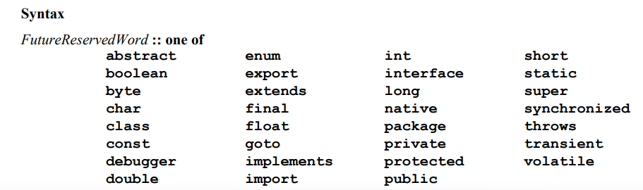
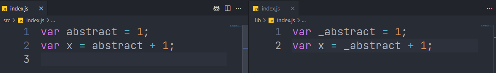
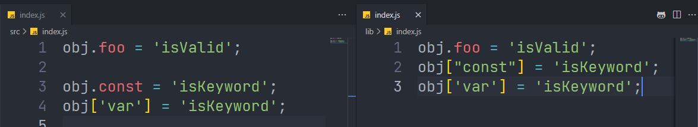
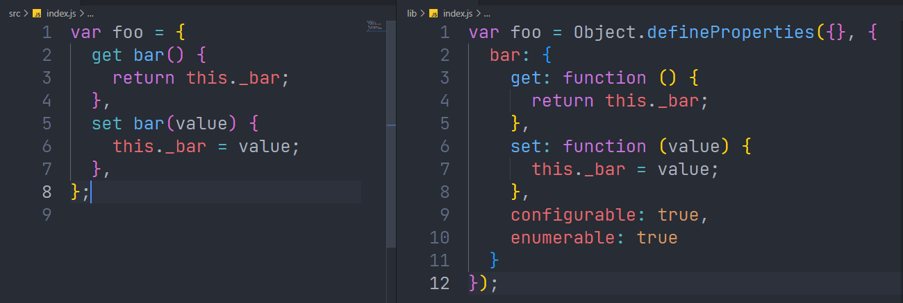

## ES3

1.`@babel/plugin-transform-reserved-words` **保留关键字**转换插件





2.`@babel/plugin-transform-member-expression-literals` 保留关键字对象转换



## ES5

`@babel/plugin-transform-property-mutators` 访问设置器转换



## ES2015

1.`@babel/plugin-transform-unicode-regex` 转换正则为unicode码

**输入**

```js
var string = 'foobar';
var match = string.match(/foo(.)bar/u);
```

**输出**

```js
var string = 'foobar';
var match = string.match(
  /foo((?:[\0-\t\x0B\f\x0E-\u2027\u202A-\uD7FF\uE000-\uFFFF]|[\uD800-\uDBFF][\uDC00-\uDFFF]|[\uD800-\uDBFF](?![\uDC00-\uDFFF])|(?:[^\uD800-\uDBFF]|^)[\uDC00-\uDFFF]))bar/
);
```

2.`@babel/plugin-transform-unicode-escapes` 编译unicode编码为es5

输入

```js
var \u{1d49c} = "\u{Babe1}";
console.log(\u{1d49c});
```

输出

```js
var _ud835_udc9c = '\udaaa\udfe1';
console.log(_ud835_udc9c);
```

3.`@babel/plugin-transform-typeof-symbol` 转换typeof symbol

输入

```js
typeof Symbol() === 'symbol';
```

输出

```js
function _typeof(obj) {
  '@babel/helpers - typeof';
  return (
    (_typeof =
      'function' == typeof Symbol && 'symbol' == typeof Symbol.iterator
        ? function (obj) {
            return typeof obj;
          }
        : function (obj) {
            return obj &&
              'function' == typeof Symbol &&
              obj.constructor === Symbol &&
              obj !== Symbol.prototype
              ? 'symbol'
              : typeof obj;
          }),
    _typeof(obj)
  );
}

_typeof(Symbol()) === 'symbol';
```

4.`@babel/plugin-transform-template-literals` 模板语法转换

输入

```js
`foo${bar}${c}`;
```

输出

```js
"foo".concat(bar).concat(c);
```

5.`@babel/plugin-transform-sticky-regex` 正则表达式转换

输入

```js
const a = /o+/y;
```

输出

```js
const a = new RegExp("o+", "y");
```

6.`@babel/plugin-transform-spread` 扩展语法转换

输入

```js
var a = ['a', 'b', 'c'];

var b = [...a, 'foo', 'bar'];

var c = foo(...a);
```

输出

```js
var a = ['a', 'b', 'c'];
var b = [].concat(a, ['foo', 'bar']);
var c = foo.apply(void 0, a);
```

7.`@babel/plugin-transform-shorthand-properties` 简写转换

输入

```js
var o = { a, b, c };

var cat = {
  getName() {
    return this.name;
  },
};
```

输出

```js
var o = {
  a: a,
  b: b,
  c: c
};
var cat = {
  getName: function () {
    return this.name;
  }
};
```

8.`@babel/plugin-transform-parameters` 函数参数转换

- 默认参数
- 解构参数
- 剩余参数

输入

```js
function test(x = 'hello', { a, b }, ...args) {
  console.log(x, a, b, args);
}
```

输出

```js
function test() {
  let x = arguments.length > 0 && arguments[0] !== undefined ? arguments[0] : 'hello';
  let {
    a,
    b
  } = arguments.length > 1 ? arguments[1] : undefined;

  for (var _len = arguments.length, args = new Array(_len > 2 ? _len - 2 : 0), _key = 2; _key < _len; _key++) {
    args[_key - 2] = arguments[_key];
  }

  console.log(x, a, b, args);
}
```

9.`@babel/plugin-transform-object-super` 对象父节点方法转换

输入

```js
let obj = {
  say() {
    return 'Hello';
  },
};

let obj2 = {
  say() {
    return super.say() + 'World!';
  },
};
```

输出

```js
var _obj;

function _get() { if (typeof Reflect !== "undefined" && Reflect.get) { _get = Reflect.get.bind(); } else { _get = function _get(target, property, receiver) { var base = _superPropBase(target, property); if (!base) return; var desc = Object.getOwnPropertyDescriptor(base, property); if (desc.get) { return desc.get.call(arguments.length < 3 ? target : receiver); } return desc.value; }; } return _get.apply(this, arguments); }

function _superPropBase(object, property) { while (!Object.prototype.hasOwnProperty.call(object, property)) { object = _getPrototypeOf(object); if (object === null) break; } return object; }

function _getPrototypeOf(o) { _getPrototypeOf = Object.setPrototypeOf ? Object.getPrototypeOf.bind() : function _getPrototypeOf(o) { return o.__proto__ || Object.getPrototypeOf(o); }; return _getPrototypeOf(o); }

let obj = {
  say() {
    return 'Hello';
  }

};
let obj2 = _obj = {
  say() {
    return _get(_getPrototypeOf(_obj), "say", this).call(this) + 'World!';
  }

};
```

10.`@babel/plugin-transform-new-target` new target转换

输入

```js
function Foo() {
  console.log(new.target);
}
```

输出

```js
function Foo() {
  console.log(this instanceof Foo ? this.constructor : void 0);
}
```

11.`@babel/plugin-transform-literals` 字面量转换

输入

```js
var b = 0b11; // 二进制字面量11
var o = 0o7; // 八进制字面量7
const u = 'Hello\u{000A}\u{0009}!'; // unicode字面量
```

输出

```js
var b = 3; // 二进制字面量11
var o = 7; // 八进制字面量7
const u = "Hello\n\t!"; // unicode字面量
```

11.`@babel/plugin-transform-instanceof` instanceof转换

输入

```js
foo instanceof Bar;
```

输出

```js
function _instanceof(left, right) {
  if (
    right != null &&
    typeof Symbol !== 'undefined' &&
    right[Symbol.hasInstance]
  ) {
    return !!right[Symbol.hasInstance](left);
  } else {
    return left instanceof right;
  }
}

_instanceof(foo, Bar);
```

12.`@babel/plugin-transform-function-name` function name转换

输入

```js
let number = (x) => x;
```

输出

```js
let number = x => x;
```

13.`@babel/plugin-transform-for-of` for of转换

输入

```js
for (var i of foo) {
}
```

输出

```js
function _createForOfIteratorHelper(o, allowArrayLike) {
  var it =
    (typeof Symbol !== 'undefined' && o[Symbol.iterator]) || o['@@iterator'];
  if (!it) {
    if (
      Array.isArray(o) ||
      (it = _unsupportedIterableToArray(o)) ||
      (allowArrayLike && o && typeof o.length === 'number')
    ) {
      if (it) o = it;
      var i = 0;
      var F = function () {};
      return {
        s: F,
        n: function () {
          if (i >= o.length) return { done: true };
          return { done: false, value: o[i++] };
        },
        e: function (e) {
          throw e;
        },
        f: F,
      };
    }
    throw new TypeError(
      'Invalid attempt to iterate non-iterable instance.\nIn order to be iterable, non-array objects must have a [Symbol.iterator]() method.'
    );
  }
  var normalCompletion = true,
    didErr = false,
    err;
  return {
    s: function () {
      it = it.call(o);
    },
    n: function () {
      var step = it.next();
      normalCompletion = step.done;
      return step;
    },
    e: function (e) {
      didErr = true;
      err = e;
    },
    f: function () {
      try {
        if (!normalCompletion && it.return != null) it.return();
      } finally {
        if (didErr) throw err;
      }
    },
  };
}

function _unsupportedIterableToArray(o, minLen) {
  if (!o) return;
  if (typeof o === 'string') return _arrayLikeToArray(o, minLen);
  var n = Object.prototype.toString.call(o).slice(8, -1);
  if (n === 'Object' && o.constructor) n = o.constructor.name;
  if (n === 'Map' || n === 'Set') return Array.from(o);
  if (n === 'Arguments' || /^(?:Ui|I)nt(?:8|16|32)(?:Clamped)?Array$/.test(n))
    return _arrayLikeToArray(o, minLen);
}

function _arrayLikeToArray(arr, len) {
  if (len == null || len > arr.length) len = arr.length;
  for (var i = 0, arr2 = new Array(len); i < len; i++) arr2[i] = arr[i];
  return arr2;
}

var _iterator = _createForOfIteratorHelper(foo),
  _step;

try {
  for (_iterator.s(); !(_step = _iterator.n()).done; ) {
    var i = _step.value;
  }
} catch (err) {
  _iterator.e(err);
} finally {
  _iterator.f();
}
```

14.`@babel/plugin-transform-duplicate-keys` 重复key的覆盖

输入

```js
var x = { a: 5, a: 6 };
var y = {
  get a() {},
  set a(x) {},
  a: 3,
};
```

输出

```js
var x = {
  a: 5,
  ["a"]: 6
};
var y = {
  get a() {},

  set a(x) {},

  ["a"]: 3
};
```

15.`@babel/plugin-transform-destructuring`  

输入

```js
let { x, y } = obj;

let [a, b, ...rest] = arr;
```

输出

```js
function _toArray(arr) {
  return (
    _arrayWithHoles(arr) ||
    _iterableToArray(arr) ||
    _unsupportedIterableToArray(arr) ||
    _nonIterableRest()
  );
}

function _nonIterableRest() {
  throw new TypeError(
    'Invalid attempt to destructure non-iterable instance.\nIn order to be iterable, non-array objects must have a [Symbol.iterator]() method.'
  );
}

function _unsupportedIterableToArray(o, minLen) {
  if (!o) return;
  if (typeof o === 'string') return _arrayLikeToArray(o, minLen);
  var n = Object.prototype.toString.call(o).slice(8, -1);
  if (n === 'Object' && o.constructor) n = o.constructor.name;
  if (n === 'Map' || n === 'Set') return Array.from(o);
  if (n === 'Arguments' || /^(?:Ui|I)nt(?:8|16|32)(?:Clamped)?Array$/.test(n))
    return _arrayLikeToArray(o, minLen);
}

function _arrayLikeToArray(arr, len) {
  if (len == null || len > arr.length) len = arr.length;
  for (var i = 0, arr2 = new Array(len); i < len; i++) arr2[i] = arr[i];
  return arr2;
}

function _iterableToArray(iter) {
  if (
    (typeof Symbol !== 'undefined' && iter[Symbol.iterator] != null) ||
    iter['@@iterator'] != null
  )
    return Array.from(iter);
}

function _arrayWithHoles(arr) {
  if (Array.isArray(arr)) return arr;
}

let _obj = obj,
  x = _obj.x,
  y = _obj.y;

let _arr = arr,
  _arr2 = _toArray(_arr),
  a = _arr2[0],
  b = _arr2[1],
  rest = _arr2.slice(2);
```

16.`@babel/plugin-transform-computed-properties` 计算属性

输入

```js
var obj = {
  ['x' + foo]: 'heh',
  ['y' + bar]: 'noo',
  foo: 'foo',
  bar: 'bar',
};
```

输出

```js
var _obj;

function _defineProperty(obj, key, value) {
  if (key in obj) {
    Object.defineProperty(obj, key, {
      value: value,
      enumerable: true,
      configurable: true,
      writable: true,
    });
  } else {
    obj[key] = value;
  }
  return obj;
}

var obj =
  ((_obj = {}),
  _defineProperty(_obj, 'x' + foo, 'heh'),
  _defineProperty(_obj, 'y' + bar, 'noo'),
  _defineProperty(_obj, 'foo', 'foo'),
  _defineProperty(_obj, 'bar', 'bar'),
  _obj);
```

17.`@babel/plugin-transform-classes` classes转换

输入

```js
class Test {
  constructor(name) {
    this.name = name;
  }

  logger() {
    console.log('Hello', this.name);
  }
}
```

输出

```js
function _classCallCheck(instance, Constructor) {
  if (!(instance instanceof Constructor)) {
    throw new TypeError('Cannot call a class as a function');
  }
}

function _defineProperties(target, props) {
  for (var i = 0; i < props.length; i++) {
    var descriptor = props[i];
    descriptor.enumerable = descriptor.enumerable || false;
    descriptor.configurable = true;
    if ('value' in descriptor) descriptor.writable = true;
    Object.defineProperty(target, descriptor.key, descriptor);
  }
}

function _createClass(Constructor, protoProps, staticProps) {
  if (protoProps) _defineProperties(Constructor.prototype, protoProps);
  if (staticProps) _defineProperties(Constructor, staticProps);
  Object.defineProperty(Constructor, 'prototype', { writable: false });
  return Constructor;
}

let Test = /*#__PURE__*/ (function () {
  function Test(name) {
    _classCallCheck(this, Test);

    this.name = name;
  }

  _createClass(Test, [
    {
      key: 'logger',
      value: function logger() {
        console.log('Hello', this.name);
      },
    },
  ]);

  return Test;
})();
```

18.`@babel/plugin-transform-block-scoping` 块级范围

输入

```js
{
  let a = 3;
}

let a = 3;
```

输出

```js
{
  var _a = 3;
}
var a = 3;
```

19.`@babel/plugin-transform-arrow-functions` 箭头函数

输入

```js
var a = () => {};
var a = (b) => b;

const double = [1, 2, 3].map((num) => num * 2);
console.log(double); // [2,4,6]

var bob = {
  _name: 'Bob',
  _friends: ['Sally', 'Tom'],
  printFriends() {
    this._friends.forEach((f) => console.log(this._name + ' knows ' + f));
  },
};
console.log(bob.printFriends());
```

输出

```js
var a = function () {};

var a = function (b) {
  return b;
};

const double = [1, 2, 3].map(function (num) {
  return num * 2;
});
console.log(double); // [2,4,6]

var bob = {
  _name: 'Bob',
  _friends: ['Sally', 'Tom'],

  printFriends() {
    var _this = this;

    this._friends.forEach(function (f) {
      return console.log(_this._name + ' knows ' + f);
    });
  }

};
console.log(bob.printFriends());
```

## ES2016

1.`@babel/plugin-transform-exponentiation-operator` 指数运算符

输入

```js
let x = 10 ** 2;

x **= 3;
```

输出

```js
let x = Math.pow(10, 2);
x = Math.pow(x, 3);
```

## ES2017

`@babel/plugin-transform-async-to-generator` 同步函数转换

输入

```js
async function foo() {
  await bar();
}
```

输出

```js
function asyncGeneratorStep(gen, resolve, reject, _next, _throw, key, arg) {
  try {
    var info = gen[key](arg);
    var value = info.value;
  } catch (error) {
    reject(error);
    return;
  }
  if (info.done) {
    resolve(value);
  } else {
    Promise.resolve(value).then(_next, _throw);
  }
}

function _asyncToGenerator(fn) {
  return function () {
    var self = this,
      args = arguments;
    return new Promise(function (resolve, reject) {
      var gen = fn.apply(self, args);
      function _next(value) {
        asyncGeneratorStep(gen, resolve, reject, _next, _throw, 'next', value);
      }
      function _throw(err) {
        asyncGeneratorStep(gen, resolve, reject, _next, _throw, 'throw', err);
      }
      _next(undefined);
    });
  };
}

function foo() {
  return _foo.apply(this, arguments);
}

function _foo() {
  _foo = _asyncToGenerator(function* () {
    yield bar();
  });
  return _foo.apply(this, arguments);
}
```

## ES2018

1.`@babel/plugin-transform-named-capturing-groups-regex` 正则分组

输入

```js
var re = /(?<year>\d{4})-(?<month>\d{2})-(?<day>\d{2})/;

console.log(re.exec('1999-02-29').groups.year);
```

输出

```js
var re = /*#__PURE__*/ _wrapRegExp(/(\d{4})\x2D(\d{2})\x2D(\d{2})/, {
  year: 1,
  month: 2,
  day: 3,
});

console.log(re.exec('1999-02-29').groups.year);
```

2.`@babel/plugin-transform-dotall-regex` 多线程正则

输入

```js
/./s;
/./su;
```

输出

```js
/[\s\S]/;
/[\s\S]/u;
```

3.`@babel/plugin-proposal-unicode-property-regex` 正则unicode

输入

```js
var regex = /\p{Script_Extensions=Greek}/u;
```

输出

```js
var regex =
  /[\u0342\u0345\u0370-\u0373\u0375-\u0377\u037A-\u037D\u037F\u0384\u0386\u0388-\u038A\u038C\u038E-\u03A1\u03A3-\u03E1\u03F0-\u03FF\u1D26-\u1D2A\u1D5D-\u1D61\u1D66-\u1D6A\u1DBF-\u1DC1\u1F00-\u1F15\u1F18-\u1F1D\u1F20-\u1F45\u1F48-\u1F4D\u1F50-\u1F57\u1F59\u1F5B\u1F5D\u1F5F-\u1F7D\u1F80-\u1FB4\u1FB6-\u1FC4\u1FC6-\u1FD3\u1FD6-\u1FDB\u1FDD-\u1FEF\u1FF2-\u1FF4\u1FF6-\u1FFE\u2126\uAB65\u{10140}-\u{1018E}\u{101A0}\u{1D200}-\u{1D245}]/u;
```

4.`@babel/plugin-proposal-object-rest-spread` 剩余参数

输入

```js
let { x, y, ...z } = { x: 1, y: 2, a: 3, b: 4 };
```

输出

```js
let _x$y$a$b = {
  x: 1,
  y: 2,
  a: 3,
  b: 4
},
    {
  x,
  y
} = _x$y$a$b,
    z = _objectWithoutProperties(_x$y$a$b, ["x", "y"]);
```

5.`@babel/plugin-proposal-async-generator-functions` 生成器转换

输入

```js
async function* agf() {
  await 1;
  yield 2;
}
```

输出

```js
function agf() {
  return _agf.apply(this, arguments);
}

function _agf() {
  _agf = _wrapAsyncGenerator(function* () {
    yield _awaitAsyncGenerator(1);
    yield 2;
  });
  return _agf.apply(this, arguments);
}
```

## ES2019

`@babel/plugin-proposal-optional-catch-binding` catch 绑定 

输入

```js
try {
  throw 0;
} catch {
  doSomethingWhichDoesNotCareAboutTheValueThrown();
} finally {
  doSomeCleanup();
}
```

输出

```js
try {
  throw 0;
} catch (_unused) {
  doSomethingWhichDoesNotCareAboutTheValueThrown();
} finally {
  doSomeCleanup();
}
```

