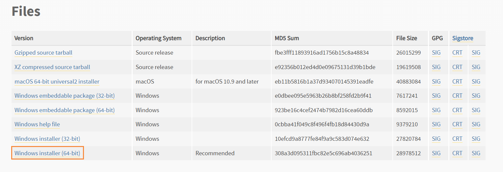
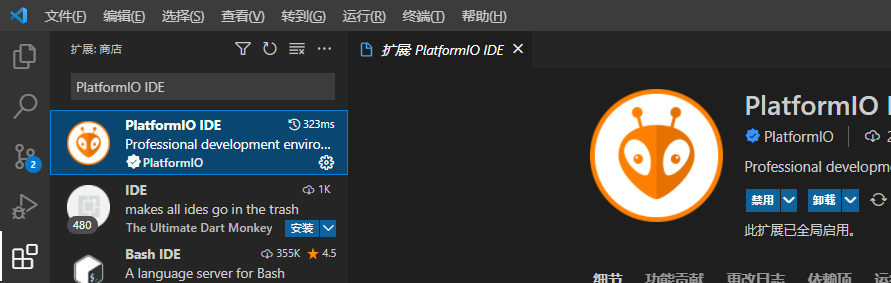
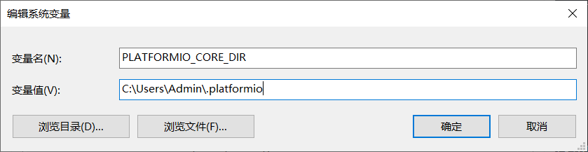

## 1.安装python

[链接](https://www.python.org/downloads/release/python-3108/)



## 2.配置环境变量

```
C:\Users\Admin\AppData\Local\Programs\Python\Python310
C:\Users\Admin\AppData\Local\Programs\Python\Python310\Scripts
```

```shell
# 检查python是否安装成功
python --version
# 检查pip是否安装成功
pip --version
```

## 3.安装pio core

```shell
pip install -i https://pypi.tuna.tsinghua.edu.cn/simple platformio
```

```shell
# 检查pio是否安装成功
pio --version
```

## 4.vscode配置setting

> platformio-ide.customPATH 配置pio 安装的位置

```json
{
    "platformio-ide.useBuiltinPIOCore": false,
  	"platformio-ide.useBuiltinPython": false,
  	"platformio-ide.customPATH": "C:\\Users\\Admin\\AppData\\Local\\Programs\\Python\\Python310\\Scripts",
}
```

## 5.安装插件

> PlatformIO IDE



## 6.配置PlatformIO Core 位置

> 默认安装位置 C:\Users\Admin\.platformio

```shell
# 查看platformIO信息
$ pio system info
--------------------------  -----------------------------------------------------------------------------
PlatformIO Core             6.1.3
Python                      3.10.4-final.0
System Type                 windows_amd64
Platform                    Windows-10
File System Encoding        utf-8
Locale Encoding             cp936
PlatformIO Core Directory   C:\Users\Admin\.platformio
PlatformIO Core Executable  C:\Users\Admin\AppData\Local\Programs\Python\Python310\Scripts\platformio.exe
Python Executable           C:\Users\Admin\AppData\Local\Programs\Python\Python310\python.exe
Global Libraries            2
Development Platforms       4
Tools & Toolchains          25
--------------------------  ------------------------
```

修改PlatformIO Core 位置

```properties
PLATFORMIO_CORE_DIR: C:\Users\Admin\.platformio
```


