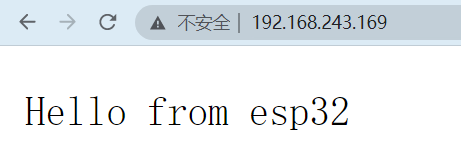
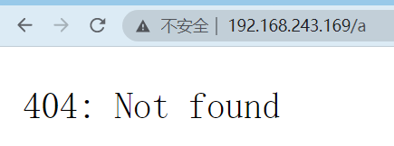
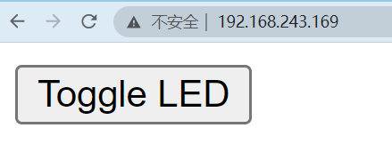
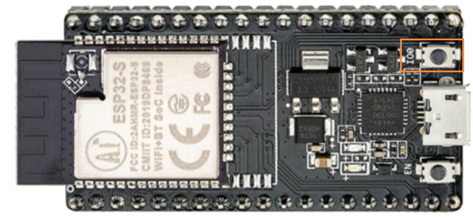

## 基本网络服务器

```cpp
#include <WiFi.h>
#include <WiFiMulti.h>
#include <WebServer.h>

// 建立wifi连接对象
WiFiMulti wifiMulti;
// 创建webServer服务器 80端口
WebServer  server(80);

void handleRoot(){
  server.send(200,"text/plain","Hello from esp32");
}


void handleNotFound(){
  server.send(404,"text/plain","404: Not found");
}

void setup()
{
  // 设置串口波特率
  Serial.begin(115200);
  // 存储WiFi名称和密码
  wifiMulti.addAP("tudou1","12345678");
  wifiMulti.addAP("tudou2","12345678");
  wifiMulti.addAP("tudou3","12345678");
  // 告知用户正在连接
  Serial.print("Connecting ...");

  int i = 0;
  while (wifiMulti.run() != WL_CONNECTED)
  {
    delay(1000);
    Serial.print(i++);
    Serial.print(" ");
  }

  Serial.println("\n");
  // 连接成功
  Serial.println("Connection to");
  Serial.print(WiFi.SSID());
  Serial.print("IP address:\t");
  // 当前设备被分配的IP
  Serial.println(WiFi.localIP());
  // 启动网络服务器
  server.begin();
  server.on("/",handleRoot);
  // 未找到资源
  server.onNotFound(handleNotFound);
}

void loop(void)
{
  server.handleClient();
}
```

串口打印

```
Connecting ...

Connection to
tudou1IP address:	192.168.243.169
```

访问首页



访问404页面



## 基本控制(LED翻转)

1.设置LED引脚为输出模式

2.设置主页按钮表单

3.post请求触发LED引脚电平翻转

4.重定向到首页

```cpp
#include <WiFi.h>
#include <WiFiMulti.h>
#include <WebServer.h>

// 建立wifi连接对象
WiFiMulti wifiMulti;
// 创建webServer服务器 80端口
WebServer  server(80);

void handleRoot(){
  server.send(200,"text/html", "<form action=\"/LED\" method=\"POST\"><input type=\"submit\" value=\"Toggle LED\"></form>");
}

void handleLED(){
  // 读取led引脚电平并取反
  digitalWrite(LED_BUILTIN,!digitalRead(LED_BUILTIN));
  // 跳转到首页
  server.sendHeader("Location","/");
  // 设置跳转码
  server.send(303);
}

void handleNotFound(){
  server.send(404,"text/plain","404: Not found");
}

void setup()
{
  // 设置串口波特率
  Serial.begin(115200);
  // 设置LED引脚为输出模式
  pinMode(LED_BUILTIN,OUTPUT);
  // 存储WiFi名称和密码
  wifiMulti.addAP("tudou1","12345678");
  wifiMulti.addAP("tudou2","12345678");
  wifiMulti.addAP("tudou3","12345678");
  // 告知用户正在连接
  Serial.print("Connecting ...");

  int i = 0;
  while (wifiMulti.run() != WL_CONNECTED)
  {
    delay(1000);
    Serial.print(i++);
    Serial.print(" ");
  }

  Serial.println("\n");
  // 连接成功
  Serial.println("Connection to");
  Serial.print(WiFi.SSID());
  Serial.print("IP address:\t");
  // 当前设备被分配的IP
  Serial.println(WiFi.localIP());
  // 启动网络服务器
  server.begin();
  server.on("/",handleRoot);
  server.on("/LED",HTTP_POST,handleLED);
  // 未找到资源
  server.onNotFound(handleNotFound);
}

void loop(void)
{
  // 检查http服务器访问
  server.handleClient();
}
```



## 显示开发板引脚状态

1.读取按钮引脚状态,根据实物图得知按钮引脚为IO0




2.`<meta http-equiv='refresh' content='5'/>` 5秒刷新一次网页获取最新引脚数据

```cpp
#include <WiFi.h>
#include <WiFiMulti.h>
#include <WebServer.h>

// 建立wifi连接对象
WiFiMulti wifiMulti;
// 创建webServer服务器 80端口
WebServer  server(80);
// 定义按钮引脚
#define buttonPin GPIO_NUM_0
// 引脚状态变量
bool pinState;

String sendHtml(bool buttonState){
  String htmlCode = "<!DOCTYPE html> <html>\n";
  htmlCode +="<head><meta http-equiv='refresh' content='5'/>\n";
  htmlCode +="<title>ESP32 Butoon State</title>\n";
  htmlCode +="<style>html { font-family: Helvetica; display: inline-block; margin: 0px auto; text-align: center;}\n";
  htmlCode +="body{margin-top: 50px;} h1 {color: #444444;margin: 50px auto 30px;} h3 {color: #444444;margin-bottom: 50px;}\n";
  htmlCode +="</style>\n";
  htmlCode +="</head>\n";
  htmlCode +="<body>\n";
  htmlCode +="<h1>ESP32 BUTTON STATE</h1>\n";

  if(buttonState){
    htmlCode +="<p>Button Status: HIGH</p>\n";
  }else{
    htmlCode +="<p>Button Status: LOW</p>\n";
  }
  htmlCode +="</body>\n";
  htmlCode +="</html>\n";
  
  return htmlCode;
}

void handleRoot(){
  server.send(200,"text/html", sendHtml(pinState));
}

void handleNotFound(){
  server.send(404,"text/plain","404: Not found");
}

void setup()
{
  // 设置串口波特率
  Serial.begin(115200);
  // 设置按键引脚设置为输入上拉模式
  pinMode(buttonPin,INPUT_PULLUP);
  // 存储WiFi名称和密码
  wifiMulti.addAP("tudou1","12345678");
  wifiMulti.addAP("tudou2","12345678");
  wifiMulti.addAP("tudou3","12345678");
  // 告知用户正在连接
  Serial.print("Connecting ...");

  int i = 0;
  while (wifiMulti.run() != WL_CONNECTED)
  {
    delay(1000);
    Serial.print(i++);
    Serial.print(" ");
  }

  Serial.println("\n");
  // 连接成功
  Serial.println("Connection to");
  Serial.print(WiFi.SSID());
  Serial.print("IP address:\t");
  // 当前设备被分配的IP
  Serial.println(WiFi.localIP());
  // 启动网络服务器
  server.begin();
  server.on("/",handleRoot);
  // 未找到资源
  server.onNotFound(handleNotFound);
}

void loop(void)
{
  // 检查http服务器访问
  server.handleClient();
  // 获取引脚状态
  pinState = digitalRead(buttonPin);
}
```

**未按下按钮网页**


**按下按钮网页**


## 总结

1.通过WebServer库创建服务器

2.`server.send(200,"text/plain","Hello from esp32");` 通过send方法向浏览器发送数据

3.`server.handleClient();` 检查http服务器访问

4.`pinMode(buttonPin,INPUT_PULLUP);` 设置引脚模式

5.`digitalRead(buttonPin);` 读取引脚状态

6.`<meta http-equiv='refresh' content='5'/>` 每5秒刷新一次网页