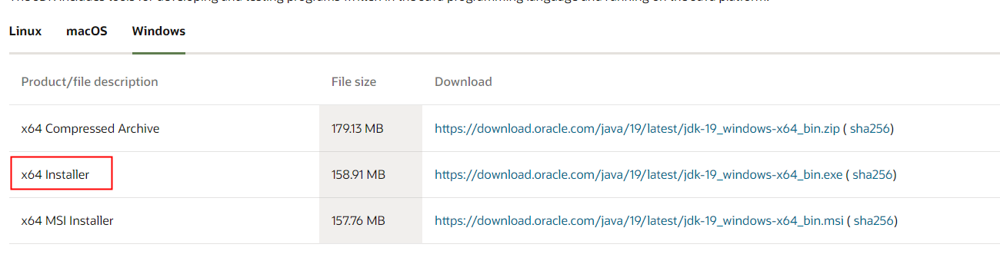
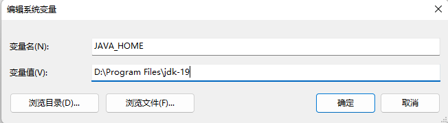
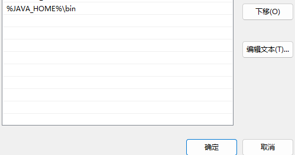
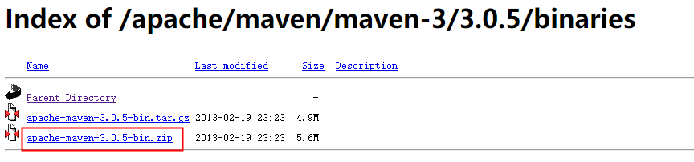
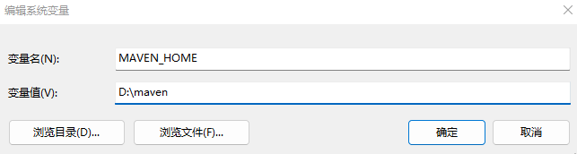
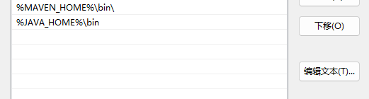
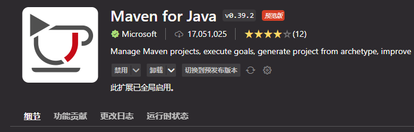
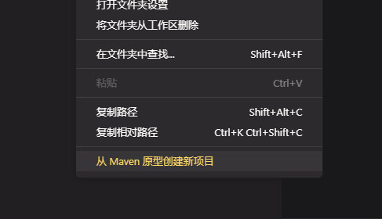

## 安装 JDK

[java下载网址](https://www.oracle.com/java/technologies/downloads/#jdk18-windows)



## 配置JDK环境变量

```properties
# java安装目标
JAVA_HOME:D:\Program Files\jdk-19
```




```properties
# 配置运行目录
%JAVA_HOME%\bin
```



## 安装MAVEN

[maven下载地址](https://mirrors.bfsu.edu.cn/apache/maven/maven-3/)



## MAVEN添加环境变量

```properties
MAVEN_HOME:D:\maven
```




```properties
%MAVEN_HOME%\bin\
```



## 配置下载镜像和本地仓库地址

`config/settings.xml`

```xml
<!-- 配置仓库地址 -->
<localRepository>D:/repository</localRepository>

<!-- 配置下载镜像 -->
<mirrors>
    <mirror>
        <id>alimaven</id>
        <name>aliyun maven</name>
        <url>https://maven.aliyun.com/repository/central</url>
        <mirrorOf>central</mirrorOf>
    </mirror>
</mirrors>
```

## 安装插件

**java运行插件**


**maven插件**



**配置maven地址**

```json
{
  "maven.settingsFile": "D:/maven/conf/settings.xml",
  "maven.excludedFolders": [
    "**/.*",
    "**/node_modules",
    "**/target",
    "**/bin",
    "**/archetype-resources"
  ]
}
```

## 创建MAVEN项目

**右键创建项目**




## 打包项目

```
mvn package
```

