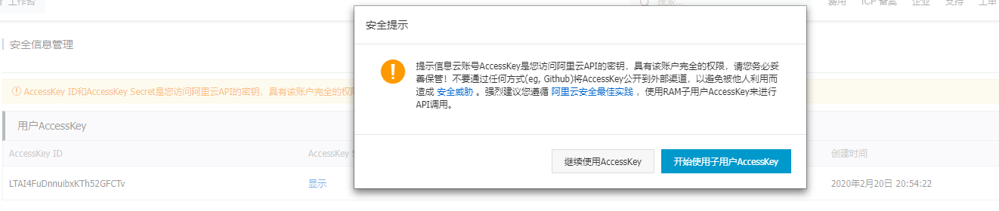
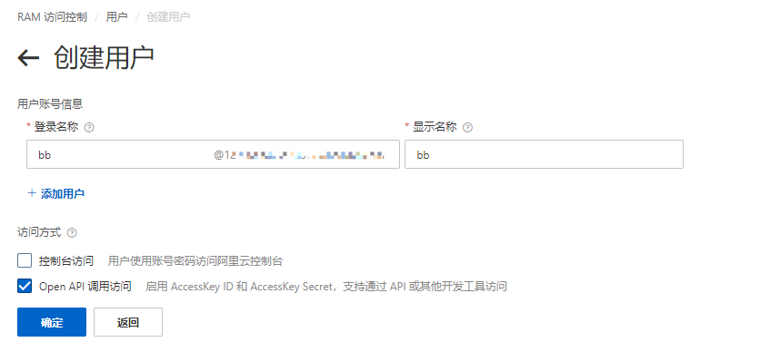
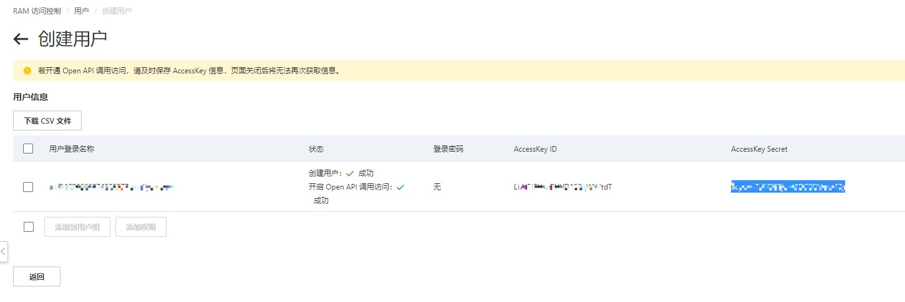
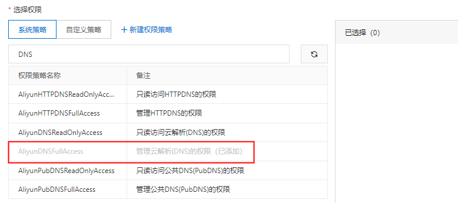
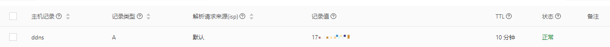
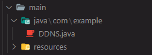
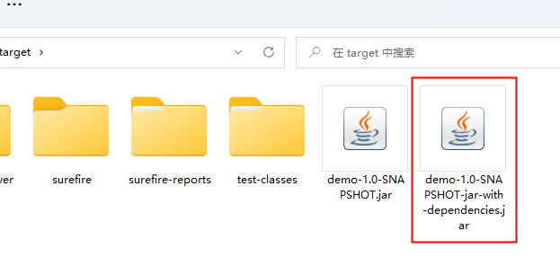

## 获取AccessKey

[AccessKey管理页面](https://usercenter.console.aliyun.com/?spm=a2c4g.11186623.0.0.4b8875a9XMsEjB#/manage/ak)



**1.创建子用户**



**2.保存ID和Secret**



**配置权限**



## 编写代码

- [官方网址](https://help.aliyun.com/document_detail/431629.html?spm=a2c1d.8251892.help.dexternal.74f45b76eXFSzs&scm=20140722.S_help%40%40%E6%96%87%E6%A1%A3%40%40431629.S_hot%2Bos0.ID_431629-RL_ddns-LOC_consoleUNDhelp-OR_ser-V_2-P0_0)
- [地域ID网址](https://help.aliyun.com/document_detail/198326.html?spm=5176.21213303.J_6704733920.7.14f053c9xflK1U&scm=20140722.S_help%40%40%E6%96%87%E6%A1%A3%40%40198326._.ID_help%40%40%E6%96%87%E6%A1%A3%40%40198326-RL_%E5%9C%B0%E5%9F%9Fid-LOC_main-OR_ser-V_2-P0_0)

**添加maven依赖**

```xml
<dependencies>
     <!-- https://mvnrepository.com/artifact/com.aliyun/aliyun-java-sdk-core -->
     <dependency>
         <groupId>com.aliyun</groupId>
         <artifactId>aliyun-java-sdk-core</artifactId>
         <version>4.4.3</version>
     </dependency>
     <!-- https://mvnrepository.com/artifact/com.aliyun/aliyun-java-sdk-alidns -->
     <dependency>
         <groupId>com.aliyun</groupId>
         <artifactId>aliyun-java-sdk-alidns</artifactId>
         <version>2.0.10</version>
     </dependency>
</dependencies>
```

**编写代码**

```java
package com.example;

import com.aliyuncs.DefaultAcsClient;
import com.aliyuncs.IAcsClient;
import com.aliyuncs.alidns.model.v20150109.DescribeDomainRecordsRequest;
import com.aliyuncs.alidns.model.v20150109.DescribeDomainRecordsResponse;
import com.aliyuncs.alidns.model.v20150109.UpdateDomainRecordRequest;
import com.aliyuncs.alidns.model.v20150109.UpdateDomainRecordResponse;
import com.aliyuncs.exceptions.ClientException;
import com.aliyuncs.profile.DefaultProfile;
import com.google.gson.Gson;

import java.io.BufferedReader;
import java.io.InputStreamReader;
import java.net.HttpURLConnection;
import java.net.URL;
import java.util.List;
import java.util.regex.Matcher;
import java.util.regex.Pattern;

/**
 * 动态域名解析
 */
public class DDNS {

    /**
     * 获取主域名的所有解析记录列表
     */
    private DescribeDomainRecordsResponse describeDomainRecords(DescribeDomainRecordsRequest request,
            IAcsClient client) {
        try {
            // 调用SDK发送请求
            return client.getAcsResponse(request);
        } catch (ClientException e) {
            e.printStackTrace();
            // 发生调用错误，抛出运行时异常
            throw new RuntimeException();
        }
    }

    /**
     * 获取当前主机公网IP
     */
    private String getCurrentHostIP() {
        // 这里使用jsonip.com第三方接口获取本地IP
        String jsonip = "https://jsonip.com/";
        // 接口返回结果
        String result = "";
        BufferedReader in = null;
        try {
            // 使用HttpURLConnection网络请求第三方接口
            URL url = new URL(jsonip);
            HttpURLConnection urlConnection = (HttpURLConnection) url.openConnection();
            urlConnection.setRequestMethod("GET");
            urlConnection.connect();
            in = new BufferedReader(new InputStreamReader(
                    urlConnection.getInputStream()));
            String line;
            while ((line = in.readLine()) != null) {
                result += line;
            }
        } catch (Exception e) {
            e.printStackTrace();
        }
        // 使用finally块来关闭输入流
        finally {
            try {
                if (in != null) {
                    in.close();
                }
            } catch (Exception e2) {
                e2.printStackTrace();
            }

        }
        // 正则表达式，提取xxx.xxx.xxx.xxx，将IP地址从接口返回结果中提取出来
        String rexp = "(\\d{1,3}\\.){3}\\d{1,3}";
        Pattern pat = Pattern.compile(rexp);
        Matcher mat = pat.matcher(result);
        String res = "";
        while (mat.find()) {
            res = mat.group();
            break;
        }
        return res;
    }

    /**
     * 修改解析记录
     */
    private UpdateDomainRecordResponse updateDomainRecord(UpdateDomainRecordRequest request, IAcsClient client) {
        try {
            // 调用SDK发送请求
            return client.getAcsResponse(request);
        } catch (ClientException e) {
            e.printStackTrace();
            // 发生调用错误，抛出运行时异常
            throw new RuntimeException();
        }
    }

    private static void log_print(String functionName, Object result) {
        Gson gson = new Gson();
        System.out.println("-------------------------------" + functionName + "-------------------------------");
        System.out.println(gson.toJson(result));
    }

    public static void main(String[] args) {
        // 设置鉴权参数，初始化客户端
        DefaultProfile profile = DefaultProfile.getProfile(
                "cn-qingdao", // 地域ID
                "xxxxx", // 您的AccessKey ID
                "xxxx");// 您的AccessKey Secret
        IAcsClient client = new DefaultAcsClient(profile);
        DDNS ddns = new DDNS();

        // 查询指定二级域名的最新解析记录
        DescribeDomainRecordsRequest describeDomainRecordsRequest = new DescribeDomainRecordsRequest();
        // 主域名
        describeDomainRecordsRequest.setDomainName("reachable.cool");
        // 主机记录
        describeDomainRecordsRequest.setRRKeyWord("ddns");
        // 解析记录类型
        describeDomainRecordsRequest.setType("A");
        DescribeDomainRecordsResponse describeDomainRecordsResponse = ddns
                .describeDomainRecords(describeDomainRecordsRequest, client);
        log_print("describeDomainRecords", describeDomainRecordsResponse);

        List<DescribeDomainRecordsResponse.Record> domainRecords = describeDomainRecordsResponse.getDomainRecords();
        // 最新的一条解析记录
        if (domainRecords.size() != 0) {
            DescribeDomainRecordsResponse.Record record = domainRecords.get(0);
            // 记录ID
            String recordId = record.getRecordId();
            // 记录值
            String recordsValue = record.getValue();
            // 当前主机公网IP
            String currentHostIP = ddns.getCurrentHostIP();
            System.out.println(
                    "-------------------------------当前主机公网IP为：" + currentHostIP +
                            "-------------------------------");
            if (!currentHostIP.equals(recordsValue)) {
                // 修改解析记录
                UpdateDomainRecordRequest updateDomainRecordRequest = new UpdateDomainRecordRequest();
                // 主机记录
                updateDomainRecordRequest.setRR("ddnstest");
                // 记录ID
                updateDomainRecordRequest.setRecordId(recordId);
                // 将主机记录值改为当前主机IP
                updateDomainRecordRequest.setValue(currentHostIP);
                // 解析记录类型
                updateDomainRecordRequest.setType("A");
                UpdateDomainRecordResponse updateDomainRecordResponse = ddns
                        .updateDomainRecord(updateDomainRecordRequest, client);
                log_print("updateDomainRecord", updateDomainRecordResponse);
            }
        }
    }
}
```

## 配置日志

**1.jar包**

```xml
<dependency>
    <groupId>log4j</groupId>
    <artifactId>log4j</artifactId>
    <version>1.2.17</version>
</dependency>
```

**2.日志配置问卷**

```properties
# log4j.properties
# src/main/resources

### 设置###
log4j.rootLogger = debug,D,E
### 输出INFO 级别以上的日志到=D://logs/info.log ###
log4j.appender.D = org.apache.log4j.DailyRollingFileAppender
log4j.appender.D.File = D://logs/info.log
log4j.appender.D.Append = true
log4j.appender.D.Encoding=UTF8
log4j.appender.D.Threshold = INFO
log4j.appender.D.layout = org.apache.log4j.PatternLayout
log4j.appender.D.layout.ConversionPattern = %-d{yyyy-MM-dd HH:mm:ss}  - [ %p ] - %m %n
### 输出ERROR 级别以上的日志到=D://logs/error.log ###
log4j.appender.E = org.apache.log4j.DailyRollingFileAppender
log4j.appender.E.File =D://logs/error.log
log4j.appender.E.Append = true
log4j.appender.E.Encoding=UTF8
log4j.appender.E.Threshold = ERROR
log4j.appender.E.layout = org.apache.log4j.PatternLayout
log4j.appender.E.layout.ConversionPattern = %-d{yyyy-MM-dd HH:mm:ss}  - [ %p ] - %m %n
```

## 重写代码



```java
package com.example;

import com.aliyuncs.DefaultAcsClient;
import com.aliyuncs.IAcsClient;
import com.aliyuncs.alidns.model.v20150109.DescribeDomainRecordsRequest;
import com.aliyuncs.alidns.model.v20150109.DescribeDomainRecordsResponse;
import com.aliyuncs.alidns.model.v20150109.UpdateDomainRecordRequest;
import com.aliyuncs.alidns.model.v20150109.UpdateDomainRecordResponse;
import com.aliyuncs.exceptions.ClientException;
import com.aliyuncs.profile.DefaultProfile;
import java.io.BufferedReader;
import java.io.InputStreamReader;
import java.net.HttpURLConnection;
import java.net.URL;
import java.util.List;
import java.util.regex.Matcher;
import java.util.regex.Pattern;

import org.apache.log4j.Logger;

/**
 * 动态域名解析
 */
public class DDNS {
    private static Logger logger = Logger.getLogger(DDNS.class);

    /**
     * 获取主域名的所有解析记录列表
     */
    private DescribeDomainRecordsResponse describeDomainRecords(DescribeDomainRecordsRequest request,
            IAcsClient client) {
        try {
            // 调用SDK发送请求
            return client.getAcsResponse(request);
        } catch (ClientException e) {
            e.printStackTrace();
            // 发生调用错误，抛出运行时异常
            throw new RuntimeException();
        }
    }

    /**
     * 获取当前主机公网IP
     */
    private String getCurrentHostIP() {
        // 这里使用jsonip.com第三方接口获取本地IP
        String jsonip = "https://jsonip.com/";
        // 接口返回结果
        String result = "";
        BufferedReader in = null;
        try {
            // 使用HttpURLConnection网络请求第三方接口
            URL url = new URL(jsonip);
            HttpURLConnection urlConnection = (HttpURLConnection) url.openConnection();
            urlConnection.setRequestMethod("GET");
            urlConnection.connect();
            in = new BufferedReader(new InputStreamReader(
                    urlConnection.getInputStream()));
            String line;
            while ((line = in.readLine()) != null) {
                result += line;
            }
        } catch (Exception e) {
            e.printStackTrace();
        }
        // 使用finally块来关闭输入流
        finally {
            try {
                if (in != null) {
                    in.close();
                }
            } catch (Exception e2) {
                e2.printStackTrace();
            }

        }
        // 正则表达式，提取xxx.xxx.xxx.xxx，将IP地址从接口返回结果中提取出来
        String rexp = "(\\d{1,3}\\.){3}\\d{1,3}";
        Pattern pat = Pattern.compile(rexp);
        Matcher mat = pat.matcher(result);
        String res = "";
        while (mat.find()) {
            res = mat.group();
            break;
        }
        return res;
    }

    /**
     * 修改解析记录
     */
    private UpdateDomainRecordResponse updateDomainRecord(UpdateDomainRecordRequest request, IAcsClient client) {
        try {
            logger.error("更新IP成功");
            // 调用SDK发送请求
            return client.getAcsResponse(request);
        } catch (ClientException e) {
            e.printStackTrace();
            logger.error("解析出错");
            // 发生调用错误，抛出运行时异常
            throw new RuntimeException();
        }
    }

    public static void main(String[] args) {
        // 设置鉴权参数，初始化客户端
        DefaultProfile profile = DefaultProfile.getProfile(
                "cn-qingdao", // 地域ID
                "xxxxxxx", // 您的AccessKey ID
                "xxxxx");// 您的AccessKey Secret
        IAcsClient client = new DefaultAcsClient(profile);
        DDNS ddns = new DDNS();

        // 查询指定二级域名的最新解析记录
        DescribeDomainRecordsRequest describeDomainRecordsRequest = new DescribeDomainRecordsRequest();
        // 主域名
        describeDomainRecordsRequest.setDomainName("reachable.cool");
        // 主机记录
        describeDomainRecordsRequest.setRRKeyWord("ddns");
        // 解析记录类型
        describeDomainRecordsRequest.setType("A");
        DescribeDomainRecordsResponse describeDomainRecordsResponse = ddns
                .describeDomainRecords(describeDomainRecordsRequest, client);
        List<DescribeDomainRecordsResponse.Record> domainRecords = describeDomainRecordsResponse.getDomainRecords();
        // 最新的一条解析记录
        if (domainRecords.size() != 0) {
            DescribeDomainRecordsResponse.Record record = domainRecords.get(0);
            // 记录ID
            String recordId = record.getRecordId();
            // 记录值
            String recordsValue = record.getValue();
            // 当前主机公网IP
            String currentHostIP = ddns.getCurrentHostIP();
            logger.info("公网IP为:" + currentHostIP);
            if (!currentHostIP.equals(recordsValue)) {
                // 修改解析记录
                UpdateDomainRecordRequest updateDomainRecordRequest = new UpdateDomainRecordRequest();
                // 主机记录
                updateDomainRecordRequest.setRR("ddns");
                // 记录ID
                updateDomainRecordRequest.setRecordId(recordId);
                // 将主机记录值改为当前主机IP
                updateDomainRecordRequest.setValue(currentHostIP);
                // 解析记录类型
                updateDomainRecordRequest.setType("A");
                ddns.updateDomainRecord(updateDomainRecordRequest, client);
            }
        }
    }
}
```

## 打包

**1.配置maven打包插件**



```xml
<build>
    <plugins>
        <!-- 使用maven-assembly-plugin插件打包 -->
        <plugin>
            <groupId>org.apache.maven.plugins</groupId>
            <artifactId>maven-assembly-plugin</artifactId>
            <version>3.2.0</version>
            <configuration>
                <archive>
                    <manifest>
                    	<!-- 配置入口main方法类所在路径 -->
                        <mainClass>com.example.DDNS</mainClass>
                    </manifest>
                </archive>
                <descriptorRefs>
                    <descriptorRef>jar-with-dependencies</descriptorRef>
                </descriptorRefs>
            </configuration>
            <executions>
                <execution>
                    <id>make-assembly</id>
                    <phase>package</phase>
                    <goals>
                        <goal>single</goal>
                    </goals>
                </execution>
            </executions>
        </plugin>
    </plugins>
</build>
```

**2.打包**

```
mvn package
```

**3.运行**

```
java -jar demo-1.0-SNAPSHOT-jar-with-dependencies.jar
```




