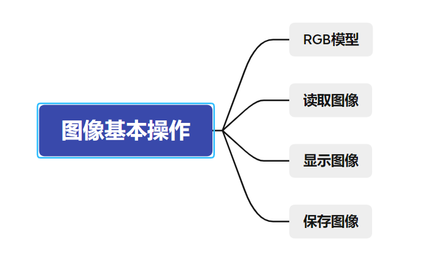
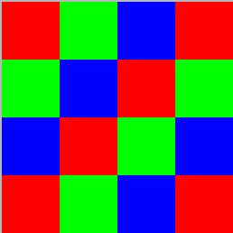
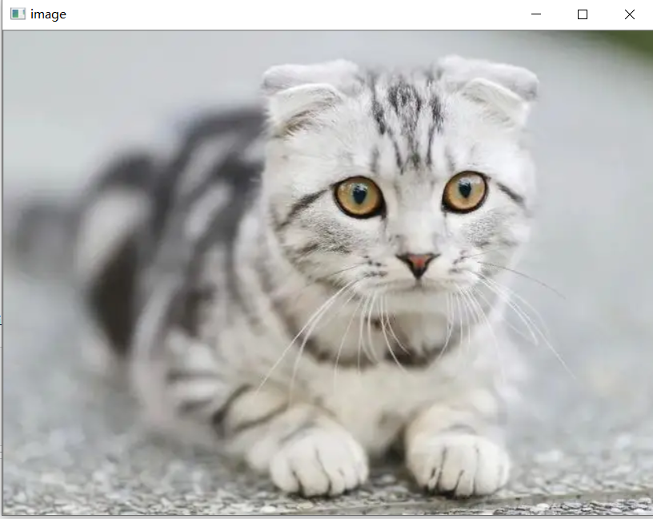

## 思维导图



## RGB 模型

光学三原色中的一个像素点由一个数组`[R,G,B]`构成，一般该**数组的类型**为「一个字节的无符号整型」。

在OpenCV中采用的是[B,G,R]

## 读取图像



```py
import cv2  # opencv读取的格式是BGR
import matplotlib.pyplot as plt
import numpy as np
%matplotlib inline

img = cv2.imread('4x4.png')
print(img)
```

输出结果

```py
[[[  0   0 255]
  [  0 255   0]
  [255   0   0]
  [  0   0 255]]

 [[  0 255   0]
  [255   0   0]
  [  0   0 255]
  [  0 255   0]]

 [[255   0   0]
  [  0   0 255]
  [  0 255   0]
  [255   0   0]]

 [[  0   0 255]
  [  0 255   0]
  [255   0   0]
  [  0   0 255]]]
```

输出结果为一个三维矩阵，最内层数组表示一个像素点的BGR值，第二层表示每一行像素的集合，第三次表示整个图像。

## 显示图像

```py
import cv2  
import matplotlib.pyplot as plt
import numpy as np
%matplotlib inline
img = cv2.imread('cat.jpg')

#图像的显示，窗口名为image
cv2.imshow('image',img)
#等待时间，毫秒级，0表示任意键终止
cv2.waitKey(0) // 无限等待
cv2.destroyAllWindows() // 关闭所有窗口
```



**imshow函数**

* winname 窗口名称
* mat 要显示的图像

```py
cv2.imshow(winname,mat)
```

**waitKey**

* retval 表示返回值。如果没有键盘按下返回-1，如果有按键按下返回对应ASCLL码
* delay 等待键盘触发的时间，0时无限等待

```py
retval = cv2.waitKey([delay])
```

示例二

```py
import cv2
cat = cv2.imread('cat.jpg')
dog = cv2.imread('dog.jpg')
cv2.imshow('image',cat)
key=cv2.waitKey()
print(key)
if key==ord('A'):
    cv2.imshow("cat",cat)
elif key==ord('B'):
    cv2.imshow("dog",dog)
```

**destroyWindow & destroyAllWindows**

* winname 要销毁的窗口名称

```py
cv2.destroyWindow( winname )
```

* 销毁所有窗口

```py
cv2.destroyAllWindows()
```

## 保存图像

* retval 返回值，保存成功True否则False
* filename 保存的完整路径
* img 图像

```py
retval = cv2.imwrite(filename,img)
```

示例一

```py
import cv2
cat = cv2.imread('cat.jpg')
# 保存图片
r = cv2.imwrite('cat2.jpg',cat)
```

