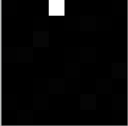

## 思维导图


## 图像的基本表示方法

1.二值图像

二值图像是指仅仅包含黑白两种颜色的图像


2.灰度图像

通常，计算机会将灰度处理为256个灰度级，区间[0,255]


3.彩色图像

通过R通道、G通道、B通道三个通道组成


## 像素处理

1.二值图像及灰色图像

OpenCV中，最小的数据类型是无符号的8位数。二值通常用0表示黑色，使用255表示白色。

```py
import cv2
import numpy as np
img = np.zeros((8,8),dtype=np.uint8)
# 修改第一行第三个像素为白色
img[0,3]=255
print(img)
cv2.imwrite('img.jpg',img)
```

```py
[[  0   0   0 255   0   0   0   0]
 [  0   0   0   0   0   0   0   0]
 [  0   0   0   0   0   0   0   0]
 [  0   0   0   0   0   0   0   0]
 [  0   0   0   0   0   0   0   0]
 [  0   0   0   0   0   0   0   0]
 [  0   0   0   0   0   0   0   0]
 [  0   0   0   0   0   0   0   0]]
```



2.彩色图像

彩色图像有三个通道B通道、G通道、R通道

* 第一个索引表示第0行
* 第二个索引表示第0列
* 第三个索引表示第0个颜色通道

```py
import cv2
import numpy as np
img = np.zeros((4,4,3),dtype=np.uint8)
# 蓝色 :所有行 0 第一列 0 第一个通道--B通道
img[:,0,0]=255
# 绿色 1 第二个通道--B通道
img[:,1,1]=255
# 红色 2 第三个通道--R通道
img[:,2,2]=255
print(img)
cv2.imwrite('img.png',img)
```

```py
[[[255   0   0]
  [  0 255   0]
  [  0   0 255]
  [  0   0   0]]

 [[255   0   0]
  [  0 255   0]
  [  0   0 255]
  [  0   0   0]]

 [[255   0   0]
  [  0 255   0]
  [  0   0 255]
  [  0   0   0]]

 [[255   0   0]
  [  0 255   0]
  [  0   0 255]
  [  0   0   0]]]
```


## 访问像素

numpy.array提供item()和itemset()函数来访问和修改像素值，速度比使用索引要快

1.二值图像及灰度图像

```py
# 访问图像像素点
item(行,列)
# 设置图像像素点
itemset(索引值,新值)
```

示例一

```py
import cv2
import numpy as np
# 随机生成10-99，大小为5*5的二维数组
img=np.random.randint(10,99,size=[5,5],dtype=np.uint8)

# 读取像素点,读取4行的第3像素的值
img.item(3,2)
# 设置像素点
img.itemset((3,2),255)
print(img)
```

输出

```py
[[ 82  19  28  13  49]
 [ 16  87  97  19  65]
 [ 23  58  98  18  52]
 [ 34  49 255  71  24]
 [ 12  89  63  33  98]]
```

2.彩色图像

```py
# 读取像素
item(行,列,通道)
# 设置像素
itemset(三元组索引值,新值)
```

示例一

```py
import cv2
import numpy as np
img=np.random.randint(10,99,size=[2,4,3],dtype=np.uint8)

# 读取像素点,读取2行第3个像素B通道的值
img.item(1,2,0)
# 设置像素点
img.itemset((1,2,0),255)
print(img)
```

输出

```py
[[[ 94  25  18]
  [ 53  35  88]
  [ 85  30  76]
  [ 73  51  46]]

 [[ 86  24  91]
  [ 17  83  94]
  [255  35  93]
  [ 97  50  27]]]
```

## 感兴趣区域(ROI)

操作特定的区域(感兴趣区域)，图像中的黑色ROI可以表示img[200:400,200:400]


示例一

```py
import cv2
import numpy as np
img = np.zeros((16,16),dtype=np.uint8)
# 设置区域为白色
img[1:5,3:7] = 255
print(img)
```


颜色复制到右侧

```py
import cv2
import numpy as np
img = np.zeros((16,16),dtype=np.uint8)
# 设置区域为白色
img[1:5,3:7] = 255
# 复制像素
a = img[1:5,3:7]
img[1:5,8:12] = a
print(img)
cv2.imwrite('img.jpg',img)
```


## 通道操作

**2.5.1 通道拆分**

针对RGB图像，可以分别拆分出其R通道、G通道、B通道

1.通过索引拆分

```py
b = img[:,:,0]
g = img[:,:,1]
r = img[:,:,2]
```

2.通过函数拆分

```py
b,g,r = cv2.split(img)
```

**2.5.2 通道合并**

```py
bgr = cv2.merge([b,g,r])
```

## 获取图像属性

获取图像的属性，例如图像的大小、类型等

* shape: 彩色图像(包含行数、列数、通道数)，二值图像或灰度图像(包含行数、列数)
* size: 返回图像的像素数目。值为行x列x通道数
* dtype:返回图像的数据类型

```py
import cv2 
import numpy as np

img = cv2.imread('cat.jpg')
# 图像shape属性
print(img.shape)
# 图像size属性
print(img.size)
# 图像类型属性
print(img.dtype)
```

输出

```py
(484, 650, 3)
943800
uint8
```

