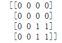

## 思维导图


## 图像加法运算

像素用8个比特来表示，像素值的范围是[0,255]。两个像素值在进行加法运算时，求得的和很可能超过255。

3.1.1加号运算符

使用加号运算符“+”对图像进行求和运算时，遵循一下规则,mod取余数


```py
import cv2 
import numpy as np

img1=np.random.randint(0,256,size=[3,3],dtype=np.uint8)
img2=np.random.randint(0,256,size=[3,3],dtype=np.uint8)
print(img1)
print(img2)
print(img1+img2)
```

   

```py
(157+143)%256 = 44
```

3.1.2 cv2.add()函数

```py
计算结果 = cv2.add(像素a,像素b)
```


```py
import cv2 
import numpy as np

img1=np.random.randint(0,256,size=[3,3],dtype=np.uint8)
img2=np.random.randint(0,256,size=[3,3],dtype=np.uint8)
print(img1)
print(img2)
print(cv2.add(img1,img2))
```

  

```py
(178 + 208 ) > 255 结果为 255
```

## 图像加权和

所谓图像加权和，就是在计算两幅图像的像素值之和时，将每幅图像的权重考虑进来，可以用公式表示为

dst=saturate（src1×α+src2×β+γ）

* saturate（）表示取饱和值(**最大值**)
* src1和src2必须大小、类型相同

OpenCV中提供了函数cv2.addWeighted()来实现图像的加权和（混合、融合），该函数的语法格式为：

```py
dst=cv2.addWeighted(src1,alpha,src2,beta,gamma)
```

该函数实现的功能是dst = src1*alpha +* src2*beta + gamma。可以理解为"结果图像 = 图像* x 系数1 + 图像2 x 系数2 + 亮度调节"

```py
import cv2 
import numpy as np
# 生成3*4大小元素都是100的灰度图
img1 = np.ones((3,4),dtype=np.uint8)*100
# 生成3*4大小元素都是10的灰度图
img2 = np.ones((3,4),dtype=np.uint8)*10
# 亮度参数
gamma = 3
# 加权相加
img3 = cv2.addWeighted(img1,0.6,img2,5,gamma)

print(img3)
```


```py
100*0.6 + 10*5 + 3 = 113
```

## 按位逻辑运算

常见的位运算


3.3.1按位与运算

* dst表示运算后的结果输出
* src2表示第一个图像
* src2表示第二个图像
* mask表示可选操作掩码

```py
dst = cv2.bitwise_and(src1,src2[,mask])
```


其他位运算

```py
# 按位或
dst = cv2.bitwise_or(src1,src2[,mask])
# 按位非
dst = cv2.bitwise_not(src1,src2[,mask])
# 按位异或
dst = cv2.bitwise_xor(src1,src2[,mask])
```

## 掩模

当使用掩模参数时，操作只会在掩模值为空的像素点上执行，并将其他像素点的值置为0

```py
计算结果=cv2.add(参数1，参数2，掩模)
```

示例一

```py
import cv2
import numpy as np
# 图片1
img1=np.ones((4,4),dtype=np.uint8)*3
# 图片2
img2=np.ones((4,4),dtype=np.uint8)*5
# 掩模
mask=np.zeros((4,4),dtype=np.uint8)
mask[2:4,2:4]=1
# 图片3
img3=cv2.add(img1,img2,mask=mask)

print(img1)
print(img2)
print(mask)
print(img3)
```

   

## 图像与数值的运算

一副图像与一个数值相加，会给振幅图像加上的每一个像素加上同一个值

示例一

```py
import cv2
import numpy as np
img1=np.ones((4,4),dtype=np.uint8)*3

img2 = cv2.add(img1,5)
print(img1)
print(img2)
```

 

## 位平面分解

将灰度图像中处于同一比特上的二进制像素值进行组合，得到一副二进制图像，该图像被称为灰度图像的一个位平面，这个过程被称为位平面分解。

**示例一**

一幅灰度图的像素数


分解为二进制为

```py
209 = 1*2^7 + 1*2^6 + 0*2^5 + 1*2^4 + 0*2^3 + 0*2^2 + 0*2^1 1*2^0   即 1101 0001
```


分解为8个位平面图(从低到高)


从e到a第一个组成第一个像素。h的权重为7权重最高对图像影响最高，a的权重最低为0对图像影响最新

## 图像的加密与解密

通过按位异或运算可以实现图像的加密和解密


根据上述规则，假设：

```py
xor(a,b)=c
```

则可以得到

```py
xor(a,b)=====xor(0,1)=1
xor(c,b)=====xor(1,1)=0
xor(c,a)=====xor(1,0)=1
##########
xor(c,b)=a
xor(c,a)=b
```

按位运算示例过程


* a 明文
* b 密钥
* c 密文，xor(a,b)实现

加密解密过程

* 加密 xor(a,b)
* 解密xor(c,b)

## 数字水印

最低有效位指的是一个二进制中的第0位(即最低有效位)。

作用：信息隐藏、版权认证、身份认证等功能

建立水印步骤

1. 载入图像预处理
2. 建立提取矩阵
3. 载体图像最低位有效位置零
4. 水印图像处理
5. 嵌入水印

水印提前过程

1. 含水印图像处理
2. 建立提取矩阵
3. 提取水印信息
4. 计算删除水印后的载体图像
5. 显示图像