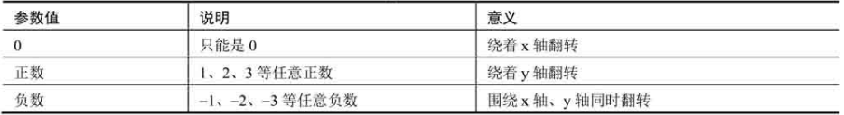
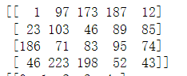

## 思维导图


## 缩放

OpenCV中，使用函数cv2.resize()实现图像缩放

```py
dst = cv2.resize(src,dsize[,fx[,fy[,interpolation]]])
```

* dst 输出的图像
* src 原始图像
* dsize 输出图像大小
* fx 水平方向缩放比例
* fy 垂直方向缩放比例
* interpolation代表插值方式

图像的大小可以通过**dsize**或**fx和fy**二者之一来指定

示例一

dsize中第一个值是列数，第二个值是行数

```py
# 通过 dsize改变
import cv2
import numpy as np
img=cv2.imread("cat.jpg")
rows,cols=img.shape[:2]
size=(int(cols*0.9),int(rows*0.5))

rst = cv2.resize(img,size)
print(img.shape)
print(rst.shape)
```

结果

```py
(484, 650, 3)
(242, 585, 3)
```

分析

```py
列数 650*0.9 = 585
行数 484*0.5 = 242
```

示例二

```py
# 通过 fx和fy
import cv2
import numpy as np
img=cv2.imread("cat.jpg")

rst = cv2.resize(img,None,fx=2,fy=0.5)
print(img.shape)
print(rst.shape)
```

结果

```py
(484, 650, 3)
(242, 1300, 3)
```

分析

```py
fx 水平方向变成2倍     650*2 = 1300
fy 垂直方向变成0.6倍   484*0.5 = 242
```

## 翻转

在OpenCV中，图像的翻转采用函数cv2.flip()实现，该函数能够实现图像在水平方向翻转、垂直方向翻转、两个方向同时翻转

```py
dst = cv2.flip( src, flipCode )
```

* dst 目标图像
* src 原始图像
* flipCode代表旋转类型



```py
import cv2
import numpy as np
img=cv2.imread("lena.jpg")

x=cv2.flip(img,0)
y=cv2.flip(img,1)
xy=cv2.flip(img,-1)
cv2.imshow("img",img)
cv2.imshow("x",x)
cv2.imshow("y",y)
cv2.imshow("xy",xy)
```


## 仿射

仿射变换是指图像可以通过一系列的几何变换来实现平移、旋转等多种操作。


**5.3.1 平移**

将原始图像src向右移动100个像素、向下移动200个像素

dst(x,y) = src(x+100,y+200)

将公式补充完整


矩阵M对应的值为

* M11 = 1
* M12 = 0
* M13 = 100
* M21 = 0
* M22 = 1
* M23 = 200

将上述值代入转换矩阵M，得到


程序实现

```py
import cv2
import numpy as np
img=cv2.imread("cat.jpg")
height,width=img.shape[:2]
x=100
y=200
# 转换矩阵
M = np.float32([[1,0,x],[0,1,y]])
move=cv2.warpAffine(img,M,(width,height))
```

**5.3.2旋转**

可以通过函数cv2.getRotationMatrix2D()获取**转换矩阵**

```py
retval = cv2.getRotationMatrix2D(center,angle,scale)
```

* center 旋转的中心点
* angle 旋转的角度（正数表示逆时针旋转，负数表示顺时针旋转）
* scale 为变换尺度（缩放大小）

程序实现

```py
import cv2
import numpy as np
img=cv2.imread("cat.jpg")
height,width=img.shape[:2]
# 中心为宽度1/2,高度1/2
# 旋转45度
# 缩小0.6倍
M = cv2.getRotationMatrix2D((width/2,height/2),45,0.6)

rotate=cv2.warpAffine(img,M,(width,height))
```

**5.3.3 更复杂的仿射变换**

OpenCV提供了函数cv2.getAffineTransform()来生成仿射函数

```py
retval = cv2.getAffineTransform(src,dst)
```

* src 代表输入图像的三个点的坐标
* dst 代表输出图像的三个点的坐标

程序实现

```py
import cv2
import numpy as np
img=cv2.imread("cat.jpg")
rows,cols,ch=img.shape
# 输入图像3个点
p1=np.float32([[0,0],[cols-1,0],[0,rows-1]])
# 输出图像3个点
p2=np.float32([[0,rows*0.33],[cols*0.85,rows*0.25],[cols*0.15,rows*0.17]])
# 转换矩阵
M = cv2.getAffineTransform(p1,p2)
# 转换
dst=cv2.warpAffine(img,M,(width,height))
```

## 透视

仿射可以将矩形映射为任意平行四边形，**透视变换则可以将矩形映射为任意四边形**

```py
dst = cv2.warpPerspective(src,M,dsize[,flags[,borderMode[,borderValue]]])
```

* dst 透视处理后的图像。dsize决定输出图像的实际大小
* src 原始图像
* M代表一个3x3的变换矩阵
* dsize 图像尺寸大小
* flags 代表插值方法
* borderMode 代表边类型
* borderValue 代表边界值，默认0

生成转换矩阵

```py
retval = cv2.getPerspectiveTransform( src,dst )
```

* src 表示输入图像的四个顶点坐标
* dst 表示输出图像的四个顶点坐标

程序设计

```py
import cv2
import numpy as np
img=cv2.imread("cat.jpg")
rows,cols,ch=img.shape
# 输入图像3个点
pts1=np.float32([[150,59],[400,50],[60,450],[310,450]])
# 输出图像3个点
pts2=np.float32([[50,50],[rows-50,50],[50,cols-50],[rows-50,cols-50]])
# 转换矩阵
M = cv2.getPerspectiveTransform(pts1,pts2)
# 转换
dst=cv2.warpPerspective(img,M,(cols,rows))
```


## 重映射

把一幅图内的像素点放置到另外一副图像内的指定位置，这个过程称为重映射。

```py
dst = cv2.remap(src,map1,map2,interpolation[,borderModel,[,borderValue])
```

* dst 代表目标图像，它和src具有相同的大小和类型
* src 原始图像
* map参数有两种可能的值：
  * 表示(x,y)点的一个映射。
  * 表示CV_16SC2,CV_32FC1,CV_32FC2类型(x,y)点的值

* Interpolation代表插值方式。
* borderModel代表边界模式。当该值为BORDER_TRANSPARENT时，表示目标图像内的对应源图像内奇异点(outliers)的像素不会被修改。
* borderValue代表边界值，该值默认为0

**5.5.2 复制**

将对应的x,y点进行复制

```py
import cv2
import numpy as np
img=np.random.randint(0,256,size=[4,5],dtype=np.uint8)

rows,cols = img.shape

# cols
mapx = np.zeros(img.shape,np.float32)
# row
mapy = np.zeros(img.shape,np.float32)

for i in range(rows):
    for j in range(cols):
        mapx.itemset((i,j),j)
        mapy.itemset((i,j),i)
# 复制
rst = cv2.remap(img,mapx,mapy,cv2.INTER_LINEAR)

print(img)
print(mapx)
print(mapy)
print(rst)
```

   

分析

```py
y的0,x的[0-9]   [0][0] [0][1] ....
```

**5.5.3 绕x轴旋转**

* x轴坐标保持不变（map1保持不变）
* y轴坐标的值以x轴为对称交换(map2 = 总行数-1-当前行数)

```py
import cv2
import numpy as np
img=np.random.randint(0,256,size=[4,5],dtype=np.uint8)

rows,cols = img.shape

# cols
mapx = np.zeros(img.shape,np.float32)
# row
mapy = np.zeros(img.shape,np.float32)

for i in range(rows):
    for j in range(cols):
        mapx.itemset((i,j),j)
        mapy.itemset((i,j),rows-1-i)
# 复制
rst = cv2.remap(img,mapx,mapy,cv2.INTER_LINEAR)

print(img)
print(mapx)
print(mapy)
print(rst)
```

   

关键代码

```py
mapy.itemset((i,j),rows-1-i)
```

5.5.4 绕y轴旋转

* y轴坐标轴的值保持不变(map2保持不变)
* x坐标轴的值以y轴为对称轴进行交换(map1的值调整为  总列数-1-当前列号)

```py
import cv2
import numpy as np
img=np.random.randint(0,256,size=[4,5],dtype=np.uint8)

rows,cols = img.shape

# cols
mapx = np.zeros(img.shape,np.float32)
# row
mapy = np.zeros(img.shape,np.float32)

for i in range(rows):
    for j in range(cols):
        mapx.itemset((i,j),cols-1-j)
        mapy.itemset((i,j),i)
# 复制
rst = cv2.remap(img,mapx,mapy,cv2.INTER_LINEAR)

print(img)
print(mapx)
print(mapy)
print(rst)
```

   

关键代码

```py
mapx.itemset((i,j),cols-1-j)
```

**5.5.7 图像缩放**

* 在目标图像的x轴(0.25×X轴长度，0.75×X轴长度）区间内生成缩小图像；x轴其余区域的点取样自x轴上任意一点的值。
  解释
* 在目标图像的x轴(0.25×Y轴长度，0.75×Y轴长度）区间内生成缩小图像；y轴其余区域的点取样自x轴上任意一点的值。

```py
import cv2
import numpy as np

img = cv2.imread("cat.jpg")
rows,cols=img.shape[:2]
mapx = np.zeros(img.shape[:2],np.float32)
mapy = np.zeros(img.shape[:2],np.float32)

for i in range(rows):
    for j in range(cols):
        if 0.25*cols<i<0.75*cols and 0.25*rows<j<0.75*rows:
            mapx.itemset((i,j),2*(j-cols*0.25)+0.5)
            mapx.itemset((i,j),2*(i-rows*0.25)+0.5)
        else:
                mapx.itemset((i,j),0)
                mapy.itemset((i,j),0)
rst = cv2.remap(img,mapx,mapy,cv2.INTER_LINEAR)
cv2.imshow("original",img)
cv2.imshow("result",rst)
```


