## 思维导图

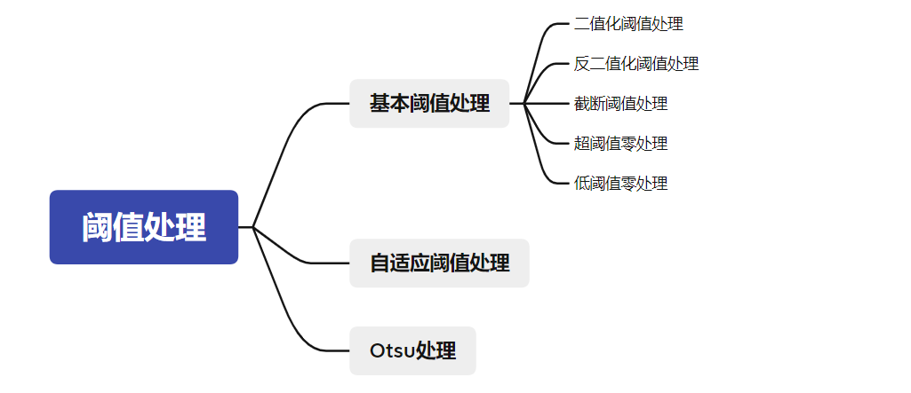

**阈值处理**是剔除图像内像素高于一定值或低于一定值的像素点。

阈值：中间的零界点

## threshold函数

阈值化处理函数

```py
retval, dst = cv2.threshold( src,thresh, maxval, type)
```

* retval 返回的阈值
* dst 阈值处理后的结果图像
* src 原始图像
* thresh 要设定的阈值
* maxval  当type为THRESH_BINARY或者THRESH_BINARY_INV类型时，需要设定的最大值。
* type 阈值的分割类型

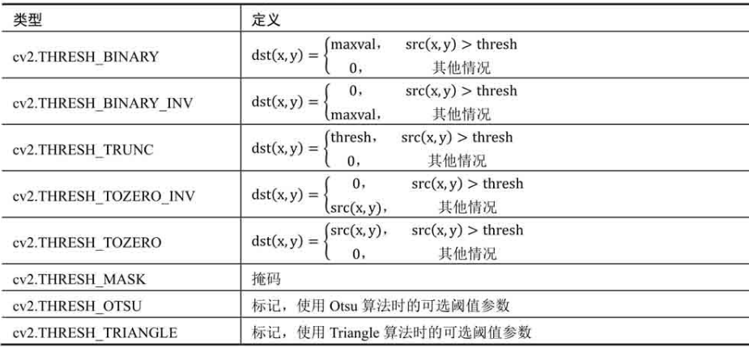

阈值分割可视化

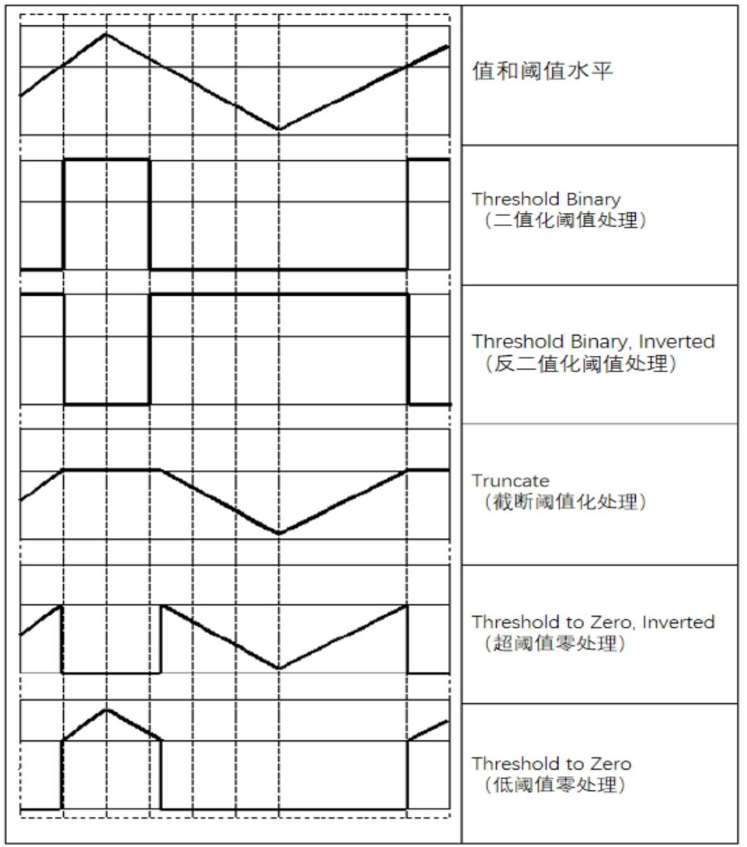

### **6.1.1 二值化阈值处理**

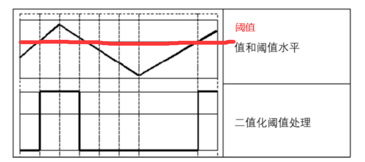

* 对于灰度值大于阈值thresh的像素点，将其灰度值设定为最大值。
* 对于灰度值小于或等于阈值thresh的像素点，将其灰度值设定为0。

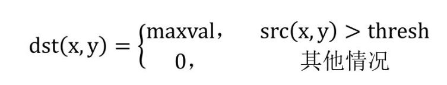

假定阈值为127，大于127的像素点会被处理为255，其余值会被处理为0

示例

```py
import cv2
import numpy as np
img = np.random.randint(0,256,size=[4,5],dtype=np.uint8)

# 阈值处理
# 阈值127，超过127输出255,否则为0
t,rst=cv2.threshold(img,127,255,cv2.THRESH_BINARY)

print(img)
print(rst)
```

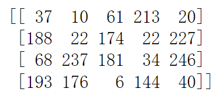 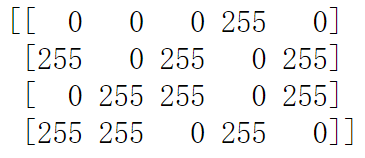

### **6.1.2 反二值化处理**

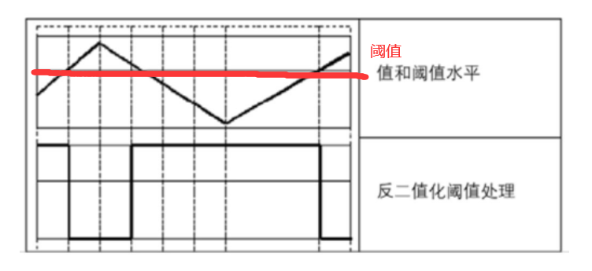

* 对于灰度值大于阈值的像素点，将其值设定为0
* 对于灰度值小于阈值的像素点，将其值设定为255

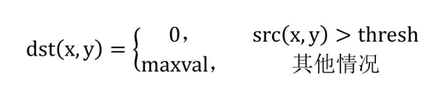

示例

```py
import cv2
import numpy as np
img = np.random.randint(0,256,size=[4,5],dtype=np.uint8)

# 阈值处理
# 阈值127，超过127输出0
t,rst=cv2.threshold(img,127,255,cv2.THRESH_BINARY_INV)

print(img)
print(rst)
```

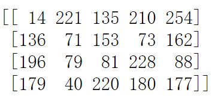 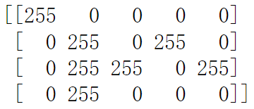

### **6.1.3 截断阈值化处理**

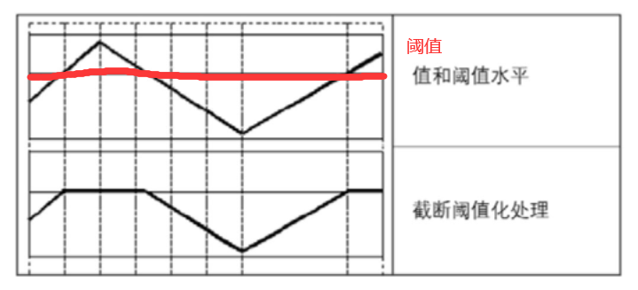

* 对于像素点大于127的像素点，其像素值设定为127
* 对于像素点小于127的像素点，其像素值保持不变

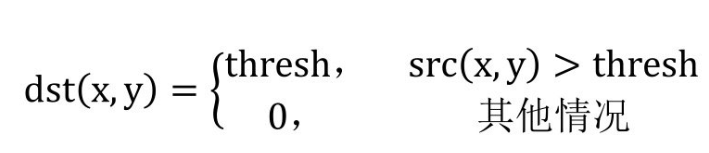

示例

```py
import cv2
import numpy as np
img = np.random.randint(0,256,size=[4,5],dtype=np.uint8)

# 阈值处理
# 阈值127，超过127输出127,否则不变
t,rst=cv2.threshold(img,127,255,cv2.THRESH_TRUNC)

print(img)
print(rst)
```

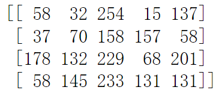 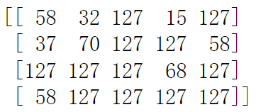

### **6.1.4 超阈值零处理**

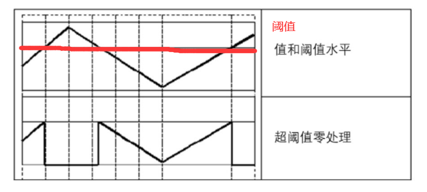

* 对于像素大于127的像素点，其值被设定为0
* 对于像素值小于127的像素点，其值保持不变

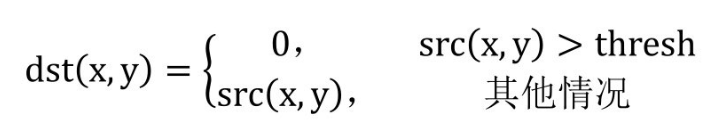

示例代码

```py
import cv2
import numpy as np
img = np.random.randint(0,256,size=[4,5],dtype=np.uint8)

# 阈值处理
# 阈值127，超过127输出0,否则不变
t,rst=cv2.threshold(img,127,255,cv2.THRESH_TOZERO_INV)

print(img)
print(rst)
```

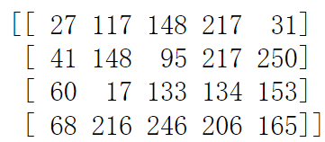 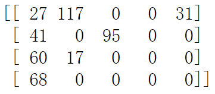

### **6.1.5 低阈值零处理**

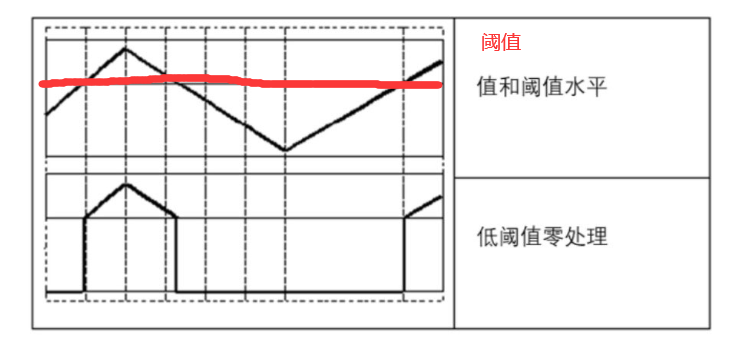

* 对于像素值大于127的像素点，其像素值将保持改变。
* 对于像素值小于或等于127的像素点，其像素值将被设定为0。

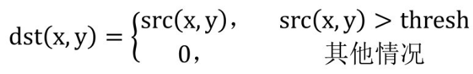

示例

```py
import cv2
import numpy as np
img = np.random.randint(0,256,size=[4,5],dtype=np.uint8)

# 阈值处理
# 阈值127，低于127输出0,否则不变
t,rst=cv2.threshold(img,127,255,cv2.THRESH_TOZERO)

print(img)
print(rst)
```

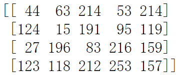 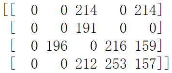

## 自适应阈值处理

自适应阈值处理的方式通过计算每个像素点周围临近区域的**加权平均值获得阈值**

```py
dst = cv.adaptiveThreshold(src,maxValue,adaptiveMethod,thresholdType,blockSize,C)
```

* dst 处理结果
* src 原始图像
* maxValue 最大值
* adaptiveMethod 代表适应的方法
* thresholdType 代表阈值处理方式,值必须是THRESH_BINARY或者THRESH_BINARY_INV中的一个
* blockSize代表块大小，通常为3 5 7 等
* C 是常量

adaptiveMethod 阈值计算方法

* ADAPTIVE_THRESH_MEAN_C 临近所有像素点的权重值是一致的
* ADAPTIVE_THRESH_GRUS_SIAN_C 临域各个像素点到中心的距离有关，通过高斯方程得到各个点的权重值。

示例代码

```py
import cv2
import numpy as np
img = cv2.imread("cat.jpg",0)
# 二值化域
t1,thd = cv2.threshold(img,127,255,cv2.THRESH_BINARY)

# 临近权重一致
athdMEAN=cv2.adaptiveThreshold(img,255,cv2.ADAPTIVE_THRESH_MEAN_C,cv2.THRESH_BINARY,5,3)
# 高斯方程权重值
athdGAUS=cv2.adaptiveThreshold(img,255,cv2.ADAPTIVE_THRESH_GAUSSIAN_C,cv2.THRESH_BINARY,5,3)

cv2.imshow("img",img)
cv2.imshow("thd",thd)
cv2.imshow("athdMEAN",athdMEAN)
cv2.imshow("athdGAUS",athdGAUS)

cv2.waitKey(0)
cv2.destroyAllWindows()
```

效果

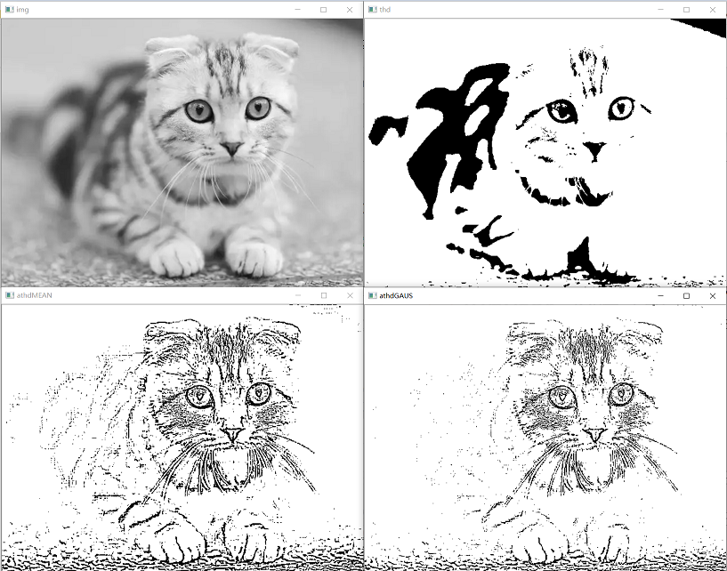

## Otsu 处理

通常情况下处理的图像都是色彩均衡的，这时直接将阈值设为127是比较合适的。

但是，有时图像灰度级的分布时不均衡的，如果此时还将阈值设置为127，那么阈值处理的结果就是失败的。

注意：在使用Otsu方法时，要把阈值设为0.

```py
t,otsu = cv2.threshold(img,0,255,cv2.THRESH_BINARY+cv2.THRESH_OTSU)
```

* 参数type 增加一个参数值cv2.THRESH_OTSU
* 设定的阈值为0
* 返回值t是Otsu方法计算得到使用的最优阈值。

示例

```py
import cv2
import numpy as np

img = np.zeros((5,5),dtype=np.uint8)
img[0:6,0:6]=123
img[2:6,2:6]=126

# 二值处理
t1,thd = cv2.threshold(img,127,255,cv2.THRESH_BINARY)

# otsu处理
t2,otsu = cv2.threshold(img,0,255,cv2.THRESH_BINARY+cv2.THRESH_OTSU)

print(img)
print(thd)
print(otsu)
```

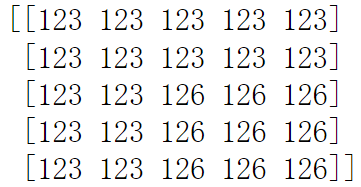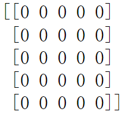 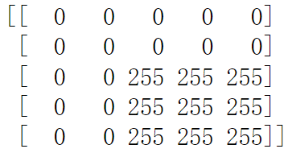