## 思维导图

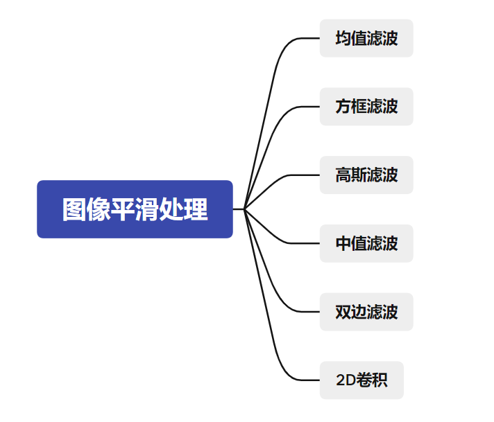

## 均值滤波

均值滤波是指用当前像素点周围N*N个像素值的均值来代替当前像素值。

取3X3区域内所有像素点平均值。

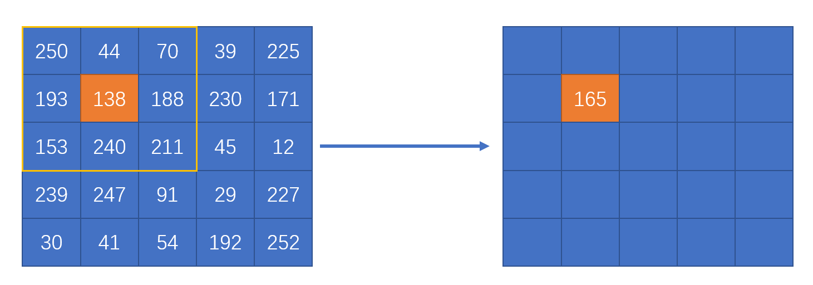

计算新值 [(250+44+70)+(193+138+188)+(153+240+211)] / 9 = 165.22

依次计算其他的值得到

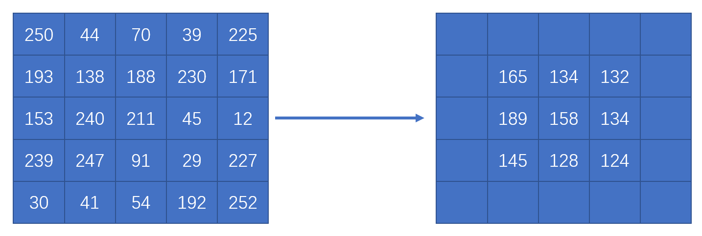

对于边缘的像素可以采用多种方式默认是BORDER_DEFAULT

对像素进行补齐，然后求值

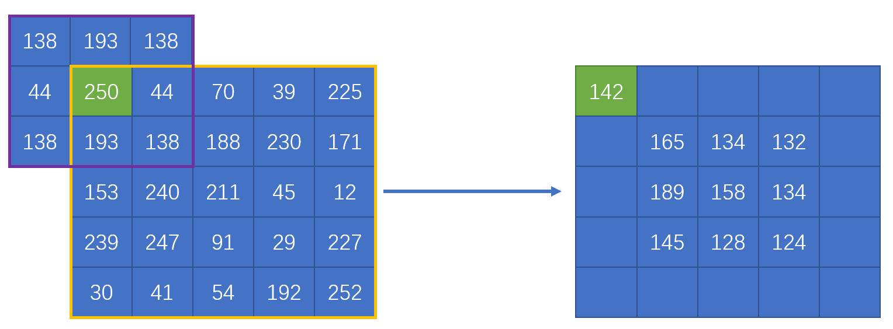

计算新值 [(138+193+138)+(44+250+44)+(138+193+138)]/9 = 141.77

依次计算其他的值得到

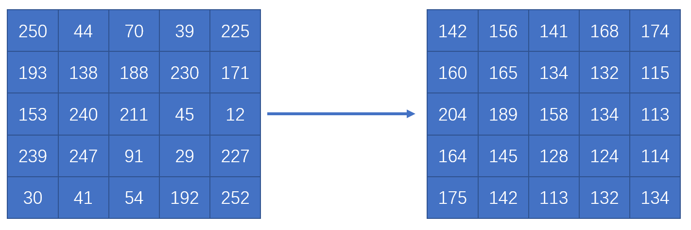

```py
dst = cv2.blur(src,ksize,anchor,borderType)
```

* dst 返回值，均值滤波后的结果
* src 原始图像数据
* ksize 滤波核的大小
* anchor 锚点
* borderType 边界样式，决定了以何种方式处理边界

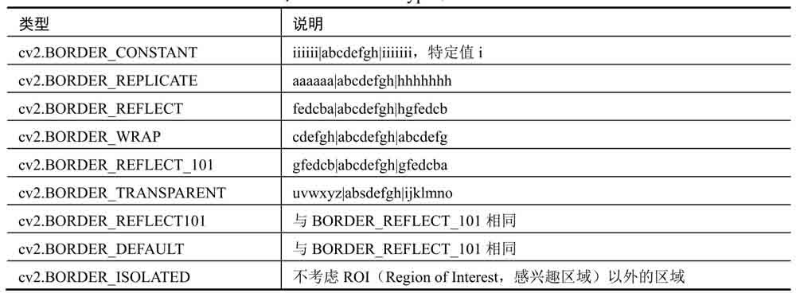

程序示例

```py
import cv2
import numpy as np
o = np.random.randint(0,256,size=[5,5],dtype=np.uint8)

# 滤波后的值
r=cv2.blur(o,(3,3))

print(o)
print(r)
```

## 方框滤波

如果计算的是**领域像素值的均值**(相当于均值滤波，及**归一化处理**)，如果是计算的是领域像素之和(及**不归一化处理**)

```py
dst = cv2.boxFilter(src,ddepth,ksize,anchor,normalize,borderType)
```

* dst 返回值，方框滤波处理后的结果
* src 原始图像
* ddepth 图像深度，**一般使用-1** 表示与原图像使用相同的图像深度
* ksize 滤波核的大小
* anchor 锚点
* normalize 表示是否归一化(默认为1，及归一化)

**7.2.1 归一化处理**

对滤波核内的所有像素求**平均值**


示例

```py
import cv2
import numpy as np
o = np.random.randint(0,256,size=[5,5],dtype=np.uint8)

# 方框滤波 归一化处理
r=cv2.boxFilter(o,-1,(3,3))

print(o)
print(r)
```

**7.2.2 不归一化处理**

对滤波核内的所有像素**求和**，大于255取255

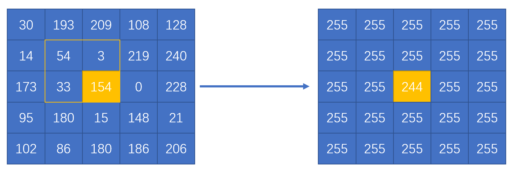

计算新值 [(54+3)+(33+154)] = 244

示例

```py
import cv2
import numpy as np
o = np.random.randint(0,256,size=[5,5],dtype=np.uint8)

# 方框滤波 不使用归一化
r=cv2.boxFilter(o,-1,(3,3),normalize=0)

print(o)
print(r)
```

## 高斯滤波

在高斯滤波中，会将**中心点的权重值加大**，**远离中心点的权重减少**，在此基础上计算各个领域内各个**像素值的和**。

3X3的高斯滤波卷积核

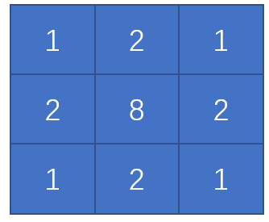

算出每个值得比例

sum = 1 + 2 + 1 + 2 + 8 + 2 + 1 + 2 + 1 = 20

分别求值 1/20  = 0.05   2/20 = 0.1  8/20 = 0.4

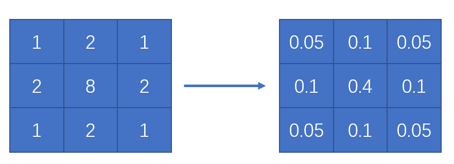

实际运用

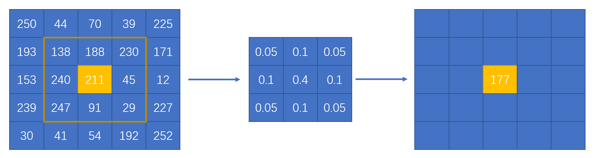

计算新值 [(138 x 0.05+188 x 0.1 + 230 x 0.05)+(240 x 0.1+211 x 0.4 + 45 x 0.1)+(247 x 0.05+91 x 0.1 + 29 x 0.05)] = 177

**函数语法**

```py
dst = cv2.GaussianBlur(src,ksize,sigmaX,sigmaY,borderType)
```

* dst 返回值，高斯滤波处理后得值
* src 原始图像
* ksize 滤波核大小
* sigmaX 卷积核在水平方向上(X轴方向)得标准差，其控制得是权重比例。
* borderType 边界样式

示例

```py
import cv2
import numpy as np
o = np.random.randint(0,256,size=[5,5],dtype=np.uint8)

# 高斯滤波
r=cv2.GaussianBlur(o,(3,3),0,0)

print(o)
print(r)
```

## 中值滤波

它用领域内所有像素值的**中间值**来替代当前像素点的像素值

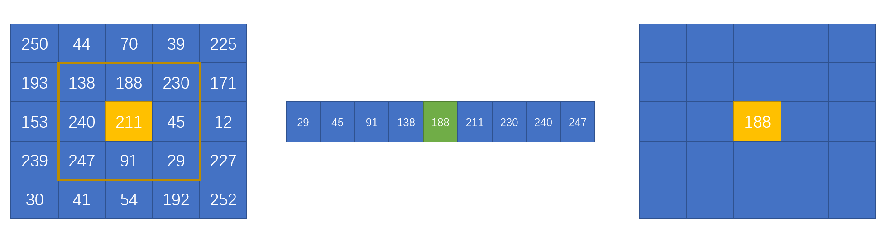

函数语法

```py
dst = cv2.medianBlur(src,ksize)
```

* dst 返回值，中值滤波处理的结果
* src 需要处理的图像
* ksize 滤波核的大小，**核大小必须是比1大的奇数，如3,5,7**

示例

```py
import cv2
import numpy as np
o = np.random.randint(0,256,size=[5,5],dtype=np.uint8)

# 中值滤波
r=cv2.medianBlur(o,3)

print(o)
print(r)
```

## 双边滤波

双边滤波是综合考虑**空间信息**和**色彩信息**的滤波方式，在滤波过程中能够有效的保护图像内的**边缘信息**。

函数语法

```py
dst = cv2.bilateralFilter(src,d,sigmaColor,sigmaSpace,borderType)
```

* dst 返回值，双边滤波后得到的处理结果
* src 原图像
* d 滤波时选取的空间距离参数
* sigmaColor是滤波处理时选取的颜色差值范围，该值决定了周围那些像素点能够参与到滤波中来。255时都能参与运算。
* sigmaSpace是坐标空间中的sigma值。它的值越大，说明有越多的点能够参与到滤波计算中来。
* borderType 边界样式

示例

```py
import cv2
import numpy as np
o = np.random.randint(0,256,size=[5,5],dtype=np.uint8)

# 双边滤波
r=cv2.bilateralFilter(o,55,100,100)

print(o)
print(r)
```

## 2D卷积

我们希望使用特定的卷积核实现卷积操作

操作函数

```py
dst = cv2.filter2D(src,ddepth,kernel,anchor,delta,borderType)
```

* dst 返回值
* src 原始图像
* ddeptch 处理结果图像的图像深度
* kernel 是卷积核
* anchor 锚点
* delta 修正值，它是可选项。如果该值存在，会在基础滤波的结果上加上该值作为最终滤波的结果
* borderType 边界样式

示例:

构建一个均值滤波卷积核

```py
import cv2
import numpy as np

o = np.random.randint(0,256,size=[5,5],dtype=np.uint8)
# 卷积核
kernal = np.ones((9,9),np.float32)/81

# 2D卷积
r=cv2.filter2D(o,-1,kernal)
print(o)
print(r)
```