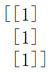
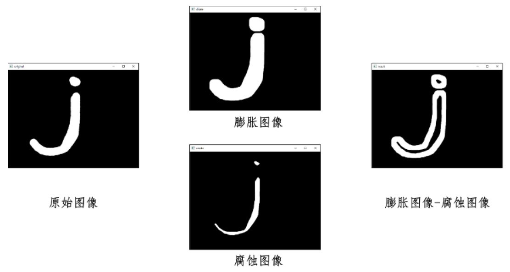
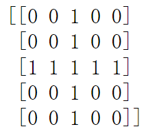

形态学主要从图像内**提取分量信息**，该分量信息通常对于表达式和描绘图像的形状具有重要意义，通常是图像理解时所使用的**最本质的形状特征**。

## 思维导图


## 腐蚀

腐蚀是最基本的形态学操作之一，它能够将图像的**边界点消除**，使图像沿着边界向内收缩，也可以**将小于指定结构体元素的部分去除**。

* 当**核**完全在前景图像中时值为1，否则值为0


对于原始图像，黄色框对应的点进行腐蚀操作，通过**核**(腐蚀结构)处理。核需要完全在**前景图像**(值为1的区域)中结果才为1，因为对于黄色框对应的核有一个不在**前景图像**中，所以**值为0**。


此图中，黄色框对应的**核**完全在前景图像中，所以**值为1**

依次腐蚀处理后的结果如下。


腐蚀操作语法

```py
dst = cv2.erode(src,kernel[,anchor[,iterations[,borderType[,borderValue]]]
```

* dst 腐蚀后的图像
* src 原始图像
* kernel 代表腐蚀操作时所采用的结构类型
* anchor 表示锚点的位置。该默认值为(-1,-1)在**核的中心位置**。
* iterations 腐蚀操作迭代次数(腐蚀次数)，默认值为1(腐蚀一次)
* borderType 表示边界样式
* borderValue 边界值

示例

```py
import cv2
import numpy as np

img = np.zeros((5,5),np.uint8)
img[1:5,1:5]=1

# 腐蚀结构
kernel = np.ones((3,1),np.uint8)
erosion = cv2.erode(img,kernel)

print(img)
print(kernel)
print(erosion)
```

  

## 膨胀

膨胀操作能对图像的**边界进行扩张**。膨胀操作将与**当前对象(前景)接触到的背景带点合并到当前对象内**，从而实现将图像的边界点向外扩展。


对于原始图像，黄色框对应的点进行膨胀操作，通过**核**(膨胀结构)处理。核需**只要有一个点**在**前景图像**(值为1的区域)中结果则为1，否则为0，因为对于**黄色框对应的核**有一个点在**前景图像**中，所以**值为1**。


此图中，**核中没有点在前景图像中**，所以值为0

依次膨胀操作处理后


膨胀操作语法

```py
dst = cv2.dilate(src,kernel[,anchor[,iterations[,borderType[,borderValue]]]
```

* dst 膨胀后的图像
* src 原始图像
* kernel 膨胀操作采用的结构类型

示例

```py
import cv2
import numpy as np

img = np.zeros((5,5),np.uint8)
img[2:3,1:4]=1

# 膨胀结构
kernel = np.ones((3,1),np.uint8)
dilate = cv2.dilate(img,kernel)

print(img)
print(kernel)
print(dilate)
```

  

## 通用形态学函数

**腐蚀操作核膨胀操作时形态学运算的基础**，将腐蚀核膨胀操作进行组合，就可以实现开运算、闭运算、形态学梯度运算、礼貌运算、黑帽运算、击中击不中等不同形式的运算。

运算函数

```py
dst = cv2.morphologyEx(src,op,kernel[,anchor[,iterations[,borderType[,borderValue]]]]])
```

* dst 表示经过形态学处理后所输出的目标图像
* src 原始图像
* op 代表操作类型


## 开运算

开运算进行的操作时先将图像腐蚀，再对图像的结果进行膨胀。开运算可以用于去噪、计数等。

1.去噪


2.计数(将连接的区域划分开来计数)


语法

```py
opening = cv2.morphologyEx(img,cv2.MORPH_OPEN,kernel)
```

示例

```py
import cv2
import numpy as np

img=cv2.imread("opening.bmp")

# 开运算结构
kernel = np.ones((10,10),np.uint8)
# 开运算
r = cv2.morphologyEx(img,cv2.MORPH_OPEN,kernel)
```

## 闭运算

闭运算是先膨胀、后腐蚀的运算，它有助于关闭前景物体内部的小孔，或**去除物体上的小黑点**，还可以将**不同的前景图像进行连接**。

1.去除小孔


2.前景图连接


语法

```py
closing = cv2.morphologyEx(img,cv2.MORPH_CLOSE,kernel)
```

示例

```py
import cv2
import numpy as np

img=cv2.imread("closing.bmp")

# 闭运算结构
kernel = np.ones((10,10),np.uint8)
# 闭运算3次
r = cv2.morphologyEx(img,cv2.MORPH_CLOSE,kernel,iterations=3)
```

## 形态学梯度运算

形态学梯度运算是用图像的**膨胀图像**减**腐蚀图像**的操作，该操作可以获取原始图像中**前景图像的边缘**。



语法

```py
result = cv2.morphologyEx(img,cv2.MORPH_GRADIENT,kernel)
```

示例

```py
import cv2
import numpy as np

img=cv2.imread("gradient.bmp")

# 梯度运算结构
kernel = np.ones((5,5),np.uint8)
# 梯度运算
r = cv2.morphologyEx(img,cv2.MORPH_GRADIENT,kernel)
```

## 礼帽运算

礼帽运算是用**原始图像**减去其**开运算图像**的操作。礼帽运算能够获取图像的**噪声信息**，或者得到比原始图像的**边缘更亮的边缘信息**。

1.噪声信息


2.边缘信息


语法

```py
result = cv2.morphologyEx(img,cv2.MORPH_TOPHAT,kernel)
```

示例

```py
import cv2
import numpy as np

img=cv2.imread("tophat.bmp")

# 礼帽运算结构
kernel = np.ones((5,5),np.uint8)
# 礼帽运算
r = cv2.morphologyEx(img,cv2.MORPH_TOPHAT,kernel)
```

## 黑帽运算

黑帽运算时用**闭运算图像**减去**原始图像**的操作。黑帽运算能够获取**图像内部的小孔**，或**前景中的小黑点**，或者得到**比原始图像的边缘(更暗)的边缘**部分。

1.内部的空，或小黑点


2.更暗的边缘信息


语法

```py
result = cv2.morphologyEx(img,cv2.MORPH_BLACKHAT,kernel)
```

示例

```py
import cv2
import numpy as np

img=cv2.imread("blackhat.bmp")

# 黑帽运算结构
kernel = np.ones((5,5),np.uint8)
# 黑帽运算
r = cv2.morphologyEx(img,cv2.MORPH_BLACKHAT,kernel)
```

## 核运算

在形态学操作时，必须定义一个特定的核(结构元)。该核可以自定义生成，也可以通过函数cv2.getStructuringElement()构造。函数cv2.getStructuringElement()能够构造并返回一个用于形态学处理所使用的结构元素。

语法

```py
retval = cv2.getStructuringElement(shape,ksize[,anchor])
```

* shape 代表形状类型
* ksize 代表结构元素大小
* anchor 代表结构元素中的锚点位置。默认(-1,-1)

shape 形状类型


示例

```py
import cv2

# 矩形结构
kernel1 = cv2.getStructuringElement(cv2.MORPH_RECT,(5,5))
# 十字结构
kernel2 = cv2.getStructuringElement(cv2.MORPH_CROSS,(5,5))
# 椭圆结构
kernel3 = cv2.getStructuringElement(cv2.MORPH_ELLIPSE,(5,5))

print(kernel1)
print(kernel2)
print(kernel3)
```

  