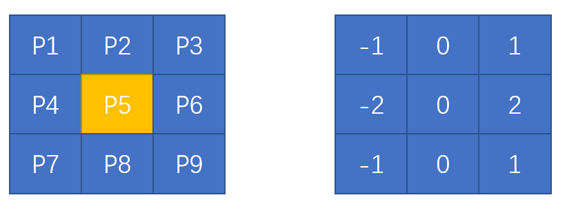

图像梯度计算的是**图像变化的速度**。对于图像的边缘部分，其灰度值变化较大，梯度值也较大；相反，对于图像中比较平滑的部分，其灰度值变化较小，相应的梯度值也较小。一般情况下，图像梯度计算的是**图像的边缘信息**。

## 思维导图


## Sobel理论基础

Sobel算子是一种离散的微分算子，该算子结合了高斯平滑核微分求导运算。

1.计算水平方向偏导数的近似值



如果要计算**P5**水平方向的偏导数,则只需将垂直方向的值乘以算子相加即可

**P5x = (P3-P1)+2(P6-P4)+(P9-P7)**

2.计算垂直方向偏导数的近似值


如果要计算P5水平方向的偏导值，则只需将水平方向的值乘以算子相加即可

**P5y = (P7-P1) + 2(P8-P2) + (P9-P3)**

## Sobel算子及函数使用

语法形式

```py
dst = cv2.Sobel(src,ddepth,dx,dy[,ksize[,scale[,delta[,borderType]]])
```

* dst 目标图像
* src 原始图像
* ddepth 图像的深度
* dx 代表x方向上的求导阶数
* dy 代表y方向上的求导阶数
* ksize 代表Sobel核的大小。该值为-1时，则会使用Scharr算子进行运算。
* scale 代表计算导数值时采用的缩放因子，默认1没有缩放
* delta 代表加在目标图像dst上的值，可选。默认0
* borderType 边界样式

**取绝对值**

```py
import cv2
import numpy as np
img = np.random.randint(-256,256,size=[4,5],dtype=np.int16)
rst=cv2.convertScaleAbs(img)

print(img)
print(rst)
```

 

**方向**

1. 计算x方向边缘(梯度)：dx=1,dy=0

```py
dst = cv2.Sobel(src,ddepth,1,0)
```


2. 计算y方向边缘(梯度) dx=0，dy=1

```py
dst = cv2.Sobel(src,ddepth,0,1)
```


3. 参数dx与参数dy的均值为1:dx=1,dy=1

```py
dst = cv2.Sobel(src,ddepth,1,1)
```

其中左图为原始图像，右图为获取的边缘图，仔细观察可以看到图中仅有若干个微小白点，每个点的大小为一个像素。


4.计算x方向和y方向的边缘叠加

```py
dx = cv2.Sobel(src,ddepth,1,0)
dy = cv2.Sobel(src,ddepth,0,1)
dst = cv2.addWeighted(src1,alpha,src2,beta,gamma)
```


示例1：深度ddepth设置为-1，参数dx和dy的值设置为dx=1,dy=0

```py
Sobelx = cv2.Sobel(img,-1,1,0)
```


分析：当参数ddepth的值为-1时，只得到了右边界，因为左边界在运算时得到了负值，其在显示时被调整为0，所以没有显示出来。要想获取左边界的值(将其显示出来)，必须将参数ddepth的值设置为更大范围的数据结构类型。

示例2：参数ddepth的值设置为cv2.CV_64F,并使用函数对运算结果取绝对值

```py
Sobelx = cv2.Sobel(o,cv2.CV_64F,1,0)
Sobelx = cv2.convertScaleAbs(Sobelx)
```


示例3：计算叠加信息

```py
Sobelx = cv2.Sobel(o,cv2.CV_64F,1,0)
Sobely = cv2.Sobel(o,cv2.CV_64F,0,1)
Sobelx = cv2.convertScaleAbs(Sobelx)
Sobely = cv2.convertScaleAbs(Sobely)
Sobelxy = cv2.addWeighted(Sobelx,0.5,Sobely,0.5,0)
```


## Scharr算子及函数使用

OpenCV提供了Scharr算子，该算子具有和Sobel算子同样的速度，且精度更高。


```1
dst = cv2.Scharr(src,ddepth,dx,dy[,scale[,delta[,borderType]]])
```

* dst代表输出图像。
* src代表原始图像。
* ddepth代表输出图像深度。该值与函数cv2.Sobel()中的参数ddepth的含义相同
* dx代表x方向上的导数阶数。
* dy代表y方向上的导数阶数。
* scale代表计算导数值时的缩放因子，该项是可选项，默认值是1，表示没有缩放。
* delta代表加到目标图像上的亮度值，该项是可选项，默认值为0。
* borderType代表边界样式。

## Sobel算子和Scharr算子的比较

Sobel算子的缺点是，当其核较小时，精确度不高，而Scharr算子具有更高的精度。


## Laplacian算子及函数使用

Laplacian(拉普拉斯)算子是一种二阶导数算子，其具有旋转不变性，可以满足不同方向的图像边缘锐化(边缘检测)的要求。通常情况下，其算子的系数之和需要为零。


Laplacian算子类似二阶Sobel导数，需要计算两个方向的梯度值


计算像素点P5的近似导数值

```1
P5lap = (P2 + P4 + P6 + P8) - 4*P5
```

函数语法格式

```1
dst = cv2.Laplacian(src,ddepth[,ksize[,scale[,delta[,borderType]]]])
```

* dst 目标图像
* src 原始图像
* ddepth 目标图像的深度
* ksize 二阶导数的核尺寸大小。该值必须是正的奇数。
* scale Laplacian值得缩放比例因子，该参数是可选得。默认情况下，该值为1
* delta 加到目标图像上得可选值，默认为0
* borderType代表边界样式
