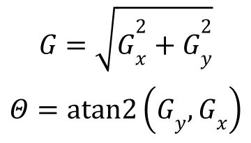
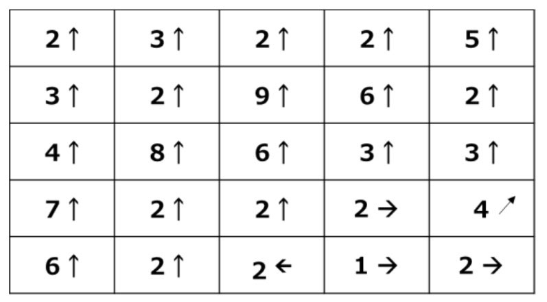
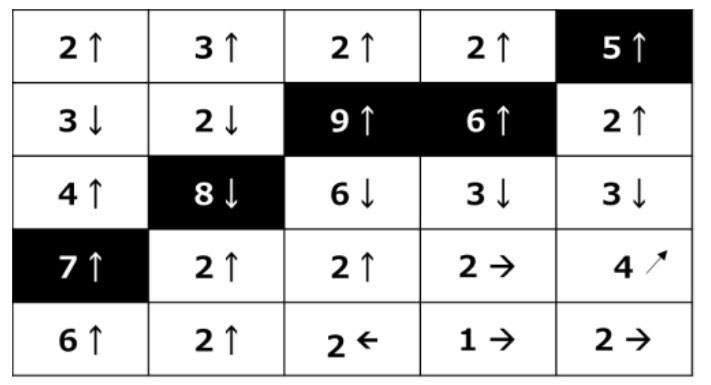
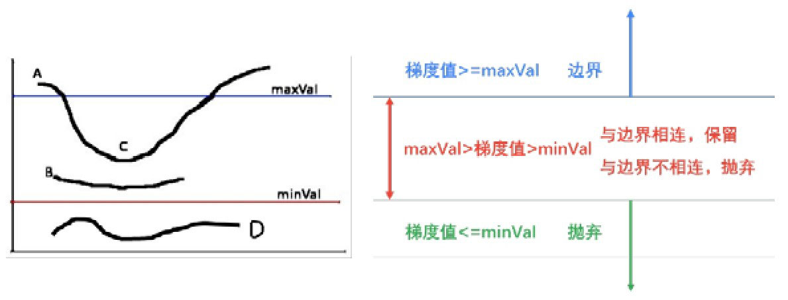
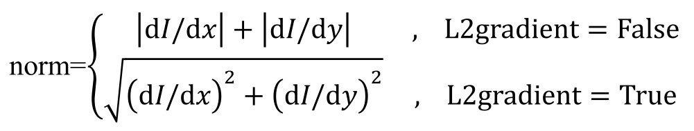
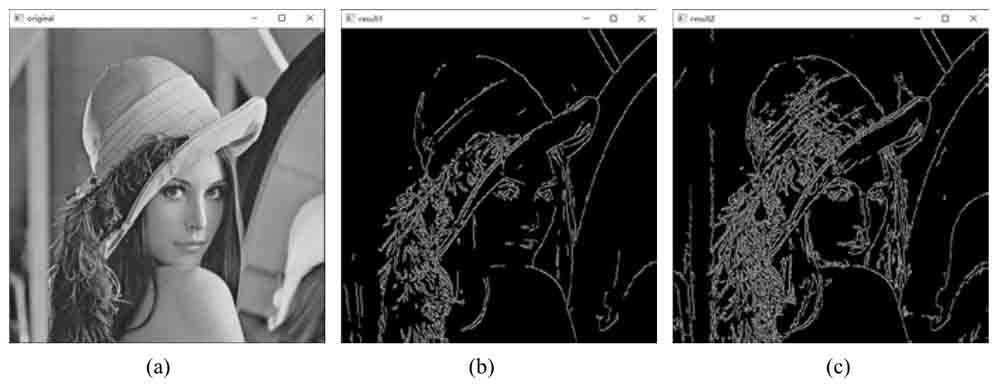

Canny边缘检测是一种使用了**多级**边缘检测算法检测边缘的方法。

openCV提供了函数cv2.Canny()实现Canny边缘检测。

## 思维导图


## Canny边缘检测基础

步骤1：**去噪**。噪声会影响边缘检测的准确性，因此首先要将噪声过滤掉。

步骤2：计算梯度的幅度与方向。

步骤3：非极大值抑制，即适当地让边缘“变瘦”

步骤4：确定边缘。使用双阈值算法确定最终的边缘信息。

**1.应用高斯滤波去除噪声**

滤波的目的是平滑一些纹理较弱的非边缘区域，以便得到更准确的边缘。在实际处理过程中，通常采用**高斯滤波**去除图像中的噪声。

**2.计算梯度**

梯度的方向与边缘的方向是垂直的。

边缘检测算子返回水平方向的Gx和垂直方向的Gy。梯度的幅度G和方向Θ（用角度值表示）为：



梯度示例



2↑ 梯度的幅度G为2，方向为90度

**3.非极大值抑制**

获得梯度的幅度和方向后，遍历图像中的像素点，**去除所有非边缘的点**。

逐一遍历像素点，判断当前像素点是否是周围像素点中具有**相同梯度方向的最大值**，并判断结果决定是否抑制该点。、

* 如果该点是正/负梯度方向上的局部最大值，则保留该点。
* 如果不是，则抑制该点（归零）


黑色背景点都**向上方向梯度**(**水平边缘**)的局部**最大值**。因此，这些点会被保留；其余点被抑制（处理为0）。这些点被处理为边缘点。



黑色背景的像素点都是垂直方向梯度**(向上、向下)方向上**（即**水平边缘**）的局部最大值。这些点最终会被处理为边缘点。

**4.应用双阈值确定边缘**

一些虚边缘可能也在边缘图像内。这些虚边缘可能也在边缘图像内。这些边缘可以是真实图像产生的，也可能是由于噪**声所产生的**（需要剔除）

剔除处理：设置两个阈值，高阈值maxVal和低阈值minVal

* 如果当前边缘像素的梯度值大于或等于maxVal,则将当前边缘像素标记为强边缘。
* 如果当前边缘像素的梯度值介于maxVal和minVal之间，则将当前边缘像素标记为**虚边缘**（需要保留）。
* 如果当前边缘像素的梯度值小于或等于minVal,则抑制当前边缘像素。

虚边缘需要进一步处理

* 与强边缘连接，则将该边缘处理为边缘。
* 与强边缘无连接，则该边缘为弱边缘，**将其抑制**。

示例一



* A点的梯度值大于maxVal,属于强边缘
* B和C点的梯度值介于maxVal和minVal之间，因此B、C是虚边缘。
* D点的梯度值小于minVal,因此D被抑制**(抛弃)**

虚边缘处理

* B点与强边缘不相连，故将其抛弃。
* C点与强边缘A相连，故将其保留。

## Canny函数及使用

```1
edges = cv.Canny(image,threshold1,threshold2[,apertureSize[,L2gradient]]]
```

* edges  计算的边缘图像
* image为8位输入图像
* threshold1表示处理过程中的第一个阈值。
* threshold2表示处理过程中的第二个阈值。
* apertureSize表示Sobel算子的孔径大小。
* L2gradient为计算图像梯度幅度（gradient magnitude）的标识。其默认值为False。如果为True，则使用更精确的L2范数进行计算（即两个方向的导数的平方和再开方），否则使用L1范数（直接将两个方向导数的绝对值相加）。



示例

```py
import cv2
o=cv2.imread("lena,bmp",cv2.IMREAD_GRAYSCALE)
r1=cv2.Canny(o,128,200)
r2=cv2.Canny(o,32,128)
cv2.imshow("original",o)
cv2.imshow("result1",r1)
cv2.imshow("result2",r2)
cv2.waitKey()
cv2.destroyAllWindows()
```



* b 阈值128-200时的边缘检测结果
* c 阈值32-128时的边缘检测结果

总结：当阈值范围更小时能捕获更多边缘信息。