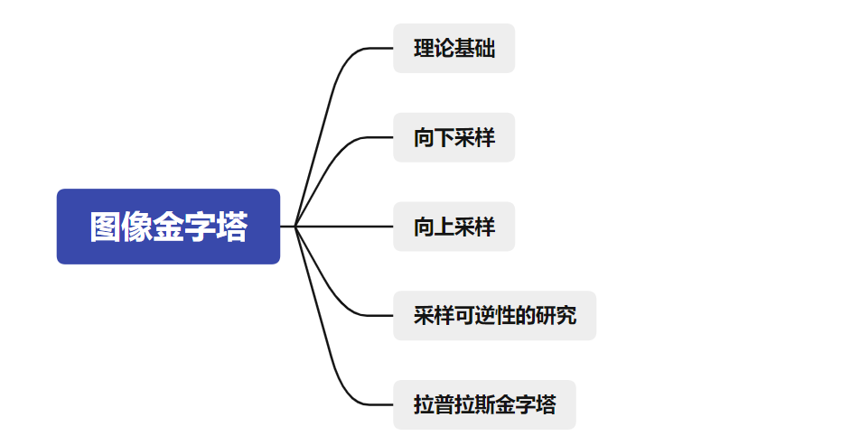
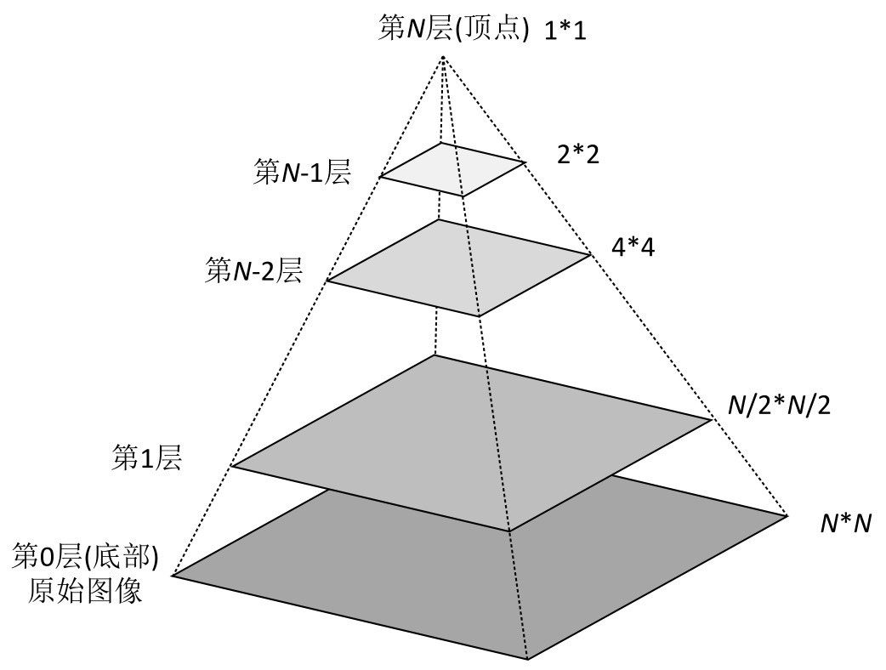
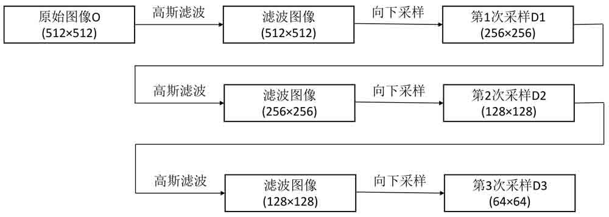
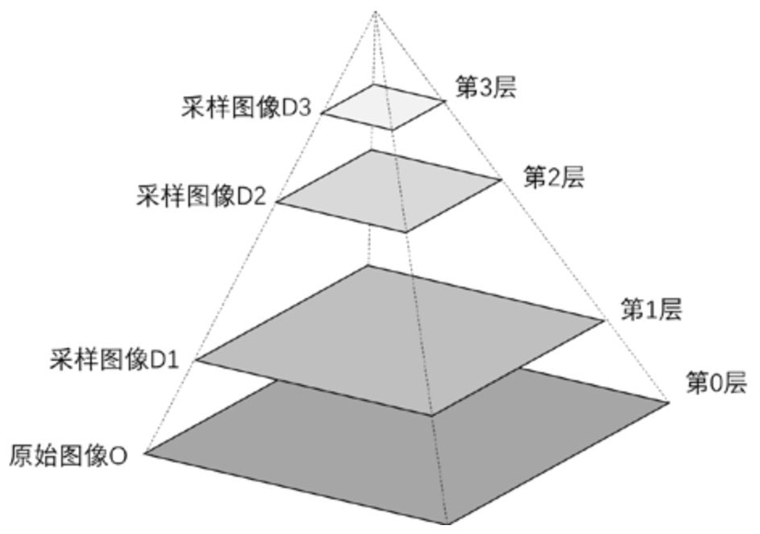
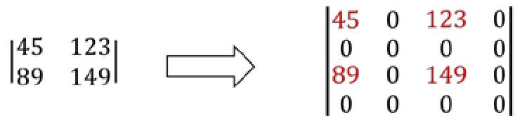
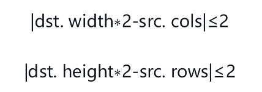
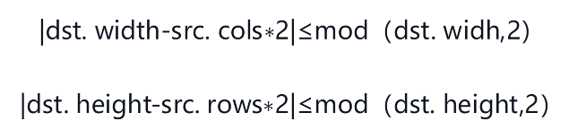
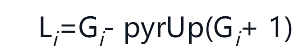
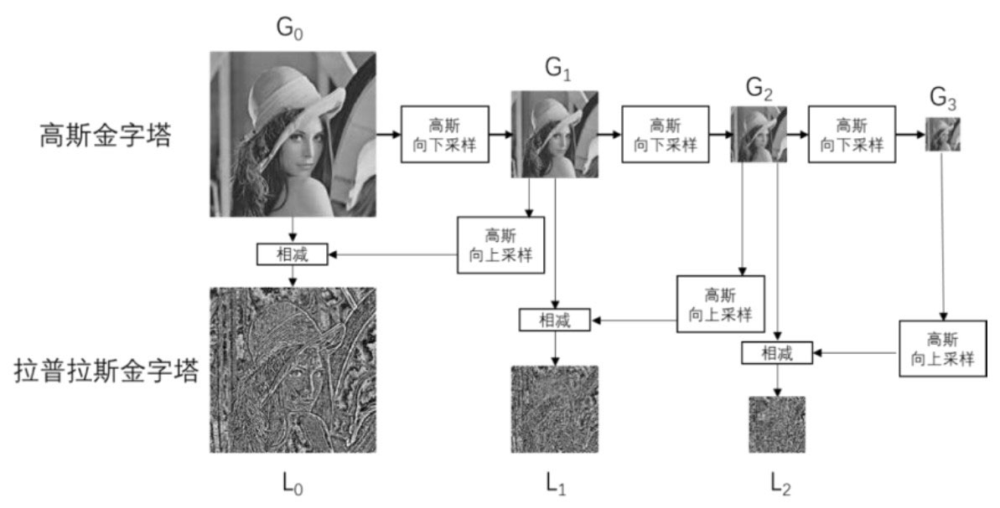
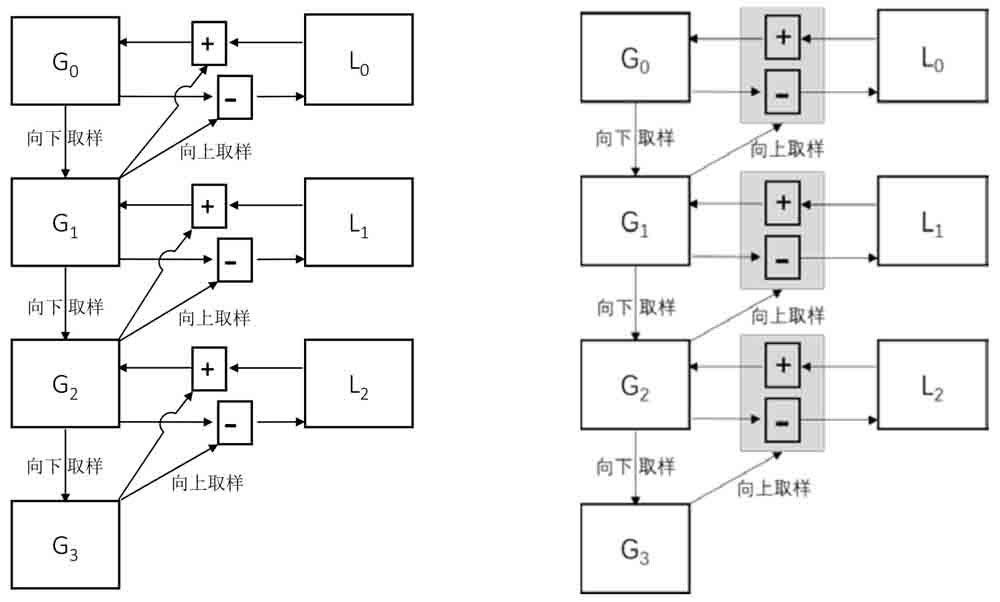

## 思维导图



## 理论基础

图像金字塔是由一幅图像的**多个分辨率**的子图所构成的**图像集合**。图像金字塔是一系列以金字塔形状排列的、自底向上分辨率逐渐降低的图像集合。



图像金字塔是同一图像不同分辨率的子图集合，是通过对原图像不断地向下采样而产生的，即由高分辨率的图像（大尺寸）产生低分辨率的近似图像（小尺寸）。

实现方式

* 简单方式：有一副图像，其大小是N*N,删除其偶数行和偶数列得到一副(N/2) * (N/2)大小的图像。不断重复该过程就可以得到该图像的图像金字塔。
* 平均金字塔：采用领域平均技术求原始图像的近似图像。该滤波器能够产生平均金字塔。
* 高斯金字塔：采用高斯滤波器对原始图像进行滤波，得到高斯金字塔。这是函数cv2.pyrDown()所采用的方式。

生成高斯金字塔的过程



向下采样：原始图像称为第0层，第1次向上采用的结果图像称为第1层，第2次向上采用的结果称为第3层，以此类推。



向上采样：通常将图像的宽度和高度都变为原来的2倍。这意味着，向上采样的结果图像的大小是原始图像的4倍。因此，要在结果图像中补充大量的像素点。对新生成的像素点进行赋值，称为**插值处理**，该过程可以通过多种方式实现，例如最临近插值就是用最邻近的像素点给当前还没有值的像素点赋值。

常见插值处理方式：通常是在每列像素点的右侧插入值为零的列，在每行像素点的下方插入值为零的行



## 向下采样

用于实现图像高斯金字塔操作中的向下采样，其语法形式为：

```py
dst = cv2.pyrDown( src[, dstsize[, borderType]])
```

* dst 目标图像
* src 原始图像
* dstsize 目标图像的大小
* borderType 边界类型，默认值为BORDER_DEFAULT,**且仅支持BORDER_DEFAULT**.

默认情况下，输出图像的大小为Size((src.cols+1)/2, (src.rows+1)/2)。在任何情况下，图像尺寸必须满足如下条件：



cv2.pyrDown()函数首先对原始图像进行高斯滤波变换，以获取原始图像的近似图像。

示例

```py
import cv2
o=cv2.imread("lena.bmp",cv2.IMREAD_GRAYSCALE)
r1=cv2.pyrDown(o)
r2=cv2.pyrDown(r1)
r3=cv2.pyrdown(r2)

cv2.waitKey()
cv2.destroyAllWindows()
```

## 向上采样

使用函数cv2.pyrUp()实现图像金字塔操作中的向上采样，其语法形式如下：

```py
dst = cv2.pyrUp( src[, dstsize[, borderType]] )
```

* dst 目标图像
* src 原始图像
* dstsize为目标图像的大小。
* borderType为边界类型，默认值为BORDER_DEFAULT，且这里仅支持BORDER_DEFAULT。

默认情况下，目标图像的大小为Size(src.cols*2, src.rows*2)。在任何情况下，图像尺寸需要满足下列条件：



```py
import cv2
o=cv2.imread("lenas.bmp")
r1=cv2.pyrUp(o)
r2=cv2.pyrUp(r1)
r3=cv2.pyrUp(r2)
print(r1.shape)
print(r2.shape)
print(r3.shape)
```

## 采样可逆性的研究

虽然一幅图像在先后经过向下采样、向上采样后，会恢复为原始大小，但是向上采样和向下采样不是互逆的。也就是说，虽然在经历两次采样操作后，得到的结果图像与原始图像的大小一致，肉眼看起来也相似，但是二者的像素值并不是一致的。

## 拉普拉斯金字塔

我们希望通过对金字塔中的小图像进行向上采样以获取完整的大尺寸高分辨率图像，这时就需要用到拉普拉斯金字塔。



*  Li表示拉普拉斯金字塔中的第i层。
*  Gi表示高斯金字塔中的第i层。



使用函数cv2.pyrDown()和cv2.pyrUp()构造拉普拉斯金字塔。

```py
import cv2
o=cv2.imread("lena.bmp")
G0=0
G1=cv2.pyrDown(G0)
G2=cv2.pyrDown(G1)
G3=cv2.pyrDown(G2)
L0=G0-cv2.pyrUp(G1)
L1=G1-cv2.pyrUp(G2)
L2=G2-cv2.pyrUp(G3)

cv2.waitKey()
cv2.destroyAllWindows()
```

● (a)图是通过语句“L0=G0-cv2.pyrUp(G1)”，用“原始图像G0”减去“图像G1的向上采样结果”，得到的拉普拉斯金字塔的第0层L0。

● (b)图是通过语句“L1=G1-cv2.pyrUp(G2)”，用“图像G1”减去“图像G2的向上采样结果”，得到的拉普拉斯金字塔的第1层L1。

● (c)图是通过语句“L2=G2-cv2.pyrUp(G3)”，用“图像G2”减去“图像G3的向上采样结果”，得到的拉普拉斯金字塔的第2层L2。

应用

拉普拉斯金字塔的作用在于，能够恢复高分辨率的图像。图11-13演示了如何通过拉普拉斯金字塔恢复高分辨率图像。其中，右图是对左图的简化。



图11-13中的各个标记的含义如下：

● G0、G1、G2、G3分别是高斯金字塔的第0层、第1层、第2层、第3层。

● L0、L1、L2分别是拉普拉斯金字塔的第0层、第1层、第2层。

● 向下的箭头表示向下采样操作（对应cv2.pyrDown()函数）。

● 向右上方的箭头表示向上采样操作（对应cv2.pyrUp()函数）。

● 加号“+”表示加法操作。● 减号“-”表示减法操作。

在图11-13中，描述的操作及关系有：

* 向下采样（高斯金字塔的构成）

```py
G1 = cv2.pyrDonwn(G0)
G2 = cv2.pyrDown(G1)
G3 = cv2.pyrDown(G2)
```

* 拉普拉斯金字塔

```py
L0=G0-cv2.pyrUp(G1)
L1=G1-cv2.pyrUp(G2)
L2=G2-cv2.pyrUp(G3)
```

* 向上采样恢复高分辨率图像

```py
G0=L0+cv2.pyrUp(G1)
G1=L1+cv2.pyrUP(G2)
G2=L2+cv2.pyrUp(G3)
```

上述关系是通过数学运算推导得到的。例如，已知L0=G0-cv2.pyrUp(G1)，将表达式右侧的cv2.pyrUp(G1)移到左侧，就得到了表达式G0=L0+cv2.pyrUp(G1)。除此之外，G1和G2都可以通过拉普拉斯金字塔的构造表达式得到。在前面已经介绍过了，构造拉普拉斯金字塔的目的就是为了恢复高分辨率的图像。