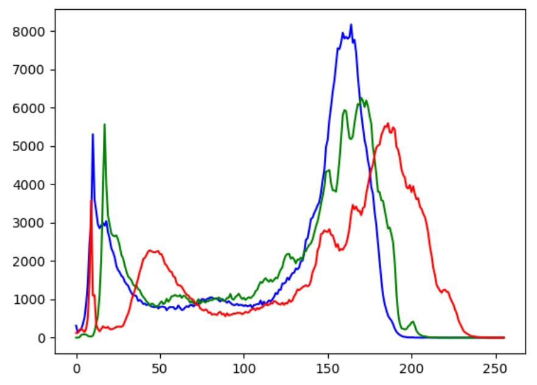

## 思维导图


## 直方图的含义

直方图从图像内部**灰度**级的角度对图像进行表述，包含十分丰富而重要的信息。从直方图的角度对图像进行处理，可以达到**增强图像显示效果**的目的。

直方图统计图像内**各个灰度级出现的次数**。


图中的**数表示灰度级**，从图中看出一个存在1,2,3,4,5共5个灰度级，统计各个灰度级出现的次数


根据上述关系，可以绘制出折线图（左图）和直方图（右图）。一般情况下，我们把**左侧的直线图和右侧直方图都称为直方图**。


图像直方图的x轴区间一般是[0, 255]，对应的是8位位图的**256个灰度级**；y轴对应的是具有相应灰度级的像素点的个数。

有时为了便于表示，也会采用**归一化直方图**。在归一化直方图中，**x轴仍然表示灰度级**；y轴不再表示灰度级出现的次数，而是**灰度级出现的频率**。


**归一化直方图**


OpenCV的官网上，特别提出了要注意三个概念：**DIMS**、**BINS**、**RANGE**

* DIMS：表示在绘制直方图时，收集的**参数的数量**。一般情况下，直方图中收集的数据只有一种，就是**灰度级。因此，该值为1**
* RANGE：表示要统计的灰度级范围，一般为[0, 255]。0对应的是黑色，255对应的是白色。
* BINS：参数**子集的数目**。在处理数据的过程中，有时需要将众多的数据划分为若干个组，再进行分析。

你可能希望将**两个像素值作为一组讨论**。这样，整个灰度级被划分为三组，具体为{ {1,2} , {3,4} , {5} }

**灰度级分组前后直方图**


## 绘制直方图

matplotlib.pyplot中的hist()函数能够方便地绘制直方图，我们通常采用该函数直接绘制直方图。除此以外，OpenCV中的cv2.calcHist()函数能够计算统计直方图，还可以在此基础上绘制图像的直方图。

### 1.使用Numpy绘制直方图

模块matplotlib.pyplot提供了一个类似于MATLAB绘图方式的框架，可以使用其中的matplotlib.pyplot.hist()函数（以下简称为hist()函数）来绘制直方图。

此函数的作用是根据数据源和灰度级分组绘制直方图。其基本语法格式为：

```python
matplotlib.pyplot.hist(X, BINS)
```

* X：数据源，必须是一维的。图像通常是二维的，需要使用ravel()函数将图像处理为一维数据源以后，再作为参数使用。
* BINS:BINS的具体值，表示灰度级的分组情况。

函数ravel()的作用是将二维数组降维成一维数组。例如，有图像a，其值为：


使用函数ravel()对a进行处理：

```python
b = a.ravel()
```

可以得到b为：


例一：使用hist()函数绘制一幅图像的直方图。

```python
import cv2
import matplotlib.pyplot as plt
o=cv2.imread("image\\boat.jpg")
cv2.imshow("original", o)
plt.hist(o.ravel(),256)
cv2.waitKey()
cv2.destroyAllWindows()
```


实例二：使用函数hist()将一幅图像的灰度级划分为16组后，绘制该图像的直方图。

```python
import cv2
import matplotlib.pyplot as plt
o=cv2.imread("image\\boat.bmp")
plt.hist(o.ravel(),16)
```


从图中可以看到，整个灰度级被划分为16个子集。

### 2.使用OpenCV绘制直方图

OpenCV提供了函数cv2.calcHist()用来计算图像的统计直方图，该函数能统计各个灰度级的像素点个数。

利用matplotlib.pyplot模块中的plot()函数，可以将函数cv2.calcHist()的统计结果绘制成直方图。

1．用cv2.calcHist()函数统计图像直方图信息

函数cv2.calcHist()用于统计图像直方图信息，其语法格式为：

```python
hist = cv2.calcHist( images, channels, mask, histSize, ranges, accumulate )
```

* hist：返回的统计直方图，是一个一维数组，数组内的元素是各个灰度级的像素个数。
* images：原始图像，该图像需要使用“[ ]”括起来。
* channels：指定通道编号。通道编号需要用“[ ]”括起来，如果输入图像是单通道灰度图像，该参数的值就是[0]。对于彩色图像，它的值可以是[0]、[1]、[2]，分别对应通道B、G、R。
* mask：掩模图像。当统计整幅图像的直方图时，将这个值设为None。当统计图像某一部分的直方图时，需要用到掩模图像。
* histSize:BINS的值，该值需要用“[ ]”括起来。例如，BINS的值是256，需要使用“[256]”作为此参数值。
* ranges：即像素值范围。例如，8位灰度图像的像素值范围是[0, 255]
* accumulate：累计（累积、叠加）标识，默认值为False。如果被设置为True，则直方图在开始计算时不会被清零，计算的是多个直方图的累积结果，用于对一组图像计算直方图。该参数允许从多个对象中计算单个直方图，或者实时更新直方图。该参数是可选的，**一般情况下不需要设置**。

实例一：使用cv2.calcHist()函数计算一幅图像的统计直方图结果，并观察得到的统计直方图信息。

```python
import cv2
import numpy as np
img=cv2.imread("image\\boat.jpg")
hist = cv2.calcHist([img], [0], None, [256], [0,255])
print(type(hist))
print(hist.shape)
print(hist.size)
print(hist)
```

* 第1个参数“[img]”表示要绘制直方图的原始图像，是使用“[ ]”括起来的。
* 第2个参数表示要统计哪个通道的直方图信息。本例中读取的img是灰度图像，所以使用“[0]”来表示。
* 第3个参数是掩模图像，在本例中的值为“None”，表示计算整幅图像的直方图。
* 第4个参数“[256]”表示BINS的值是256。
* 第5个参数“[0, 255]”表示灰度级的范围是[0, 255]。


从图中可以看到，函数cv2.calcHist()返回值的数据类型为“ndarray”。该数据的shape为（256,1），说明其有256行1列。该数据的size为256，说明有256个元素，分别对应着256个灰度级在图像内出现的次数。

图所示的程序运行结果的下半部分是hist内的部分数据，限于篇幅，这里仅截取了256条数据中的前6条。这6条数据，对应着灰度级为0~5的像素点出现的次数。

**2.plot()函数的使用**

使用matplotlib.pyplot模块内的plot()函数，可以将函数cv2.calcHist()的返回值绘制为图像直方图。

实例一：将给定的x= [0,1,2,3,4,5,6], y = [0.3,0.4,2,5,3,4.5,4]，使用plot()函数绘制出来。

```python
import matplotlib.pyplot as plt
x = [0,1,2,3,4,5,6]
y = [0.3,0.4,2,5,3,4.5,4]
plt.plot(x, y)
```

程序的运行结果如图所示。图中x轴由x= [0, 1, 2, 3, 4, 5, 6]指定，y轴由y =[0.3, 0.4, 2, 5, 3, 4.5, 4]指定。


实例二：给定y = [0.3, 0.4, 2, 5, 3, 4.5, 4]，使用plot()函数将其绘制出来，观察绘制结果。

```python
import matplotlib.pyplot as plt
y = [0.3,0.4,2,5,3,4.5,4]
        plt.plot(y)
```


如果仅仅指定一个参数，则其对应x轴的值默认是一个自然数序列x=[0, 1, … ,n-1, n]。自然序列x的长度与y的长度保持一致。

实例三：使用plot()函数将两组不同的值a= [0.3, 0.4, 2, 5, 3, 4.5, 4], b=[3, 5, 1,2, 1, 5, 3]以不同的颜色绘制出来。

```python
import matplotlib.pyplot as plt
a = [0.3,0.4,2,5,3,4.5,4]
b=[3,5,1,2,1,5,3]
plt.plot(a, color='r')
plt.plot(b, color='g')
```


**3.绘制统计直方图**

实例一:使用函数plot()将函数cv2.calcHist()的返回值绘制为直方图。

```python
import cv2
import matplotlib.pyplot as plt
o=cv2.imread("image\\boatGray.bmp")
# 计算统计直方图
histb = cv2.calcHist([o], [0], None, [256], [0,255])
# 绘制统计直方图
plt.plot(histb, color='b')
plt.show()
```


实例二：使用函数plot()和函数cv2.calcHist()，将彩色图像各个通道的直方图绘制在一个窗口内。

```python
import cv2
import matplotlib.pyplot as plt
o=cv2.imread("image\\girl.bmp")
# 得到三个通道R,G,B的直方图数据
histb = cv2.calcHist([o], [0], None, [256], [0,255])
histg = cv2.calcHist([o], [1], None, [256], [0,255])
histr = cv2.calcHist([o], [2], None, [256], [0,255])
# 绘制直方图
plt.plot(histb, color='b')
plt.plot(histg, color='g')
plt.plot(histr, color='r')
plt.show()
```



**13.2.3 使用掩模绘制直方图**


第1部分：与掩模图像中黑色背景位置对应的部分，该部分的像素值都被置为零。

第2部分：与掩模图像中白色背景位置对应的部分，该部分的像素保留原有值。

绘制掩模图像时，首先将函数cv2.calcHist()的mask参数设置为掩模图像，得到掩模处理的直方图信息，再使用plot()函数完成直方图的绘制。

```python
hist = cv2.calcHist( images, channels, mask, histSize, ranges, accumulate )
```

其中，mask参数就是掩模图像

实例一：演示绘制掩模结果图像的直方图。

```python
import cv2
import numpy as np
import matplotlib.pyplot as plt
image=cv2.imread("image\\girl.bmp", cv2.IMREAD_GRAYSCALE)
# 构建掩模
mask=np.zeros(image.shape, np.uint8)
mask[200:400,200:400]=255
# 原始图像直方图
histImage=cv2.calcHist([image], [0], None, [256], [0,255])
# 掩模直方图
histMI=cv2.calcHist([image], [0], mask, [256], [0,255])
plt.plot(histImage)
plt.plot(histMI)
```


## 直方图均衡化

如果一幅图像拥有全部可能的灰度级，并且像素值的灰度均匀分布，那么这幅图像就具有高对比度和多变的灰度色调，灰度级丰富且覆盖范围较大。在外观上，这样的图像具有更丰富的色彩，不会过暗或过亮。

直方图均衡化的主要目的是将原始图像的灰度级均匀地映射到整个灰度级范围内，得到一个灰度级分布均匀的图像。这种均衡化，既实现了**灰度值统计上的概率均衡**，也实现了**人类视觉系统（Human Visual System, HVS）上的视觉均衡**。

例如，在某幅图像内仅仅出现了1、2、3、101、102、103等6个像素值，其分布分别如表中的情况A和情况B所示。


* 情况A：每一个灰度级在图像内出现的**次数都是1**，灰度级均匀地映射到当前的灰度级范围内，所以可以理解为其直方图**是均衡的**。
* 情况B：灰度级1、2、3出现的次数**都是1次**，灰度级103出现的次数是3次，灰度级101、102出现的次数是0次。**从表面上看，灰度级是不均衡的**。从**HVS**的角度来说，人眼的**敏感度不足以区分1个像素值的差异**，即人眼会将**灰度级1、2和3看作是相同的**，会将灰度级101、102和103看作是相同的。也就是说，HVS会自动地将灰度级划分为两组，灰度级[1, 3]为一组，灰度级[101, 103]为另一组。在整幅图像内，这两组的灰度级出现的**次数都是3次，概率是相等**的。在均衡化处理中，综合考虑了统计概率和HVS的均衡。

**13.3.1 直方图均衡化原理**

直方图均衡化的算法主要包括两个步骤：（1）计算累计直方图。（2）对累计直方图进行区间转换

例如，图像A如图13-24所示，它是一幅3位的位图，即共有8（23）个灰度级，有49个像素。


图像A共有8个灰度级，范围为[0, 7]，计算其**统计直方图**如表所示。


在此基础上，计算**归一化统计直方图**，计算方式是计算**每个像素在图像内出现的概率**。出现概率=出现次数/像素总数，用每个灰度级的像素个数除以总的像素个数（49），就得到归一化统计直方图，如表所示。


计算**累计统计直方图**，即计算所有灰度级的累计概率，结果如表所示

0 -> 0.18, 1-> 0.18+0.18 = 0.37, 2 -> 0.37+0.12 = 0.49依次类推


**1．在原有范围内实现均衡化**

原始图像统计


在原有范围内实现直方图均衡化时，用当前灰度级的累计概率乘以当前灰度级的最大值7，得到新的灰度级，并作为均衡化的结果。表所示的就是计算得到的新灰度级。

0-> 7×0.18=1.26≈1，1->7×0.37=2.59≈3 依次类推


**归一化直方图**各个灰度级的关系，完成均衡化值（新的灰度级）的映射


* 原始图像**A中的灰度级0**，经直方图均衡化后调整为**新的灰度级1**（即均衡化值1）。在原始图像A中，**灰度级0共有9个像素点**，所以在均衡化后的图像中，**灰度级1共有9个像素点**。
* 原始图像**A中的灰度级1和2**经直方图均衡化后**调整为灰度级3**。在原始图像A中，灰度级**1共有9个像素点**，灰度级**2共有6个像素点**，所以在均衡化后的图像中，**灰度级3共有9 + 6=15个像素点**。依次类推

根据上述关系，可以得到下表。其中列出了直方图均衡化后每个灰度级的像素个数。


经过均衡化处理后，灰度级在整个灰度空间内的分布会更均衡。所示的是直方图均衡化前后的对比图。

其中，左图是均衡化之前的直方图，右图是均衡化之后的直方图。


从图13-25中可以看出，右图的灰度级在整个灰度空间内分布更均衡。值得注意的，这里的均衡化是综合考虑了统计概率和HVS的结果。

● 在图像A中，未进行直方图均衡化之前：灰度级0-3之间的像素个数为29个，灰度级4-7之间的像素个数为20个。

● 对图像A进行直方图均衡化之后：灰度级0-3之间的像素个数为24个，灰度级4-7之间的像素个数为25个

**2．在更广泛的范围内实现均衡化**

在更广泛的范围内实现直方图均衡化时，用当前灰度级的累计概率乘以更广泛范围灰度级的最大值，得到新的灰度级，并作为均衡化的结果。例如，**要将灰度级空间扩展为[0, 255]共256个灰度级**，就必须将原灰度级的**累计概率乘以255**，得到新的灰度级。表13-15所示的是图像A在新的灰度级空间[0, 255]内的新的灰度级。

0 -> 255×0.18 = 45.9 ≈ 46 , 1 -> 255×0.37=94.35≈94 , 2->255×0.49=124.95≈125


均衡化前图


均衡化后图


**13.3.2 直方图均衡化处理**

OpenCV使用函数cv2.equalizeHist()实现直方图均衡化。该函数的语法格式为：

```python
dst = cv2.equalizeHist( src )
```

式中，src是8位单通道原始图像，dst是直方图均衡化处理的结果。

```python
#-----------导入使用的模块---------------
import cv2
import matplotlib.pyplot as plt
#-----------读取原始图像---------------
img = cv2.imread('image\\equ.bmp', cv2.IMREAD_GRAYSCALE)
#-----------直方图均衡化处理---------------
equ = cv2.equalizeHist(img)
#-----------显示均衡化前后的图像---------------
cv2.imshow("original", img)
cv2.imshow("result", equ)
#-----------显示均衡化前后的直方图---------------
plt.figure("原始图像直方图")   #构建窗口
plt.hist(img.ravel(),256)
plt.figure("均衡化结果直方图")  #构建新窗口
plt.hist(equ.ravel(),256)
#----------等待释放窗口---------------------
cv2.waitKey()
cv2.destroyAllWindows()
```

运行结果

