## 思维导图

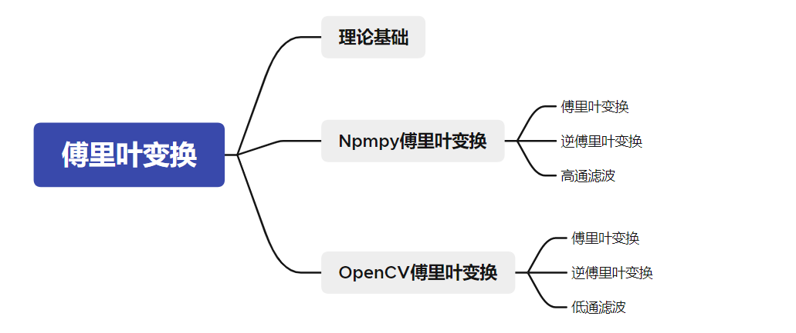

## 理论基础

图像处理一般分为**空间域**处理和**频率域**处理。

* **空间域处理**是直接对**图像内的像素进行处理**。

* **频率域处理**是先将图像变换到频率域，然后在频率域对图像进行处理，最后通过**反变换**将**图像从频率域变换到空间域**。**傅里叶变换**是应用最广泛的一种频域变换，它能够将图像从空间域变换到频率域，而**逆傅里叶变换**能够将频率信息变换到空间域内。

傅里叶变换的目的，就是为了将图像从空域转换到频域，并在频域内实现对图像内特定对象的处理，然后再对经过处理的频域图像进行逆傅里叶变换得到空域图像。傅里叶变换在图像处理领域发挥着非常关键的作用，可以实现图像增强、图像去噪、边缘检测、特征提取、图像压缩和加密等。

## Numpy实现傅里叶变换

Numpy模块提供了傅里叶变换功能，Numpy模块中的fft2()函数可以实现图像的傅里叶变换。

### **1.实现傅里叶变换**

Numpy提供的实现傅里叶变换的函数是numpy.fft.fft2()，它的语法格式是：

```python
返回值 = numpy.fft.fft2(原始图像)
```

* 参数“原始图像”的类型是灰度图像
* 函数的返回值是一个复数数组（complex ndarray）。

经过该函数的处理，就能得到图像的频谱信息。此时，图像频谱中的零频率分量位于频谱图像（频域图像）[插图]的左上角，**为了便于观察**，通常会使用numpy.fft.fftshift()函数将**零频率成分移动到频域图像的中心**位置


函数numpy.fft.fftshift()的语法格式是：

```python
返回值=numpy.fft.fftshift(原始频谱)
```

使用该函数处理后，图像频谱中的零频率分量会被移到频域图像的中心位置，对于观察傅里叶变换后频谱中的**零频率**部分非常有效。

对图像进行傅里叶变换后，得到的是一个**复数数组**。为了显示为图像，需要将它们的值调整到[0, 255]的灰度空间内，使用的公式为：

```python
像素新值=20*np.log(np.abs(频谱值))
```

实例一：用Numpy实现傅里叶变换，观察得到的频谱图像。

```python
import cv2
import numpy as np
import matplotlib.pyplot as plt
img = cv2.imread('image\\lena.bmp',0)
# 傅里叶变换
f = np.fft.fft2(img)
# 将低频移动到中间
fshift = np.fft.fftshift(f)
# 将复数数组调整到灰度空间内
magnitude_spectrum = 20*np.log(np.abs(fshift))

# 显示原始图像
plt.subplot(121)
plt.imshow(img, cmap = 'gray')
plt.title('original')
plt.axis('off')
plt.subplot(122)
# 显示频谱图
plt.imshow(magnitude_spectrum, cmap = 'gray')
plt.title('result')
plt.axis('off')
plt.show()
```

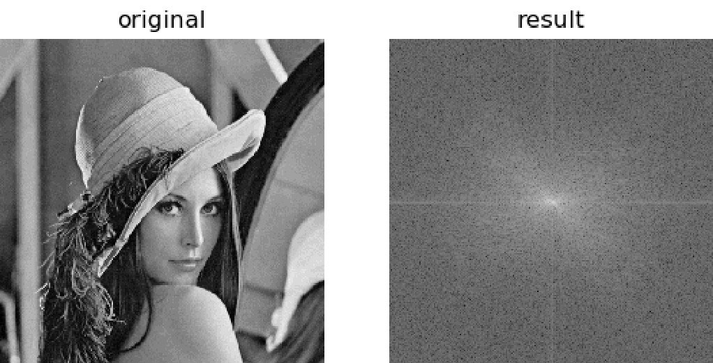

### **2.实现逆傅里叶变换**

1.如果在傅里叶变换过程移动了零频率分量，逆变换过程需要通过numpy.fft.ifftshift()函数将零频率分量移到原来的位置。

2.进行逆傅里叶变换

函数numpy.fft.ifftshift()是numpy.fft.fftshift()的逆函数，其语法格式为：

```python
调整后的频谱 = numpy.fft.ifftshift(原始频谱)
```

numpy.fft.ifft2()函数可以**实现逆傅里叶变换**，返回空域复数数组。

```python
返回值=numpy.fft.ifft2(频域数据)
```

函数numpy.fft.ifft2()的返回值仍旧是一个复数数组（complex ndarray）。

逆傅里叶变换得到的空域信息是一个复数数组，需要将该信息调整至[0, 255]灰度空间内，使用的公式为：

```python
iimg = np.abs(逆傅里叶变换结果)
```

实例二：在Numpy内实现傅里叶变换、逆傅里叶变换，观察逆傅里叶变换的结果图像。

```python
import cv2
import numpy as np
import matplotlib.pyplot as plt
img = cv2.imread('image\\boat.bmp',0)
# 傅里叶变换
f = np.fft.fft2(img)
# 移动零点位置
fshift = np.fft.fftshift(f)
# 还原零点位置
ishift = np.fft.ifftshift(fshift)
# 逆傅里叶变换
iimg = np.fft.ifft2(ishift)
# 还原图像
iimg = np.abs(iimg)

# 打印图像
plt.subplot(121), plt.imshow(img, cmap = 'gray')
plt.title('original'), plt.axis('off')
plt.subplot(122), plt.imshow(iimg, cmap = 'gray')
plt.title('iimg'), plt.axis('off')
plt.show()
```

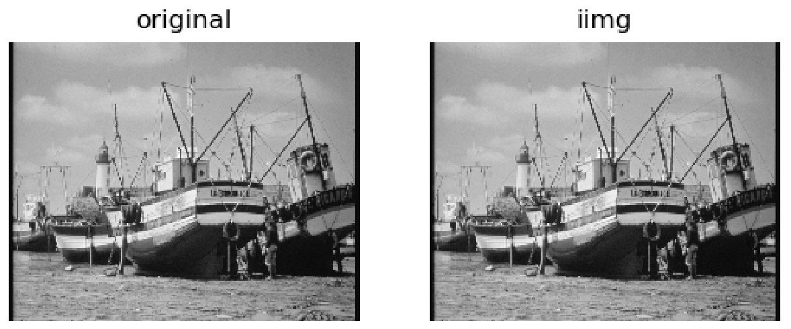

### **3.高通滤波示例**

在一幅图像内，同时存在着高频信号和低频信号。

* **低频信号**对应图像内**变化缓慢**的灰度分量。例如，在一幅大草原的图像中，低频信号对应着颜色趋于一致的广袤草原。
* **高频信号**对应图像内**变化越来越快**的灰度分量，是由灰度的尖锐过渡造成的。如果在上面的大草原图像中还有一头狮子，那么高频信号就对应着狮子的边缘等信息。

滤波器能够允许一定频率的分量通过或者拒绝其通过，按照其作用方式可以划分为**低通滤波器**和**高通滤波器**。

* 允许**低频信号**通过的滤波器称为**低通滤波器**。低通滤波器使高频信号衰减而对低频信号放行，会使图像变模糊。
* 允许**高频信号**通过的滤波器称为**高通滤波器**。高通滤波器使低频信号衰减而让高频信号通过，将增强图像中尖锐的细节，但是会导致图像的对比度降低。

傅里叶变换可以将图像的高频信号和低频信号分离

**高通滤波实现**：将傅里叶变换结果图像result中的**低频分量值都替换为0**（处理为黑色），就屏蔽了低频信号，只保留高频信号，实现高通滤波。

需要先计算其中心位置的坐标，然后选取以该坐标为中心，上下左右各30个像素大小的区域，将这个区域内的像素值置零。该滤波器的实现方法为：

```python
rows, cols = img.shape
crow, ccol = int(rows/2) , int(cols/2)
fshift[crow-30:crow+30, ccol-30:ccol+30] = 0
```

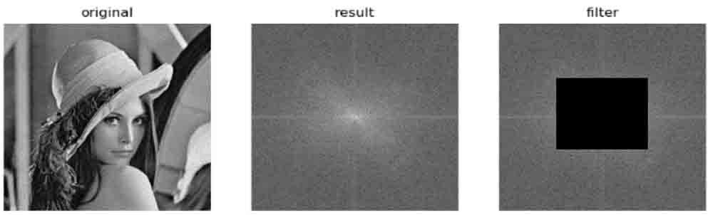

实例三：在Numpy内对图像进行傅里叶变换，得到其频域图像。然后，在频域内将低频分量的值处理为0，实现高通滤波。最后，对图像进行逆傅里叶变换，得到恢复的原始图像。

```python
import cv2
import numpy as np
import matplotlib.pyplot as plt
img = cv2.imread('image\\boat.bmp',0)
# 傅里叶变换
f = np.fft.fft2(img)
# 将零频域移动到中间
fshift = np.fft.fftshift(f)
# 构建低频区域
rows, cols = img.shape
crow, ccol = int(rows/2) , int(cols/2)
# 将频谱中间置零
fshift[crow-30:crow+30, ccol-30:ccol+30] = 0
# 将零频域还原
ishift = np.fft.ifftshift(fshift)
# 逆傅里叶变换
iimg = np.fft.ifft2(ishift)
# 得到图像
iimg = np.abs(iimg)

# 显示图像
plt.subplot(121), plt.imshow(img, cmap = 'gray')
plt.title('original'), plt.axis('off')
plt.subplot(122), plt.imshow(iimg, cmap = 'gray')
plt.title('iimg'), plt.axis('off')
plt.show()
```

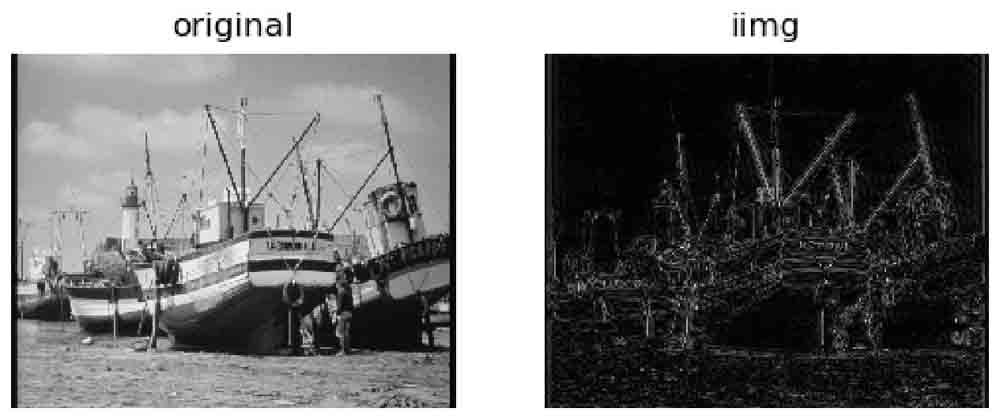

## OpenCV实现傅里叶变换

OpenCV提供了函数cv2.dft()和cv2.idft()来实现傅里叶变换和逆傅里叶变换

### 1.实现傅里叶变换

函数cv2.dft()的语法格式为：

```python
返回结果=cv2.dft(原始图像，转换标识)
```

* 对于参数“原始图像”，要首先使用np.float32()函数将图像转换成np.float32格式。
* “转换标识”的值通常为“cv2.DFT_COMPLEX_OUTPUT”，用来输出一个复数阵列。

函数cv2.dft()返回的结果与使用Numpy进行傅里叶变换得到的结果是一致的，但是它返回的值是双通道的，第1个通道是结果的**实数部分**，第2个通道是结果的**虚数部分**。

经过函数cv2.dft()的变换后，我们得到了原始图像的频谱信息。此时，零频率分量并不在中心位置，为了处理方便需要将其移至中心位置，可以用函数numpy.fft.fftshift()实现。

```python
dftShift = np.fft.fftshift(dft)
```

经过上述处理后，频谱图像还只是一个由实部和虚部构成的值。要将其显示出来，还要做进一步的处理才行。函数cv2.magnitude()可以计算频谱信息的幅度。

```python
返回值=cv2.magnitude(参数1，参数2)
```

* 参数1：浮点型x坐标值，也就是实部。
* 参数2：浮点型y坐标值，也就是虚部，它必须和参数1具有相同的大小（size值的大小，不是value值的大小）。

函数cv2.magnitude()的返回值是参数1和参数2的平方和的平方根，公式为：

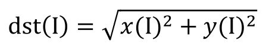

式中，I表示原始图像，dst表示目标图像。

得到**频谱信息的幅度**后，通常还要对幅度值做进一步的转换，以便将频谱信息以**图像的形式展示出来**。简单来说，就是需要将幅度值映射到灰度图像的灰度空间[0,255]内，使其以灰度图像的形式显示出来。

```python
result = 20*np.log(cv2.magnitude(实部，虚部))
```

下面对一幅图像进行傅里叶变换，帮助读者观察上述处理过程。如下代码针对图像“lena”进行傅里叶变换，并且计算了幅度值，对幅度值进行了规范化处理：

```python
import numpy as np
import cv2
img = cv2.imread('image\\lena.bmp',0)
# 傅里叶变换
dft = cv2.dft(np.float32(img), flags = cv2.DFT_COMPLEX_OUTPUT)
print(dft)
# 移到中间
dftShift = np.fft.fftshift(dft)
print(dftShift)
# 计算频谱信息幅度
result = 20*np.log(cv2.magnitude(dftShift[:, :,0], dftShift[:, :,1]))
print(result)
```

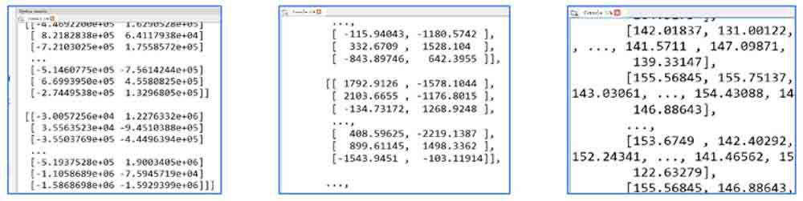

* 左图显示的是函数cv2.dft()得到的频谱值，该值是由实部和虚部构成的。
* 中间的图显示的是函数cv2.magnitude()计算得到的频谱幅度值，这些值不在标准的图像灰度空间[0, 255]内。
* 右图显示的是对函数cv2.magnitude()计算得到的频谱幅度值进一步规范的结果，现在值的范围在[0, 255]内。

实例四：用OpenCV函数对图像进行傅里叶变换，并展示其频谱信息

```python
import numpy as np
import cv2
import matplotlib.pyplot as plt
img = cv2.imread('image\\lena.bmp',0)
# 傅里叶变换
dft = cv2.dft(np.float32(img), flags = cv2.DFT_COMPLEX_OUTPUT)
# 零频域移动中间
dftShift = np.fft.fftshift(dft)
# 得到频谱范围结果
result = 20*np.log(cv2.magnitude(dftShift[:, :,0], dftShift[:, :,1]))

# 显示图像
plt.subplot(121), plt.imshow(img, cmap = 'gray')
plt.title('original'), plt.axis('off')
plt.subplot(122), plt.imshow(result, cmap = 'gray')
plt.title('result'), plt.axis('off')
plt.show()
```

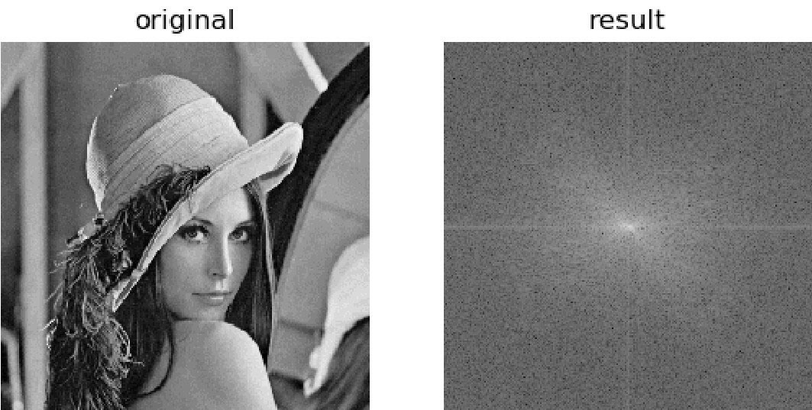

### **2.实现逆傅里叶变换**

在OpenCV中，使用函数cv2.idft()实现逆傅里叶变换，该函数是傅里叶变换函数cv2.dft()的逆函数。其语法格式为：

```python
返回结果=cv2.idft(原始数据)
```

对图像进行**傅里叶变换**后，通常会将**零频率分量移至频谱图像的中心位置**。如果使用函数numpy.fft.fftshift()移动了零频率分量，那么在**进行逆傅里叶变换前**，要**使用函数numpy.fft.ifftshift()将零频率分量恢复到原来位置**。

在进行逆傅里叶变换后，得到的值仍旧是复数，需要使用函数cv2.magnitude()计算其幅度。

实例五：用OpenCV函数对图像进行傅里叶变换、逆傅里叶变换，并展示原始图像及经过逆傅里叶变换后得到的图像。

```python
import numpy as np
import cv2
import matplotlib.pyplot as plt
img = cv2.imread('image\\lena.bmp',0)
# 傅里叶变换
dft = cv2.dft(np.float32(img), flags = cv2.DFT_COMPLEX_OUTPUT)
# 零点移动到中间
dftShift = np.fft.fftshift(dft)
# 零点还原
ishift = np.fft.ifftshift(dftShift)
# 逆傅里叶变换
iImg = cv2.idft(ishift)
# 计算幅度
iImg= cv2.magnitude(iImg[:, :,0], iImg[:, :,1])

# 显示图像
plt.subplot(121), plt.imshow(img, cmap = 'gray')
plt.title('original'), plt.axis('off')
plt.subplot(122), plt.imshow(iImg, cmap = 'gray')
plt.title('inverse'), plt.axis('off')
plt.show()
```

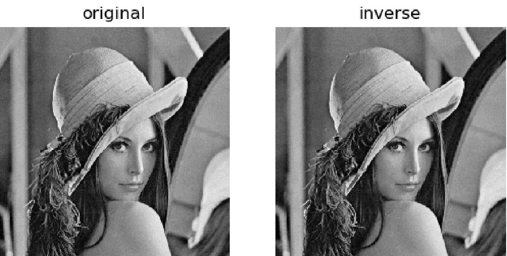

### **3.低通滤波示例**

将傅里叶变换结果图像result中的**高频信号值都替换为0**（处理为黑色），就屏蔽了高频信号，只保留低频信号，从而实现了低通滤波。

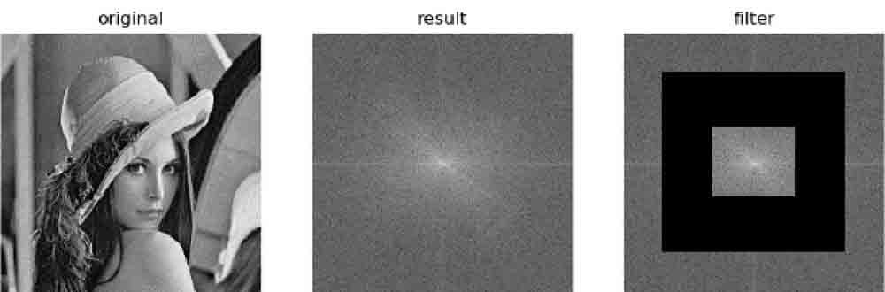

在实现低通滤波时，可以专门构造一个如图左图所示的图像，用它与原图的傅里叶变换频谱图像进行与运算，就能将频谱图像中的高频信号过滤掉。

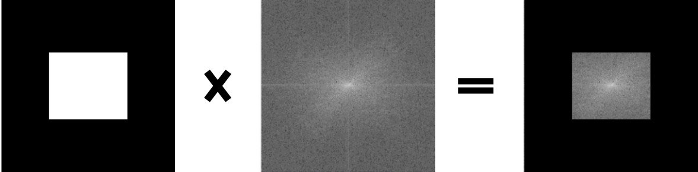

可以采用如下方式构造：

```python
rows, cols = img.shape
crow, ccol = int(rows/2) , int(cols/2)
# 将所有点填充黑色
mask = np.zeros((rows, cols,2), np.uint8)
# 将中心填充白色构成左1图
mask[crow-30:crow+30, ccol-30:ccol+30] = 1
```

然后，将其与频谱图进行运算，实现低通滤波。

```python
fShift = dftShift*mask
```

实例六：使用函数cv2.dft()对图像进行傅里叶变换，得到其频谱图像。然后，在频域内将其高频分量的值处理为0，实现低通滤波。最后，对图像进行逆傅里叶变换，得到恢复的原始图像。观察傅里叶变换前后图像的差异。

```python
import numpy as np
import cv2
import matplotlib.pyplot as plt
img = cv2.imread('image\\lena.bmp',0)
# 傅里叶变换
dft = cv2.dft(np.float32(img), flags = cv2.DFT_COMPLEX_OUTPUT)
# 移动到中间
dftShift = np.fft.fftshift(dft)
rows, cols = img.shape
crow, ccol = int(rows/2) , int(cols/2)
mask = np.zeros((rows, cols,2), np.uint8)
#两个通道，与频域图像匹配
mask[crow-30:crow+30, ccol-30:ccol+30] = 1
# 构建低频滤波
fShift = dftShift*mask
ishift = np.fft.ifftshift(fShift)
iImg = cv2.idft(ishift)
iImg= cv2.magnitude(iImg[:, :,0], iImg[:, :,1])
plt.subplot(121), plt.imshow(img, cmap = 'gray')
plt.title('original'), plt.axis('off')
plt.subplot(122), plt.imshow(iImg, cmap = 'gray')
plt.title('inverse'), plt.axis('off')
plt.show()
```

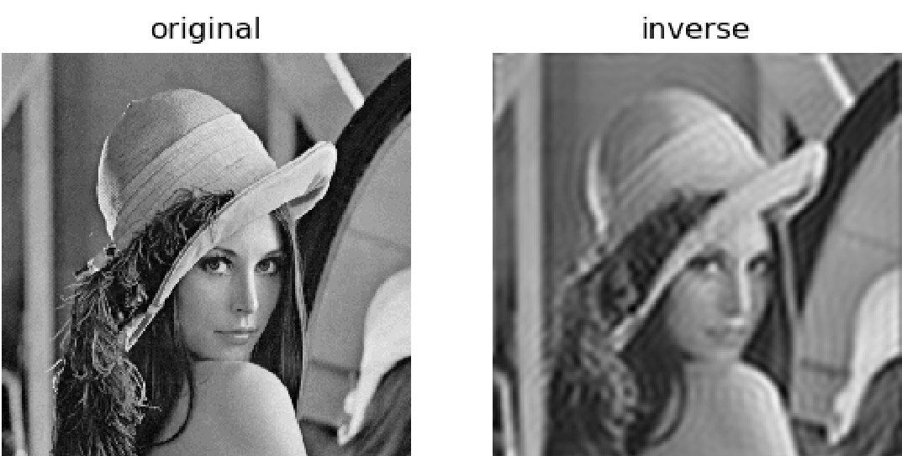