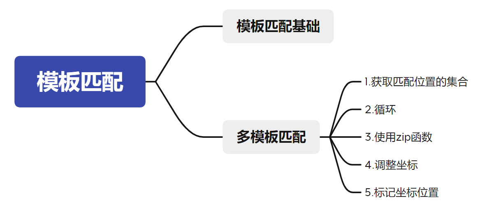
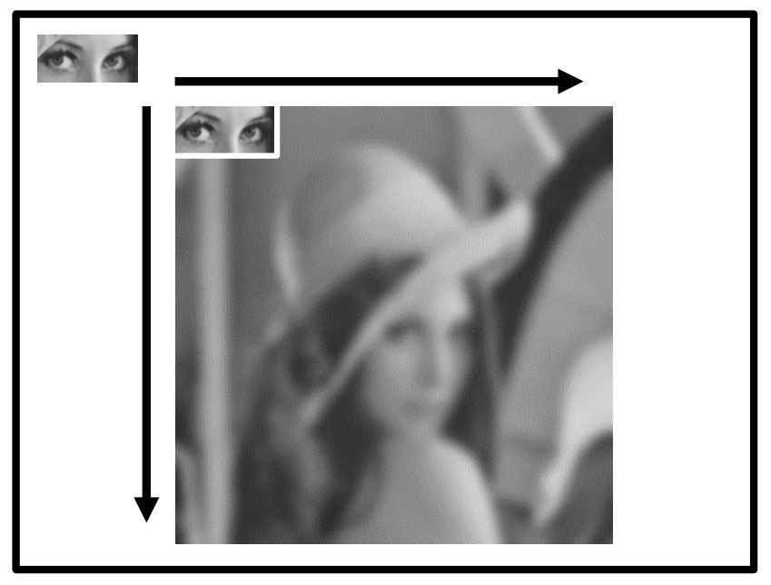
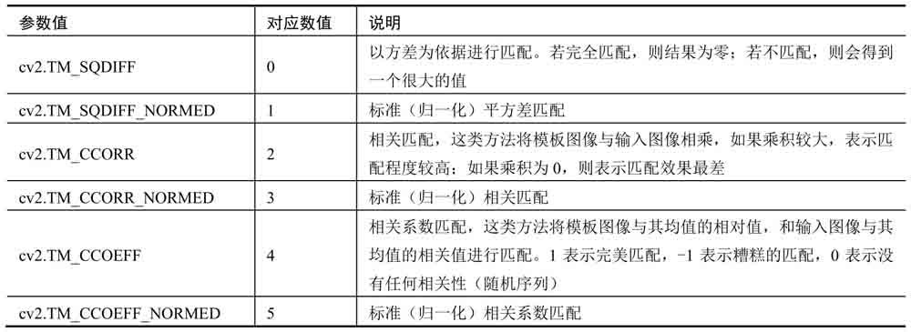
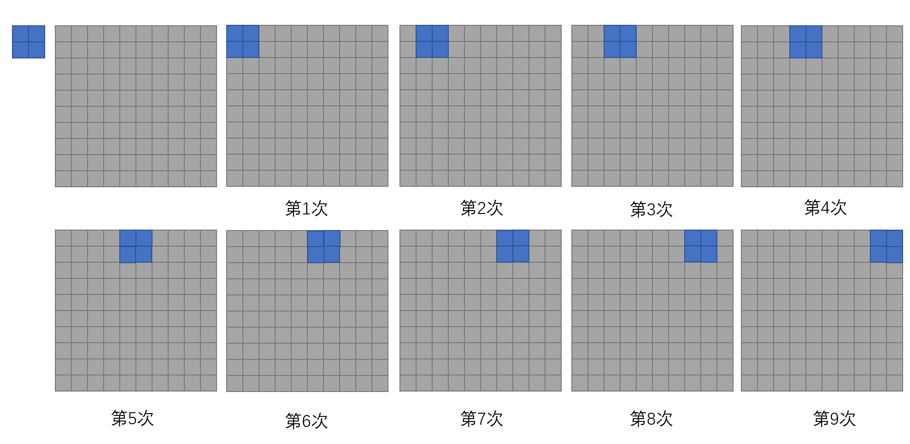
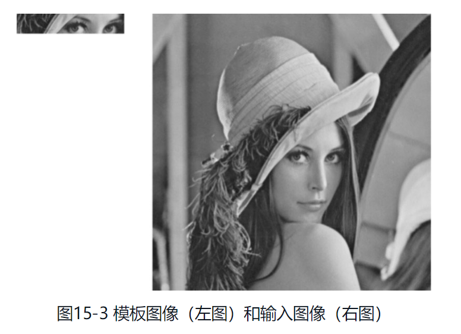
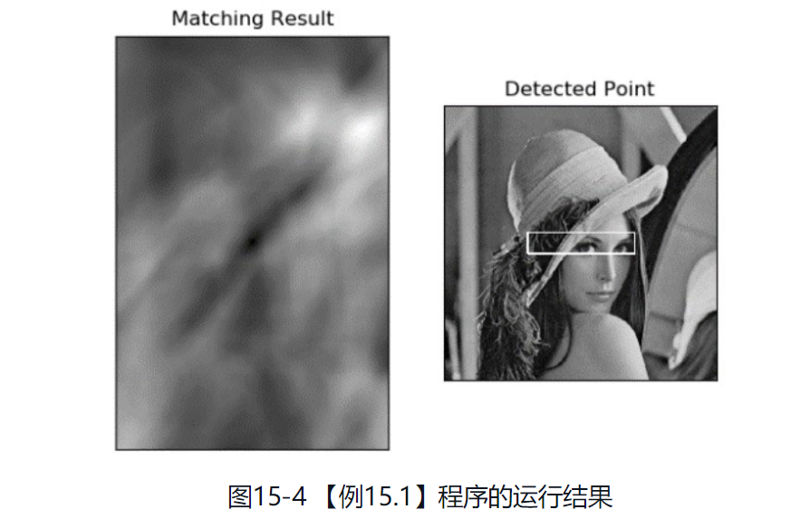
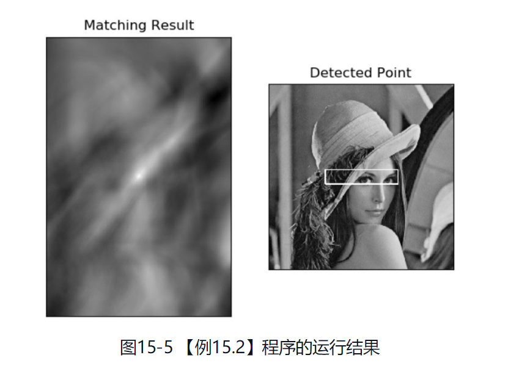
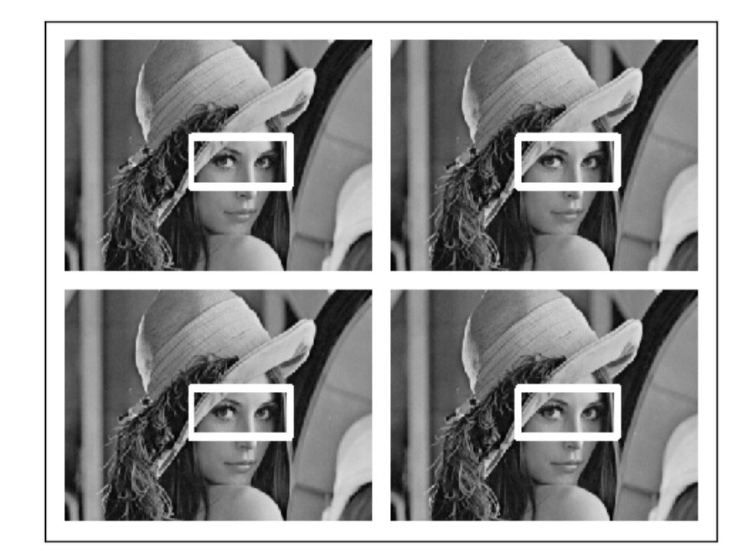

## 思维导图



模板匹配是指在当前**图像A**内寻找与图像B**最相似**的部分，一般将图像**A称为输入图像**，将图像**B称为模板图像**。模板匹配的操作方法是将模板**图像B在图像A上滑动**，遍历所有像素以完成匹配。



## 模板匹配基础

在OpenCV内，模板匹配是使用函数cv2.matchTemplate()实现的。该函数的语法格式为：

```python
result = cv2.matchTemplate(image, templ, method[, mask ] )
```

* image为原始图像，必须是8位或者32位的浮点型图像。
* templ为模板图像。它的尺寸**必须小于或等于原始图像**，并且与原始图像具有**同样的类型**。
* mask为模板图像掩模。它必须和模板图像templ具有**相同的类型和大小**。通常情况下该值使用默认值即可。当前，该参数仅支持TM_SQDIFF和TM_CCORR_NORMED两个值。
* method为匹配方法。该参数通过TemplateMatchModes实现，有6种可能的值



其具体对应的计算公式如表15-2所示。


函数cv2.matchTemplate()的返回值result是由**每个位置的比较结果组合**所构成的一个结果集，类型是单通道32位浮点型。如果输入图像（原始图像）尺寸是W×H*，模板的尺寸是*w×h，则返回值的大小为(W-w+1)*(H-h+1)。


在进行模板匹配时，模板在原始图像内遍历。在水平方向上：

● 遍历的起始坐标是原始图像左数第1个像素值（序号从1开始）。

● 最后一次比较是当模板图像位于原始图像的最右侧时，此时其左上角像素点所在的位置是W-w+1。

因此，返回值result在水平方向上的大小是W-w+1（水平方向上的比较次数）。

如果原始图像尺寸是W×H*，模板的尺寸是*w×h，则返回值的大小为(W-w+1)×(H-h+1)也就是说，模板图像要在输入图像内比较(W-w+1)×(H-h+1)次。

例如，在图中，左上方的2×2小方块是**模板图像**，右下方的10×10图像是**输入图像**（原始图像）。在进行模板匹配时：



* 首先将模板图像置于输入图像的左上角。
* 模板图像在向右移动时，最远只能位于输入图像的最右侧边界处，此时模板图像左上角的像素对应着输入图像的第9列（输入图像宽度-模板图像宽度+1=10-2+1=9）。
* 模板图像在向下移动时，最远只能位于输入图像最下端的边界处。此时模板图像左上角的像素对应着输入图像的第9行（输入图像高度-模板图像高度+1=10-2+1=9）。

根据上述分析可知，比较结果result的大小满足(W-w+1)*(H-h+1)，在上例中就是(10-2+1) ×(10-2+1)，即9×9。也就是说，模板图像要在输入图像内总计比较9×9=81次，这些比较结果将构成一个9×9大小的二维数组

这里需要注意的是，函数cv2.matchTemplate()通过参数method来决定使用不同的查找方法。对于不同的查找方法，返回值result具有不同的含义。例如：

* method的值为cv2.TM_SQDIFF和cv2.TM_SQDIFF_NORMED时，result值为0表示匹配度最好，**值越大，表示匹配度越差**。
* method的值为cv2.TM_CCORR、cv2.TM_CCORR_NORMED、cv2.TM_CCOEFF和cv2.TM_CCOEFF_NORMED时，result的**值越小表示匹配度越差**，**值越大表示匹配度越好**。

从上述分析可以看出，查找方法不同，结果的判定方式也不同。在查找最佳匹配时，首先要确定使用的是何种method，然后再确定到底是查找最大值，还是查找最小值。查找最值（极值）与最值所在的位置，可以使用cv2.minMaxLoc()函数实现。该函数语法格式如下：

```python
minVal, maxVal, minLoc, maxLoc   = cv2.minMaxLoc( src [, mask] )
```

* src为单通道数组。
* minVal为返回的最小值，如果没有最小值，则可以是NULL（空值）。
* maxVal为返回的最大值，如果没有最小值，则可以是NULL。
* minLoc为最小值的位置，如果没有最大值，则可以是NULL。
* maxLoc为最大值的位置，如果没有最大值，则可以是NULL。
* mask为用来选取掩模的子集，可选项。

函数cv2.minMaxLoc()能够查找整个数组内的最值及它们的位置，并且可以根据当前的掩模集来选取特定子集的极值。

函数cv2.matchTemplate()返回值中的最值位置就是模板匹配的位置。当然，选用表15-1中的不同参数值，匹配位置可能位于最大值所在的位置也可能位于最小值所在的位置。通过函数cv2.minMaxLoc()来查找函数cv2.matchTemplate()返回值中的最值位置，就可以找到最佳模板匹配的位置例如，当method的值为cv2.TM_SQDIFF和cv2.TM_SQDIFF_NORMED时，0表示最佳匹配，值越大，则表示匹配效果越差。因此，在使用这两种方法时，要寻找最小值所在的位置作为最佳匹配。如下语句能够找到cv2.matchTemplate()函数返回值中最小值的位置：

```python
minVal, maxVal, minLoc, maxLoc = cv2.minMaxLoc(matchTemplate函数的返回值)
topLeft = minLoc                          # 查找最小值所在的位置
```

以topLeft点为模板匹配位置的左上角坐标，结合模板图像的宽度w和高度h可以确定匹配位置的右下角坐标，代码如下所示：

```python
bottomRight = (topLeft[0] + w, topLeft[1] + h)    #w和h是模板图像的宽度和高度
```

当method的值为cv2.TM_CCORR、cv2.TM_CCORR_NORMED、cv2.TM_CCOEFF和cv2.TM_CCOEFF_NORMED时，cv2.matchTemplate()函数的返回值越小，表示匹配度越差，而返回值越大则表示匹配度越好。此时，要寻找最大值所在的位置作为最佳匹配。如下语句能够找到模板匹配返回值中最大值的位置，并以该点为左上角，结合模板的宽度w和高度h确定匹配位置的右下角坐标。

```python
minVal, maxVal, minLoc, maxLoc = cv2.minMaxLoc(matchTemplate函数的返回值)
topLeft = maxLoc         # 查找最大值所在的位置
bottomRight = (topLeft[0] + w, topLeft[1] + h)        # w和h是模板的宽度和高度
```

通过上述方式，我们确定了模板匹配的矩形对角坐标位置，接下来可以借助函数cv2.rectangle()将该位置用白色标记出来。函数cv2.rectangle的语法格式为：

```python
Img = cv.rectangle( img, pt1, pt2, color[, thickness])
```

* img表示要标记的目标图像。
* pt1是矩形的顶点。
* pt2是pt1的对角顶点。
* color是要绘制矩形的颜色或灰度级（灰度图像）。
* thickness是矩形边线的宽度。

因此，使用的标记语句为：

```python
cv2.rectangle(img, topLeft, bottomRight, 255, 2)
```

该语句表示，在img内标记一个矩形，矩形的两个对角顶点为topLeft和bottomRight，矩形颜色为白色（255），宽度为2。

**例一**：使用函数cv2.matchTemplate()进行模板匹配。要求参数method的值设置为cv2.TM_SQDIFF，显示函数的返回结果及匹配结果。

```python
import cv2
import numpy as np
from matplotlib import pyplot as plt
# 原始图像
img = cv2.imread('lena512g.bmp',0)
# 模板图像
template = cv2.imread('temp.bmp',0)
# 获取模板图像的宽高
th, tw = template.shape[::]
# 进行匹配
rv = cv2.matchTemplate(img, template, cv2.TM_SQDIFF)
minVal, maxVal, minLoc, maxLoc = cv2.minMaxLoc(rv)
# 获取最小值坐标
topLeft = minLoc
# 获取右下角点坐标
bottomRight = (topLeft[0] + tw, topLeft[1] + th)
# 绘制矩形
cv2.rectangle(img, topLeft, bottomRight, 255, 2)

# 显示图像
plt.subplot(121), plt.imshow(rv, cmap = 'gray')
plt.title('Matching Result'), plt.xticks([]), plt.yticks([])
plt.subplot(122), plt.imshow(img, cmap = 'gray')
plt.title('Detected Point'), plt.xticks([]), plt.yticks([])
plt.show()
```



运行上述代码，得到如图15-4所示结果，其中左图是函数cv2.matchTemplate()的返回值，右图是模板匹配的结果。



**实例二**：使用cv2.matchTemplate()函数进行模板匹配。要求参数method的值设置为cv2.TM_CCOEFF，显示函数的返回结果及匹配结果。

```python
import cv2
import numpy as np
from matplotlib import pyplot as plt
# 原始图像
img = cv2.imread('lena512g.bmp',0)
# 模板图像
template = cv2.imread('temp.bmp',0)
# 获取模板宽高
tw, th = template.shape[::-1]
# 匹配运算
rv = cv2.matchTemplate(img, template, cv2.TM_CCOEFF)
minVal, maxVal, minLoc, maxLoc = cv2.minMaxLoc(rv)
# 最大值坐标
topLeft = maxLoc
# 右下角点坐标
bottomRight = (topLeft[0] + tw, topLeft[1] + th)
# 绘制矩形
cv2.rectangle(img, topLeft, bottomRight, 255, 2)

# 显示图像
plt.subplot(121), plt.imshow(rv, cmap = 'gray')
plt.title('Matching Result'), plt.xticks([]), plt.yticks([])
plt.subplot(122), plt.imshow(img, cmap = 'gray')
plt.title('Detected Point'), plt.xticks([]), plt.yticks([])
plt.show()
```



## 多模板匹配

我们在输入图像lena中搜索其眼部子图，该子图在整个输入图像内**仅出现了一次**。但是，有些情况下，要搜索的模板图像很可能在输入图像内出现了多次，这时就需要**找出多个匹配结果**。而函数cv2.minMaxLoc()仅仅能够找出最值，无法给出所有匹配区域的位置信息。所以，要想匹配多个结果，使用函数cv2.minMaxLoc()是无法实现的，需要**利用阈值进行处理**。

### **1.获取匹配位置的集合**

函数**where()**能够获取模板匹配**位置的集合**。对于不同的输入，其返回的值是不同的。

* 当输入（参数）是一维数组时，返回值是一维索引，只有一组索引数组。
* 当输入是二维数组时，返回的是匹配值的位置索引，因此会有两组索引数组表示返回值的位置。

以下代码查找在一维数组a中，数值大于5的元素的索引（即该元素所在的位置，数组的索引从0开始）：

```python
import numpy as np
a=np.array([3,6,8,1,2,88])
b=np.where(a>5)
print(b)
```

该段代码返回的结果为：

```python
(array([1, 2, 5], dtype=int64), )
```

说明索引值为1、2、5的数组元素，它们的值是大于5的。

上面介绍的是输入值为一维数组时的情况。当输入值是二维数组时，函数where()会返回满足条件的值在二维数组中的索引。例如，以下代码查找在二维数组am中，值大于5的元素的索引：

```python
import numpy as np
am=np.array([[3,6,8,77,66], [1,2,88,3,98], [11,2,67,5,2]])
b=np.where(am>5)
print(b)
```

该段代码返回的结果为：

```python
(array([0, 0, 0, 0, 1, 1, 2, 2], dtype=int64),
array([1, 2, 3, 4, 2, 4, 0, 2], dtype=int64))
```

上述结果说明，存在二维数组am，它的值为：

```python
[[ 3  6  8 77 66]
[ 1  2 88  3 98]
[11  2 67  5  2]]
```

其中，位置[0, 1]、[0, 2]、[0, 3]、[0, 4]、[1, 2]、[1, 4]、[2, 0]、[2, 2]上的元素值大于5。

综上所述，函数np.where()可以找出在函数cv2.matchTemplate()的返回值中，哪些位置上的值是**大于阈值threshold的**。在具体实现时，可以采用的语句为：

```python
loc = np.where( res >= threshold)
```

* res是函数cv2.matchTemplate()进行模板匹配后的返回值。
* threshold是预设的阈值
* loc是满足“res >= threshold”的像素点的索引集合。例如，在上面的二维数组am中，返回的大于5的元素索引集合为(array([0, 0, 0, 0, 1, 1, 2, 2],dtype=int64), array([1, 2, 3, 4, 2, 4, 0, 2], dtype=int64))。返回值loc中的两个元素，分别表示匹配值的行索引和列索引。

### **2.循环**

要处理多个值，通常需要用到循环。例如，有一个列表，其中的值为71、23、16，希望将这些值逐个输出，可以这样写代码：

```python
value = [71,23,16]
for i in value:
print('value内的值：', i)
```

运行上述代码，得到的输出结果为：

```python
value内的值： 71
value内的值： 23
value内的值： 16
```

因此，在获取匹配值的索引集合后，可以采用如下语句遍历所有匹配的位置，对这些位置做标记：

```python
for i in 匹配位置集合：
标记匹配位置。
```

### **3.在循环中使用函数zip()**

函数zip()用可迭代的对象作为参数，将对象中对应的元素**打包成一个个元组**，然后返回由这些**元组组成的列表**。例如，以下代码使用函数zip()将t内对应的元素打包成一个个元组，并打印了由这些元组组成的列表：

```python
x = [1,2,3]
y = [4,5,6]
z = [7,8,9]
t = (x, y, z)
print(t)
for i in zip(*t):
  print(i)
```

上述代码中，语句print(t)将t内的元素输出，结果为：

```python
([1, 2, 3], [4, 5, 6], [7, 8, 9])
```

循环语句for i in zip(*t)将t内的元素打包成元组后输出，结果为：

```python
(1, 4, 7)
(2, 5, 8)
(3, 6, 9)
```

因此，如果希望循环遍历由np.where()返回的模板匹配索引集合，可以采用的语句为：

```python
for i in zip(*模板匹配索引集合):
标记处理
```

例如，对于前面提到的数组am，使用函数zip()循环，就可以得到其中大于5的元素索引的集合：

```python
import numpy as np
am=np.array([[3,6,8,77,66], [1,2,88,3,98], [11,2,67,5,2]])
print(am)
b=np.where(am>5)
for i in zip(*b):
    print(i)
```

上述代码的输出结果为：

```python
[[ 3  6  8 77 66]
[ 1  2 88  3 98]
[11  2 67  5  2]]
(0, 1)
(0, 2)
(0, 3)
(0, 4)
(1, 2)
(1, 4)
(2, 0)
(2, 2)
```

### **4.调整坐标**

函数numpy.where()可以获取满足条件的模板匹配位置集合，然后可以使用函数cv2.rectangle()在上述匹配位置绘制矩形来标注匹配位置。使用函数numpy.where()在函数cv2.matchTemplate()的输出值中查找指定值，得到的形式为“（行号，列号）”的位置索引。但是，函数cv2.rectangle()中用于指定顶点的参数所使用的是形式为“（列号，行号）”的位置索引。所以，在使用函数cv2.rectangle()绘制矩形前，要先将函数numpy.where()得到的位置索引做“**行列互换**”。可以使用如下语句实现loc内行列位置的互换：

```python
loc[::-1]
```

如下语句将loc内的两个元素交换位置：

```python
import numpy as np
loc = ([1,2,3,4], [11,12,13,14])
print(loc)
print(loc[::-1])
```

其中，语句print(loc)所对应的输出为：

```python
([1, 2, 3, 4], [11, 12, 13, 14])
```

语句print(loc[::-1])所对应的输出为：

```python
([11, 12, 13, 14], [1, 2, 3, 4])
```

### **5.标记匹配图像的位置**

函数cv2.rectangle()可以标记匹配图像的具体位置，分别指定要标记的原始图像、对角顶点、颜色、矩形边线宽度即可。关于矩形的对角顶点：

* 其中的一个对角顶点A可以通过for循环语句从确定的满足条件的“匹配位置集合”内获取。
* 另外一个对角顶点，可以通过顶点A的位置与模板的宽（w）和高（h）进行运算得到。

因此，标记各个匹配位置的语句为：

```python
for i in 匹配位置集合：
   cv2.rectangle(输入图像，i, (i[0] + w, i[1] + h), 255, 2)
```

**例三**：使用模板匹配方式，标记在输入图像内与模板图像匹配的多个子图像。

```python
import cv2
import numpy as np
from matplotlib import pyplot as plt
# 原始图像
img = cv2.imread('lena4.bmp',0)
# 模板图像
template = cv2.imread('lena4Temp.bmp',0)
# 横纵坐标翻转
w, h = template.shape[::-1]
# 匹配
res = cv2.matchTemplate(img, template, cv2.TM_CCOEFF_NORMED)
# 设置匹配阈值
threshold = 0.9
# 查找匹配大于阈值的图像集合
loc = np.where( res >= threshold)
# 遍历集合
for pt in zip(*loc[::-1]):
    cv2.rectangle(img, pt, (pt[0] + w, pt[1] + h), 255, 1)
plt.imshow(img, cmap = 'gray')
plt.xticks([]), plt.yticks([])
```


