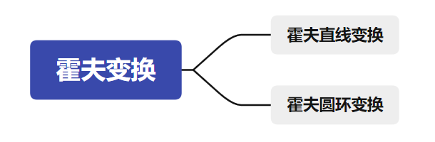
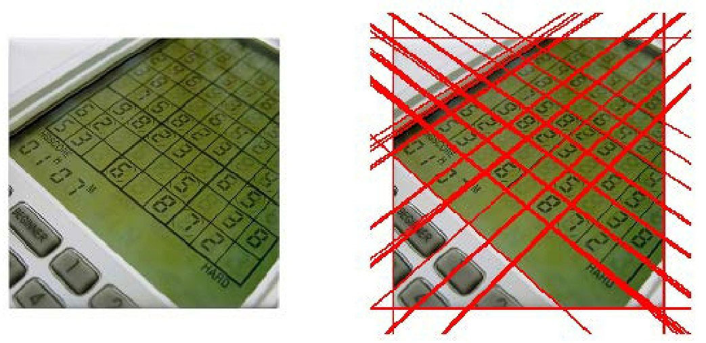
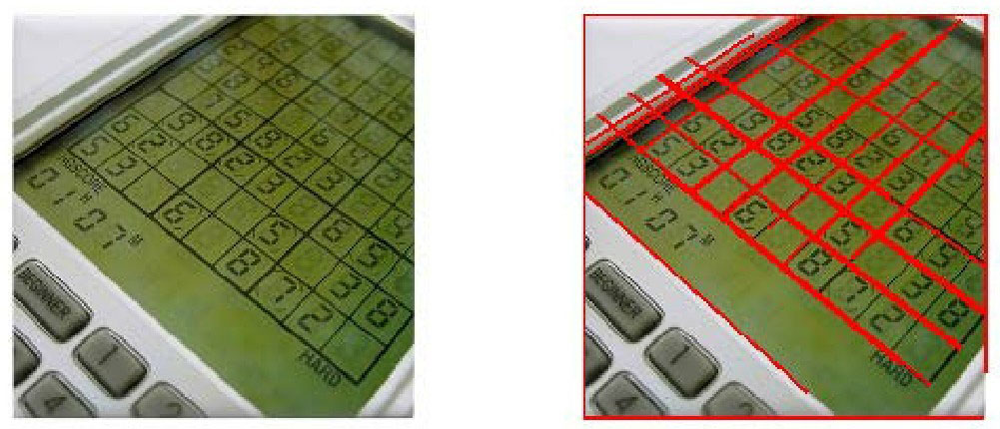
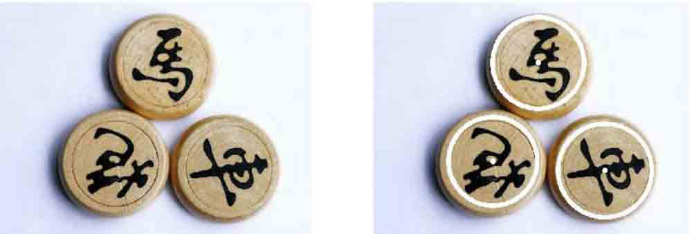
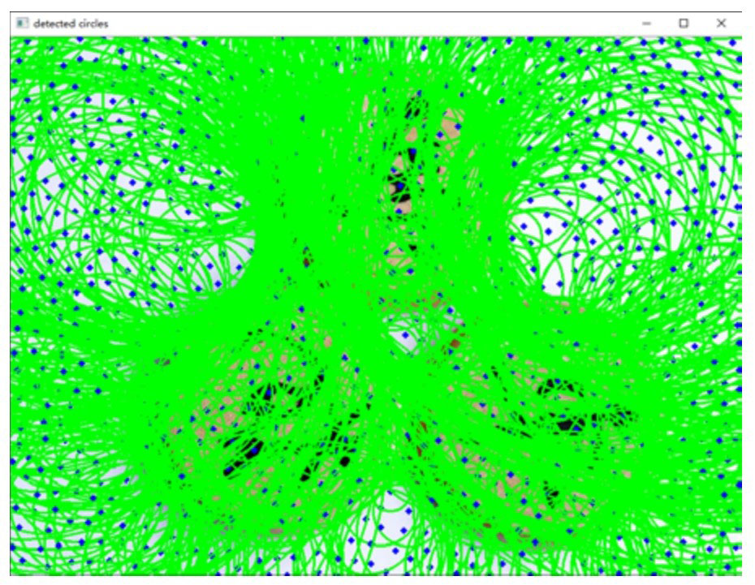

## 思维导图



霍夫变换是一种在图像中**寻找直线、圆形以及其他简单形状的方法**。霍夫变换采用类似投票的方式来获取当前图像内的形状集合，该变换由Paul Hough（霍夫）于1962年首次提出。最初的霍夫变换只能用于检测直线，经过发展后，霍夫变换不仅能够识别直线，还能识别其他简单的图形结构，常见的有圆、椭圆等

## 霍夫直线变换

### HoughLines函数

OpenCV提供了函数cv2.HoughLines()用来实现霍夫直线变换，该函数要求所操作的源图像是一个二值图像，所以在进行霍夫变换之前要先将源图像进行二值化，或者进行Canny边缘检测。

函数cv2.HoughLines()的语法格式为：

```python
lines=cv2.HoughLines(image, rho, theta, threshold)
```

* image是输入图像，即源图像，必须是8位的单通道二值图像。如果是其他类型的图像，在进行霍夫变换之前，需要将其修改为指定格式。
* rho为以像素为单位的距离r的精度。一般情况下，使用的精度是1。
* theta为角度θ的精度。一般情况下，使用的精度是π/180，表示要搜索所有可能的角度。
* threshold是阈值。**该值越小，判定出的直线就越多**。通过上一节的分析可知，识别直线时，要判定有多少个点位于该直线上。在判定直线是否存在时，对直线所穿过的点的数量进行评估，如果直线所穿过的点的数量小于阈值，则认为这些点恰好（偶然）在算法上构成直线，但是在源图像中该直线并不存在；如果大于阈值，则认为直线存在。所以，如果阈值较小，就会得到较多的直线；阈值较大，就会得到较少的直线。
* 返回值lines中的每个元素都是一对浮点数，表示检测到的直线的参数，即(r,θ)，是numpy.ndarray类型。

有一点需要强调的是，使用函数cv2.HoughLines()检测到的是图像中的**直线**而**不是线段**，因此检测到的直线是没有端点的。所以，我们在进行霍夫直线变换时所**绘制的直线都是穿过整幅图像**的。

* 对于垂直方向的直线（不是指垂线，是指**垂直方向上的各种角度的直线**），计算它与图像水平边界（即图像中的第一行和最后一行）的交叉点，然后在这两个交叉点之间画线。

* 对于水平方向上的直线，采用类似的方式完成，只不过用到的是图像的第一列和最后一列。

在绘制线时，所使用的函数是cv2.line()。该函数方便的地方在于，即使点的坐标超出了图像的范围，它也能正确地画出线来，因此没有必要检查交叉点是否位于图像内部。遍历函数cv2.HoughLines()的返回值lines，就可以绘制出所有的直线。

**例一：**使用函数cv2.HoughLines()对一幅图像进行霍夫变换，并观察霍夫变换的效果。

```python
import cv2
import numpy as np
import matplotlib.pyplot as plt
# 原图
img = cv2.imread(' computer.jpg')
# 灰度图
gray = cv2.cvtColor(img, cv2.COLOR_BGR2GRAY)
# 边缘检测
edges = cv2.Canny(gray,50,150, apertureSize = 3)
# bgr转rgb
orgb=cv2.cvtColor(img, cv2.COLOR_BGR2RGB)
# copy图像
oShow=orgb.copy()
# 霍尔变换
lines = cv2.HoughLines(edges,1, np.pi/180,140)
for line in lines:
    rho, theta = line[0]
    a = np.cos(theta)
    b = np.sin(theta)
    x0 = a*rho
    y0 = b*rho
    x1 = int(x0 + 1000*(-b))
    y1 = int(y0 + 1000*(a))
    x2 = int(x0-1000*(-b))
    y2 = int(y0-1000*(a))
    cv2.line(orgb, (x1, y1), (x2, y2), (0,0,255),2)

# 展示图像
plt.subplot(121)
plt.imshow(oShow)
plt.axis('off')
plt.subplot(122)
plt.imshow(orgb)
plt.axis('off')
```



右图中，较粗的直线是因为有多条直线靠近在一起，即检测出了重复的结果。在一些情况下，使用霍夫变换可能将图像中有限个点碰巧对齐的非直线关系检测为直线，而导致误检测，尤其是一些复杂背景的图像，误检测会很明显。此图中该问题虽然并不是特别明显，但是如果将阈值threshold的值设置得稍小些，仍然会出现较多重复的检测结果。OpenCV官网提供了一幅名为building.jpg的图像用来测试，大家可以下载该图像，对其进行霍夫变换，观察检测的效果。该图在使用霍夫变换进行检测时，存在非常严重的误检测。为了解决上述问题，人们提出了霍夫变换的改进版——**概率霍夫变换**。

### HoughLinesP函数

概率霍夫变换对基本霍夫变换算法进行了一些修正，是霍夫变换算法的优化。它没有考虑所有的点。相反，它只需要一个足以进行线检测的随机点子集即可。为了更好地判断直线（线段），概率霍夫变换算法还对选取直线的方法作了两点改进：

* 所接受直线的**最小长度**。如果有超过阈值个数的像素点构成了一条直线，但是这条**直线很短**，那么就**不会接受该直线作为判断结果**，而认为这条直线仅仅是图像中的若干个像素点恰好随机构成了一种算法上的直线关系而已，实际上原图中并不存在这条直线。
* 接受直线时允许的**最大像素点间距**。如果有超过阈值个数的像素点构成了一条直线，但是这组像素点之间的距离都很远，就不会接受该直线作为判断结果，而认为这条直线仅仅是图像中的若干个像素点恰好随机构成了一种算法上的直线关系而已，实际上原始图像中并不存在这条直线。

在OpenCV中，函数cv2.HoughLinesP()实现了概率霍夫变换。其语法格式为：

```python
lines=cv2.HoughLinesP(image, rho, theta, threshold, minLineLength,maxLineGap)
```

* image是输入图像，即源图像，必须为8位的单通道二值图像。对于其他类型的图像，在进行霍夫变换之前，需要将其修改为这个指定的格式。
* rho为以像素为单位的距离r的精度。一般情况下，使用的精度是1。
* threshold是阈值。该值越小，判定出的直线越多；值越大，判定出的直线就越少。
* minLineLength用来控制“接受直线的**最小长度**”的值，默认值为0。
* maxLineGap用来控制接受共线线段之间的**最小间隔**，即在一条线中两点的最大间隔。如果两点间的间隔超过了参数maxLineGap的值，就认为这两点不在一条线上。默认值为0。
* 返回值lines是由numpy.ndarray类型的元素构成的，其中每个元素都是一对浮点数，表示检测到的直线的参数，即( r, θ)。

**实例二**：使用函数cv2.HoughLinesP()对一幅图像进行霍夫变换，并观察图像的检测效果。

```python
import cv2
import numpy as np
import matplotlib.pyplot as plt
# 获取原图
img = cv2.imread('computer.jpg', -1)
# 转换为灰度图
gray = cv2.cvtColor(img, cv2.COLOR_BGR2GRAY)
# 进行边缘检测
edges = cv2.Canny(gray,50,150, apertureSize =3)
# BGR转RGB
orgb=cv2.cvtColor(img, cv2.COLOR_BGR2RGB)
oShow=orgb.copy()
# 绘制水平线
lines = cv2.HoughLinesP(edges,1, np.pi/180,1, minLineLength=100, maxLineGap=10)
for line in lines:
    x1, y1, x2, y2 = line[0]
    cv2.line(orgb, (x1, y1), (x2, y2), (255,0,0),5)

# 显示图像
plt.subplot(121)
plt.imshow(oShow)
plt.axis('off')
plt.subplot(122)
plt.imshow(orgb)
plt.axis('off')
```

运行上述程序，得到霍夫概率变换的结果如图16-10所示。可以看到概率霍夫变换比霍夫变换得到的检测结果更准确。



## 霍夫圆环变换

霍夫变换除了用来检测直线外，也能用来检测其他几何对象。实际上，只要是能够用一个参数方程表示的对象，都适合用霍夫变换来检测。用霍夫圆变换来检测图像中的圆，与使用霍夫直线变换检测直线的原理类似。在霍夫圆变换中，需要考虑圆半径和圆心（x坐标、y坐标）共3个参数。在OpenCV中，采用的策略是两轮筛选。第1轮筛选找出**可能存在圆的位置**（圆心）；第2轮再根据第1轮的结果**筛选出半径大小**。

与用来决定是否接受直线的两个参数“接受直线的最小长度（minLineLength）”和“接受直线时允许的最大像素点间距（MaxLineGap）”类似，霍夫圆变换也有几个用于决定是否接受圆的参数：**圆心间的最小距离**、**圆的最小半径**、**圆的最大半径**。

在OpenCV中，实现霍夫圆变换的是函数cv2.HoughCircles()，该函数将Canny边缘检测和霍夫变换结合。其语法格式为：

```python
circles=cv2.HoughCircles(image,method,dp,minDist,param1,param2,minRadius,maxRadius)
```

* image：输入图像，即源图像，类型为8位的单通道灰度图像。
* method：检测方法。截止到OpenCV 4.0.0-pre版本，HOUGH_GRADIENT是唯一可用的参数值。该参数代表的是霍夫圆检测中两轮检测所使用的方法。
* dp：累计器分辨率，它是一个分割比率，用来指定图像分辨率与圆心累加器分辨率的比例。例如，如果dp=1，则输入图像和累加器具有相同的分辨率。
* minDist：圆心间的最小间距。该值被作为阈值使用，如果存在**圆心间距离小于该值的多个圆，则仅有一个会被检测出来**。因此，如果该值太小，则会有多个临近的圆被检测出来；如果该值太大，则可能会在检测时漏掉一些圆。
* param1：该参数是缺省的，在缺省时默认值为100。它对应的是Canny边缘检测器的高阈值（低阈值是高阈值的二分之一）。
* 圆心位置必须收到的投票数。只有在第1轮筛选过程中，投票数超过该值的圆，才有资格进入第2轮的筛选。因此，该值越大，检测到的圆越少；该值越小，检测到的圆越多。这个参数是缺省的，在缺省时具有默认值100。
* minRadius：圆半径的最小值，小于该值的圆不会被检测出来。该参数是缺省的，在缺省时具有默认值0，此时该参数不起作用。
* maxRadius：圆半径的最大值，大于该值的圆不会被检测出来。该参数是缺省的，在缺省时具有默认值0，此时该参数不起作用。
* circles：返回值，由圆心坐标和半径构成的numpy.ndarray。

需要特别注意，在调用函数cv2.HoughLinesCircles()之前，要对源图像进行平滑操作，以减少图像中的噪声，避免发生误判。该函数具有非常多的参数，在实际检测中可以根据需要设置不同的值。

**实例四**：使用HoughLinesCircles函数对一幅图像进行霍夫圆变换，并观察检测效果。

```python
import cv2
import numpy as np
import matplotlib.pyplot as plt
# 原图
img = cv2.imread('chess.jpg',0)
imgo=cv2.imread('chess.jpg', -1)

# bgr转rgb
o=cv2.cvtColor(imgo, cv2.COLOR_BGR2RGB)
# copy原图
oshow=o.copy()
# 平滑处理
img = cv2.medianBlur(img,5)
# 圆环变换
circles = cv2.HoughCircles(img, cv2.HOUGH_GRADIENT,1,300,param1=50, param2=30, minRadius=100, maxRadius=200)
# 转换为uint16
circles = np.uint16(np.around(circles))
for i in circles[0, :]:
    cv2.circle(o, (i[0], i[1]), i[2], (255,0,0),12)
    cv2.circle(o, (i[0], i[1]),2, (255,0,0),12)

# 显示图像
plt.subplot(121)
plt.imshow(oshow)
plt.axis('off')
plt.subplot(122)
plt.imshow(o)
plt.axis('off')
```

可以看到霍夫圆变换检测到了源图像中的三个圆。为了方便读者在纸质版图书上观察，本例中圆环和圆心都是用白色显示的，在实际使用中可以设置函数cv2.circle()中的颜色参数，显示不同的颜色



在检测中，可能需要不断调整参数才能得到最优结果。例如，图16-12是参数为

```python
circles = cv2.HoughCircles(img, cv2.HOUGH_GRADIENT,1,20,param1=50, param2=30, minRadius=0, maxRadius=0)
```

时，针对图16-11的左图进行霍夫圆变换所得到的结果。如果仔细观察，可以看到图16-12中绘制了非常多的圆和圆心。


