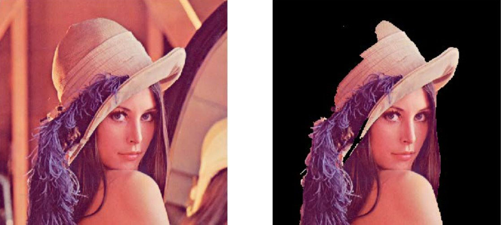

## 思维导图


在图像处理的过程中，经常需要从图像中将前景对象作为目标图像分割或者提取出来。例如，在视频监控中，观测到的是固定背景下的视频内容，而我们对背景本身并无兴趣，感兴趣的是背景中出现的车辆、行人或者其他对象。我们希望将这些**对象从视频中提取出来**，而**忽略那些没有对象进入背景的视频内容**。

## 用分水岭算法实现图像分割与提取

图像分割是图像处理过程中一种非常重要的操作。分水岭算法将图像形象地比喻为地理学上的地形表面，实现图像分割，该算法非常有效。

在OpenCV中，可以使用函数cv2.watershed()实现分水岭算法。在具体的实现过程中，还需要借助于形态学函数、距离变换函数cv2.distanceTransform()、cv2.connectedComponents()来完成图像分割。

### 1.形态学操作

在使用分水岭算法对图像进行分割前，需要对图像进行简单的形态学处理。

**实例一**：使用形态学变换，获取一幅图像的边界信息，并观察效果。

```python
import cv2
import numpy as np
import matplotlib.pyplot as plt
o=cv2.imread("my.bmp", cv2.IMREAD_UNCHANGED)
k=np.ones((5,5), np.uint8)
# 腐蚀操作
e=cv2.erode(o, k)
# 减法运算
b=cv2.subtract(o, e)

# 显示图像
plt.subplot(131)
plt.imshow(o)
plt.axis('off')
plt.subplot(132)
plt.imshow(e)
plt.axis('off')
plt.subplot(133)
plt.imshow(b)
plt.axis('off')
```

其中左图是原始图像，中间的图是对其进行腐蚀而得到的图像，右图是原始图像减去腐蚀图像后得到的边界图像。


通过以上分析可知，使用形态学操作和减法运算能够获取图像的边界信息。但是，形态学操作仅适用于比较简单的图像。如果图像内的前景对象存在连接的情况，使用形态学操作就无法准确获取各个子图像的边界了。

### 2.距离变换函数

当图像内的各个子图没有连接时，可以直接使用形态学的腐蚀操作确定前景对象，但是如果**图像内的子图连接在一起时**，就很难确定前景对象了。此时，借助于距离变换函数cv2.distanceTransform()可以方便地将前景对象提取出来。

距离变换函数cv2.distanceTransform()计算二值图像内任意点到最近背景点的距离。一般情况下，该函数计算的是图像内**非零值像素点**到**最近的零值像素点**的**距离**，即计算二值图像中所有像素点距离其最近的值为0的像素点的距离。当然，如果像素点本身的值为0，则这个距离也为0。

距离变换函数cv2.distanceTransform()的计算结果反映了各个像素与背景（值为0的像素点）的距离关系。通常情况下：

* 如果前景对象的中心（质心）距离值为0的像素点距离较远，会得到一个较大的值。
* 如果前景对象的边缘距离值为0的像素点较近，会得到一个较小的值。

如果对上述计算结果进行阈值化，就可以得到图像内子图的中心、骨架等信息。距离变换函数cv2.distanceTransform()可以用于计算对象的中心，还能细化轮廓、获取图像前景等，有多种功能。

距离变换函数cv2.distanceTransform()的语法格式为：

```python
dst=cv2.distanceTransform(src, distanceType, maskSize[, dstType]])
```

* src是8位单通道的二值图像
* distanceType为距离类型参数


* maskSize为掩模的尺寸，其可能的值如表17-2所示。需要注意，当distanceType=cv2.DIST_L1或cv2.DIST_C时，maskSize强制为3（因为设置为3和设置为5及更大值没有什么区别）。


* dstType为目标图像的类型，默认值为CV_32F。
* dst表示计算得到的目标图像，可以是8位或32位浮点数，尺寸和src相同。

**实例二**：使用距离变换函数cv2.distanceTransform()，计算一幅图像的确定前景，并观察效果。

```python
import numpy as np
import cv2
import matplotlib.pyplot as plt
# 原图像
img = cv2.imread('water_coins.jpg')
# 转灰度图
gray = cv2.cvtColor(img, cv2.COLOR_BGR2GRAY)
# BGR转RGB
img=cv2.cvtColor(img, cv2.COLOR_BGR2RGB)
ishow=img.copy()
# 进行阈值处理
ret, thresh = cv2.threshold(gray,0,255, cv2.THRESH_BINARY_INV+cv2.THRESH_OTSU)
# 设置核
kernel = np.ones((3,3), np.uint8)
# 开运算
opening = cv2.morphologyEx(thresh, cv2.MORPH_OPEN, kernel, iterations = 2)
# 计算距离
dist_transform = cv2.distanceTransform(opening, cv2.DIST_L2,5)
# 进行阈值处理
ret, fore = cv2.threshold(dist_transform,0.7*dist_transform.max(),255,0)

# 显示图像
plt.subplot(131)
plt.imshow(ishow)
plt.axis('off')
plt.subplot(132)
plt.imshow(dist_transform)
plt.axis('off')
plt.subplot(133)
plt.imshow(fore)
plt.axis('off')
```


* 左图是原始图像。
* 中间的是距离变换函数cv2.distanceTransform()计算得到的距离图像。
* 右图是对距离图像进行阈值化处理后的结果图像。

### 3.确定未知区域

使用形态学的膨胀操作能够将图像内的前景“膨胀放大”。当图像内的前景被放大后，背景就会被“压缩”，所以此时得到的背景信息一定小于实际背景的，不包含前景的“确定背景”。以下为了方便说明将确定背景称为B。

距离变换函数cv2.distanceTransform()能够获取图像的“中心”，得到“确定前景”。为了方便说明，将确定前景称为F。图像中有了确定前景F和确定背景B，剩下区域的就是未知区域UN了。这部分区域正是分水岭算法要进一步明确的区域。

针对一幅图像O，通过以下关系能够得到未知区域UN：

	未知区域UN=图像O-确定背景B-确定前景F

对上述表达式进行整理，可以得到：

	未知区域UN=（图像O-确定背景B）- 确定前景F

上式中的“图像O-确定背景B”，可以通过对图像进行形态学的膨胀操作得到。

**实例三**：标注一幅图像的确定前景、确定背景及未知区域。

```python
import numpy as np
import cv2
import matplotlib.pyplot as plt
img = cv2.imread('water_coins.jpg')
gray = cv2.cvtColor(img, cv2.COLOR_BGR2GRAY)
img=cv2.cvtColor(img, cv2.COLOR_BGR2RGB)
ishow=img.copy()
# 阈值处理
ret, thresh = cv2.threshold(gray,0,255,cv2.THRESH_BINARY_INV+cv2.THRESH_OTSU)
kernel = np.ones((3,3), np.uint8)
# 开运算
opening = cv2.morphologyEx(thresh, cv2.MORPH_OPEN, kernel, iterations = 2)
# 膨胀操作
bg = cv2.dilate(opening, kernel, iterations=3)
# 计算距离
dist = cv2.distanceTransform(opening, cv2.DIST_L2,5)
# 阈值处理
ret, fore = cv2.threshold(dist,0.7*dist.max(),255,0)
fore = np.uint8(fore)
un = cv2.subtract(bg, fore)

# 显示图像
plt.subplot(221)
plt.imshow(ishow)
plt.axis('off')
plt.subplot(222)
plt.imshow(bg)
plt.axis('off')
plt.subplot(223)
plt.imshow(fore)
plt.axis('off')
plt.subplot(224)
plt.imshow(un)
plt.axis('off')
```


* 左上角是原始图像ishow。
* 右上角是对图像ishow进行膨胀后得到的图像bg，其背景图像是确定背景，前景图像是“原始图像-确定背景”。
* 左下角是确定前景图像fore。
* 右下角图像中的小圆环就是未知区域图像un，是由图像bg和图像fore相减得到的。也就是说，未知区域图像un来源于“原始图像-确定背景-确定前景”。

值得注意的是，在图17-10右上角的图像bg中：

* 前景的一个个小圆是“原始图像-确定背景”部分，而不是“确定背景”。
* 其背景图像才是“确定背景”。

### 4.函数标记

明确了确定前景后，就可以对确定前景图像进行标注了。在OpenCV中，可以使用函数cv2.connectedComponents()进行**标注**。该函数会将背景标注为0，将其他的对象使用从1开始的正整数标注。

函数cv2.connectedComponents()的语法格式为：

```python
retval, labels = cv2.connectedComponents( image )
```

* image为8位单通道的待标注图像。
* retval为返回的标注的数量。
* labels为标注的结果图像。

**例四：**使用函数cv2.connectedComponents()标注一幅图像，并观察标注的效果。

```python
import numpy as np
import cv2
import matplotlib.pyplot as plt
img = cv2.imread('water_coins.jpg')
gray = cv2.cvtColor(img, cv2.COLOR_BGR2GRAY)
img=cv2.cvtColor(img, cv2.COLOR_BGR2RGB)
ishow=img.copy()
# 阈值处理
ret, thresh = cv2.threshold(gray,0,255,cv2.THRESH_BINARY_INV+cv2.THRESH_OTSU)
# 核
kernel = np.ones((3,3), np.uint8)
# 开运算
opening = cv2.morphologyEx(thresh, cv2.MORPH_OPEN, kernel, iterations = 2)
# 膨胀操作
sure_bg = cv2.dilate(opening, kernel, iterations=3)
# 计算距离
dist_transform = cv2.distanceTransform(opening, cv2.DIST_L2,5)
# 阈值处理
ret, fore = cv2.threshold(dist_transform,0.7*dist_transform.max(),255,0)
fore = np.uint8(fore)
# 添加标注
ret, markers = cv2.connectedComponents(fore)
plt.subplot(131)
plt.imshow(ishow)
plt.axis('off')
plt.subplot(132)
plt.imshow(fore)
plt.axis('off')
plt.subplot(133)
plt.imshow(markers)
plt.axis('off')
print(ret)
```


* 左图是原始图像ishow。
* 中间的是经过距离变换后得到的前景图像的中心点图像fore。
* 右图是对前景图像的中心点图像进行标注后的结果图像markers。

函数cv2.connectedComponents()在标注图像时，会将背景标注为0，将其他的对象用从1开始的正整数标注。具体的对应关系为：

*  数值0代表背景区域。
*  从数值1开始的值，代表不同的前景区域。

在分水岭算法中，标注值0代表未知区域。所以，我们要对函数cv2.connectedComponents()标注的结果进行调整：将标注的结果都加上数值1。经过上述处理后，在标注结果中：

* 数值1代表背景区域。
* 从数值2开始的值，代表不同的前景区域。

为了能够使用分水岭算法，还需要对原始图像内的未知区域进行标注，将已经计算出来的未知区域标注为0即可。

```python
ret, markers = cv2.connectedComponents(fore)
markers = markers+1
markers[未知区域] = 0
```

**实例五：**使用函数cv2.connectedComponents()标注一幅图像，并对其进行修正，使未知区域被标注为0，并观察标注的效果。

```python
import numpy as np
import cv2
import matplotlib.pyplot as plt
img = cv2.imread('water_coins.jpg')
gray = cv2.cvtColor(img, cv2.COLOR_BGR2GRAY)
img=cv2.cvtColor(img, cv2.COLOR_BGR2RGB)
ishow=img.copy()
# 阈值处理
ret, thresh = cv2.threshold(gray,0,255,cv2.THRESH_BINARY_INV+cv2.THRESH_OTSU)
kernel = np.ones((3,3), np.uint8)
# 开运算
opening = cv2.morphologyEx(thresh, cv2.MORPH_OPEN, kernel, iterations = 2)
# 腐蚀操作
sure_bg = cv2.dilate(opening, kernel, iterations=3)
# 计算距离
dist_transform = cv2.distanceTransform(opening, cv2.DIST_L2,5)
# 阈值处理
ret, fore = cv2.threshold(dist_transform,0.7*dist_transform.max(),255,0)
fore = np.uint8(fore)
# 标记
ret, markers1 = cv2.connectedComponents(fore)
foreAdv=fore.copy()
# 减操作计算位置区域
unknown = cv2.subtract(sure_bg, foreAdv)
# 新标记
ret, markers2 = cv2.connectedComponents(foreAdv)
# 加1操作
markers2 = markers2+1
markers2[unknown==255] = 0

# 显示图像
plt.subplot(121)
plt.imshow(markers1)
plt.axis('off')
plt.subplot(122)
plt.imshow(markers2)
plt.axis('off')
```


* 左图是对一幅图像使用函数cv2.connectedComponents()直接标注后的结果。
* 右图是修正后的标注结果。

对比左右图可以看出，右图在前景图像的边缘（未知区域）进行了标注，使得每一个确定前景都有一个黑色的边缘，这个边缘是被标注的未知区域。

### 5.函数cv2.watershed()

完成上述处理后，就可以使用分水岭算法对预处理结果图像进行分割了。在OpenCV中，实现分水岭算法的函数是cv2.watershed()，其语法格式为：

```python
markers = cv2.watershed( image, markers )
```

* image是输入图像，必须是8位三通道的图像。在对图像使用cv2.watershed()函数处理之前，必须先用正数大致勾画出图像中的期望分割区域。每一个分割的区域会被标注为1、2、3等。对于尚未确定的区域，需要将它们标注为0。我们可以将标注区域理解为进行分水岭算法分割的“种子”区域。
* markers是32位单通道的标注结果，它应该和image具有相等大小。在markers中，每一个像素要么被设置为初期的“种子值”，要么被设置为“-1”表示边界。markers可以省略。

**分水岭算法图像分割实例**

讲解一个图像分割实例。使用分水岭算法进行图像分割时，基本的步骤为：

1.通过形态学开运算对原始图像O去噪。

2.通过腐蚀操作获取“确定背景B”。需要注意，这里得到“原始图像-确定背景”即可。

3.利用距离变换函数cv2.distanceTransform()对原始图像进行运算，并对其进行阈值处理，得到“确定前景F”。

4.计算未知区域UN（UN=O -B - F）。

5.利用函数cv2.connectedComponents()对原始图像O进行标注。

6.对函数cv2.connectedComponents()的标注结果进行修正。

7.使用分水岭函数完成对图像的分割。

**实例六：**使用分水岭算法对一幅图像进行分割，并观察分割的效果。

```python
import numpy as np
import cv2
import matplotlib.pyplot as plt
img = cv2.imread('water_coins.jpg')
gray = cv2.cvtColor(img, cv2.COLOR_BGR2GRAY)
img=cv2.cvtColor(img, cv2.COLOR_BGR2RGB)
ishow=img.copy()
# 阈值处理
ret, thresh = cv2.threshold(gray,0,255,cv2.THRESH_BINARY_INV+cv2.THRESH_OTSU)
kernel = np.ones((3,3), np.uint8)
# 1.通过形态学开运算对原始图像O去噪
opening = cv2.morphologyEx(thresh, cv2.MORPH_OPEN, kernel, iterations = 2)
# 2.通过腐蚀操作获取“确定背景B”
sure_bg = cv2.dilate(opening, kernel, iterations=3)
# 3.利用距离变换函数cv2.distanceTransform()对原始图像进行运算
dist_transform = cv2.distanceTransform(opening, cv2.DIST_L2,5)
ret, sure_fg = cv2.threshold(dist_transform,0.7*dist_transform.max(),255,0)
sure_fg = np.uint8(sure_fg)
# 计算未知区域UN（UN=O -B - F）
unknown = cv2.subtract(sure_bg, sure_fg)
# 对原始图像O进行标注
ret, markers = cv2.connectedComponents(sure_fg)
# 标注结果进行修正
markers = markers+1
markers[unknown==255] = 0
# 使用分水岭函数完成对图像的分割
markers = cv2.watershed(img, markers)
img[markers == -1] = [0,255,0]
plt.subplot(121)
plt.imshow(ishow)
plt.axis('off')
plt.subplot(122)
plt.imshow(img)
plt.axis('off')
```

## 交互式前景提取

经典的前景提取技术主要使用纹理（颜色）信息，如魔术棒工具，或根据边缘（对比度）信息，如智能剪刀等完成。

在开始提取前景时，先用一个矩形框指定前景区域所在的**大致位置范围**，然后**不断迭代地分割**，直到达到最好的效果。经过上述处理后，提取前景的效果可能并不理想，存在前景没有提取出来，或者将背景提取为前景的情况，此时需要用户干预提取过程。用户在原始图像的副本中（也可以是与原始图像大小相等的任意一幅图像），用白色标注要提取为前景的区域，用黑色标注要作为背景的区域。然后，将标注后的图像作为掩模，让算法继续迭代提取前景从而得到最终结果。


下面我们来看GrabCut算法的具体实施过程。

1. 将前景所在的大致位置使用矩形框标注出来。值得注意的是，此时矩形框框出的仅仅是前景的大致位置，其中既包含前景又包含背景，所以该区域实际上是未确定区域。但是，该区域以外的区域被认为是“确定背景”。
2. 根据矩形框外部的“确定背景”数据来区分矩形框区域内的前景和背景。
3. 用高斯混合模型（Gaussians Mixture Model, GMM）对前景和背景建模。GMM会根据用户的输入学习并创建新的像素分布。对未分类的像素（可能是背景也可能是前景），根据其与已知分类像素（前景和背景）的关系进行分类。
4. 根据像素分布情况生成一幅图，图中的节点就是各个像素点。除了像素点之外，还有两个节点：前景节点和背景节点。所有的前景像素都和前景节点相连，所有的背景像素都和背景节点相连。每个像素连接到前景节点或背景节点的边的权重由像素是前景或背景的概率来决定。
5. 图中的每个像素除了与前景节点或背景节点相连外，彼此之间还存在着连接。两个像素连接的边的权重值由它们的相似性决定，两个像素的颜色越接近，边的权重值越大。
6. 完成节点连接后，需要解决的问题变成了一幅连通的图。在该图上根据各自边的权重关系进行切割，将不同的点划分为前景节点和背景节点
7. 不断重复上述过程，直至分类收敛为止。

在OpenCV中，实现交互式前景提取的函数是cv2.grabCut()，其语法格式为：

```python
mask, bgdModel, fgdModel =cv2.grabCut(img, mask, rect, bgdModel, fgdModel,iterCount[, mode])
```

*  img为输入图像，要求是8位3通道的
*  mask为掩模图像，要求是8位单通道的。该参数用于确定前景区域、背景区域和不确定区域，可以设置为4种形式。

cv2.GC_BGD：表示确定背景，也可以用数值0表示。

cv2.GC_FGD：表示确定前景，也可以用数值1表示。

cv2.GC_PR_BGD：表示可能的背景，也可以用数值2表示。

cv2.GC_PR_FGD：表示可能的前景，也可以用数值3表示。

在最后使用模板提取前景时，会将参**数值0和2合并为背景**（均当作**0处理**），将参数值**1和3合并为前景**（均当作**1处理**）。在通常情况下，我们可以使用白色笔刷和黑色笔刷在掩模图像上做标记，再通过转换将其中的白色像素设置为0，黑色像素设置为1。

* rect指包含前景对象的区域，该区域外的部分被认为是“确定背景”。因此，在选取时务必确保让前景包含在rect指定的范围内；否则，rect外的前景部分是不会被提取出来的。只有当参数mode的值被设置为矩形模式cv2.GC_INIT_WITH_RECT时，参数rect才有意义。其格式为（x, y, w, h），分别表示区域左上角像素的x轴和y轴坐标以及区域的宽度和高度。如果前景位于右下方，又不想判断原始图像的大小，对于w 和h可以直接用一个很大的值。使用掩模模式时，将该值设置为none即可。
* bgdModel为算法内部使用的数组，只需要创建大小为(1, 65)的numpy.float64数组。
* fgdModel为算法内部使用的数组，只需要创建大小为(1, 65)的numpy.float64数组。
* iterCount表示迭代的次数。
* mode表示迭代模式。


```python
import numpy as np
import cv2
import matplotlib.pyplot as plt
o = cv2.imread('lenacolor.png')
orgb=cv2.cvtColor(o, cv2.COLOR_BGR2RGB)
mask = np.zeros(o.shape[:2], np.uint8)
bgdModel = np.zeros((1,65), np.float64)
fgdModel = np.zeros((1,65), np.float64)
rect = (50,50,400,500)
# 前景提取
cv2.grabCut(o, mask, rect, bgdModel, fgdModel,5, cv2.GC_INIT_WITH_RECT)
mask2 = np.where((mask==2)|(mask==0),0,1).astype('uint8')
ogc = o*mask2[:, :, np.newaxis]
ogc=cv2.cvtColor(ogc, cv2.COLOR_BGR2RGB)

# 绘图
plt.subplot(121)
plt.imshow(orgb)
plt.axis('off')
plt.subplot(122)
plt.imshow(ogc)
plt.axis('off')
```



可以看到，在不使用掩模（掩模值都设置为默认值0时），函数cv2.grabCut()的处理效果并不太好：提取图17-15中左图的前景时，人物的帽子没有提取完整。对于有些图像，也有可能将背景错误地提取出来。

为了**得到完整的前景对象**，需要做一些改进。这里对原始**图像进行标注**，将需要保留的部分设置为白色，将需要删除的背景设置为黑色。以标记好的图像作为模板，使用函数cv2.grabCut()完成前景的提取。

1. 利用函数cv2.grabCut()在cv2.GC_INIT_WITH_RECT 模式下对图像进行初步的前景提取，得到初步提取的结果图像og。
2. 使用Windows系统自带的笔刷工具，打开要提取前景的图像，比如lena。
3. 使用白色笔刷在希望提取的**前景区域做标记**。
4. 使用黑色笔刷在希望删除的**背景区域做标记**。
5. 将当前设置好的lena图像另存为模板图像m0。
6. 将模板图像m0中的白色值和黑色值映射到模板m中。将模板图像m0中的白色值（像素值为255）映射为模板图像m中的确定前景（像素值为1），将模板图像m0中的黑色值（像素值为0）映射为模板图像m中的确定背景（像素值为0）。
7. 以模板图像m作为函数cv2.grabCut()的模板参数（mask），对图像og完成前景提取。

**实例八：**在GrabCut算法中使用模板提取图像的前景，并观察提取的效果。

```python
import numpy as np
import cv2
import matplotlib.pyplot as plt
o= cv2.imread('lenacolor.png')
orgb=cv2.cvtColor(o, cv2.COLOR_BGR2RGB)
mask = np.zeros(o.shape[:2], np.uint8)
bgd = np.zeros((1,65), np.float64)
fgd = np.zeros((1,65), np.float64)
rect = (50,50,400,500)
# 前景提取
cv2.grabCut(o, mask, rect, bgd, fgd,5, cv2.GC_INIT_WITH_RECT)
mask2 = cv2.imread('mask.png',0)
mask2Show = cv2.imread('mask.png', -1)
m2rgb=cv2.cvtColor(mask2Show, cv2.COLOR_BGR2RGB)
mask[mask2 == 0] = 0
mask[mask2 == 255] = 1
# 前景提取
mask, bgd, fgd = cv2.grabCut(o, mask, None, bgd, fgd,5, cv2.GC_INIT_WITH_MASK)
mask = np.where((mask==2)|(mask==0),0,1).astype('uint8')
ogc = o*mask[:, :, np.newaxis]
ogc=cv2.cvtColor(ogc, cv2.COLOR_BGR2RGB)
# 绘制
plt.subplot(121)
plt.imshow(m2rgb)
plt.axis('off')
plt.subplot(122)
plt.imshow(ogc)
plt.axis('off')
```


在函数cv2.grabCut()的实际使用中，也可以不使用矩形初始化，直接使用模板模式。构造一个模板图像，其中：

* 使用像素值0标注确定背景。
* 使用像素值1标注确定前景。
* 使用像素值2标注可能的背景。
* 使用像素值3标注可能的前景。

构造完模板后，直接将该模板用于函数cv2.grabCut()处理原始图像，即可完成前景的提取。

一般情况下，自定义模板的步骤为：

1. 先使用numpy.zeros构造一个内部像素值都是0（表示确定背景）的图像mask，以便在后续步骤中逐步对该模板图像进行细化。
2. 使用mask[30:512, 50:400]=3，将模板图像中第30行到第512行，第50列到400列的区域划分为可能的前景（像素值为3，对应参数mask的含义为“可能的前景”）。
3. 使用mask[50:300, 150:200]=1，将模板图像中第50行到第300行，第150列到第200列的区域划分为确定前景（像素值为1，对应参数mask的含义为“确定前景”）。

在此基础上，将mask作为自定义模板，使用GrabCut算法，完成前景的提取。

**实例九**：在GrabCut算法中直接使用自定义模板提取图像的前景，并观察提取效果。

```python
import numpy as np
import cv2
import matplotlib.pyplot as plt
o= cv2.imread('lenacolor.png')
orgb=cv2.cvtColor(o, cv2.COLOR_BGR2RGB)
bgd = np.zeros((1,65), np.float64)
fgd = np.zeros((1,65), np.float64)
mask2 = np.zeros(o.shape[:2], np.uint8)
#先将掩模的值全部构造为0（确定背景），在后续步骤中，再根据需要修改其中的部分值
mask2[30:512,50:400]=3    #lena头像的可能区域
mask2[50:300,150:200]=1   #lena头像的确定区域，如果不设置这个区域，头像的提取不完整
cv2.grabCut(o, mask2, None, bgd, fgd,5, cv2.GC_INIT_WITH_MASK)
mask2 = np.where((mask2==2)|(mask2==0),0,1).astype('uint8')
ogc = o*mask2[:, :, np.newaxis]
ogc=cv2.cvtColor(ogc, cv2.COLOR_BGR2RGB)

# 显示图像
plt.subplot(121)
plt.imshow(orgb)
plt.axis('off')
plt.subplot(122)
plt.imshow(ogc)
plt.axis('off')
```


