## 设置参数运行参数

> 配置参数可以用于快速获取图像位置

vscode配置运行参数(图片路径)

```json
{
    "version": "0.2.0",
    "configurations": [
        {
            "name": "Python: 当前文件",
            "type": "python",
            "request": "launch",
            "program": "${file}",
            "console": "integratedTerminal",
            "justMyCode": true,
            "args": [
                "--image","images/credit_card_03.png",
                "--template","ocr_a_reference.png"
            ]
        }
    ]
}
```

设置运行参数

```python
# 设置参数
ap = argparse.ArgumentParser()
ap.add_argument("-i", "--image", required=True,
	help="path to input image")
ap.add_argument("-t", "--template", required=True,
	help="path to template OCR-A image")
args = vars(ap.parse_args())
```

模板

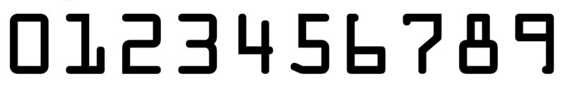

需要识别的图像


## 模板处理

### 1.读取图像

```python
# 读取一个模板图像
img = cv2.imread(args["template"])
cv_show('img',img)
```

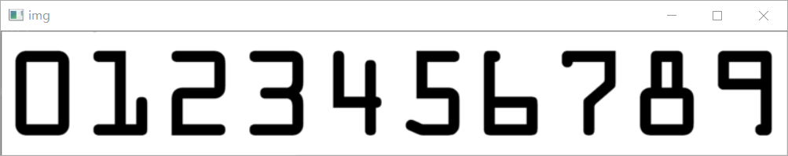


### 2.转换为灰度图

```python
# 灰度图
ref = cv2.cvtColor(img, cv2.COLOR_BGR2GRAY)
cv_show('ref',ref)
```


### 3.二值化处理

用于轮廓检测

```py
# 二值图像
ref = cv2.threshold(ref, 10, 255, cv2.THRESH_BINARY_INV)[1]
cv_show('ref',ref)
```


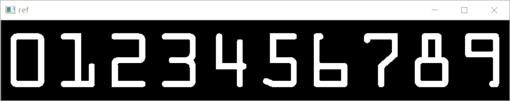

### 4.检测轮廓

```python
# 计算轮廓
#cv2.findContours()函数接受的参数为二值图，即黑白的（不是灰度图）,cv2.RETR_EXTERNAL只检测外轮廓，cv2.CHAIN_APPROX_SIMPLE只保留终点坐标
#返回的list中每个元素都是图像中的一个轮廓

ref_, refCnts, hierarchy = cv2.findContours(ref.copy(), cv2.RETR_EXTERNAL,cv2.CHAIN_APPROX_SIMPLE)
// -1表示要画所有的轮廓
cv2.drawContours(img,refCnts,-1,(0,0,255),3) 
cv_show('img',img)
```

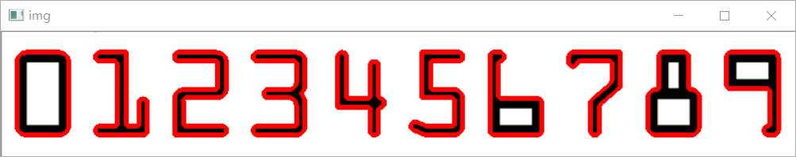


### 5.将轮廓和数字对应起来

计算外接矩形,使用外接矩形(能获取到x,y,h,w四个值，通过x点坐标值就可以判断)

获取每个外接矩形最左边一个点的坐标，然后对坐标的大小排序就能知道每个轮廓对应的数值

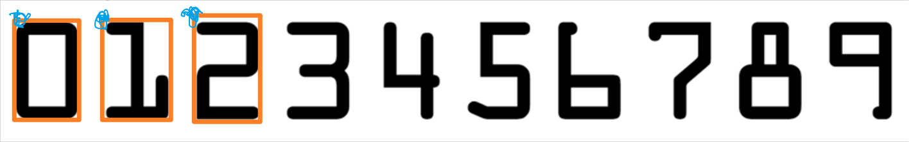

```python
# 排序函数
def sort_contours(cnts, method="left-to-right"):
    reverse = False
    i = 0

    if method == "right-to-left" or method == "bottom-to-top":
        reverse = True

    if method == "top-to-bottom" or method == "bottom-to-top":
        i = 1
    # 用一个最小的矩形，把找到的形状包起来x,y,h,w
    boundingBoxes = [cv2.boundingRect(c) for c in cnts] 
    # 执行排序操作
    (cnts, boundingBoxes) = zip(*sorted(zip(cnts, boundingBoxes),
                                        key=lambda b: b[1][i], reverse=reverse))
	# 返回轮廓和外接矩形信息
    return cnts, boundingBoxes
```

得到排序完的轮廓

```python
# 排序，从左到右，从上到下
refCnts = myutils.sort_contours(refCnts, method="left-to-right")[0] 
```

### 6.生成一个字典

生成一个字典，将数值和轮廓信息对应起来

1.计算轮廓对应的外接矩形

2.通过x,y坐标和w,h宽高将对应数据的图保存起来(将图抠出来)

3.改变一下图片大小

4.将每一个数字对应每一个模板

```python
digits = {}

# 遍历每一个轮廓
for (i, c) in enumerate(refCnts):
	# 计算外接矩形并且resize成合适大小
	(x, y, w, h) = cv2.boundingRect(c)
	roi = ref[y:y + h, x:x + w]
	roi = cv2.resize(roi, (57, 88))

	# 每一个数字对应每一个模板
	digits[i] = roi
```

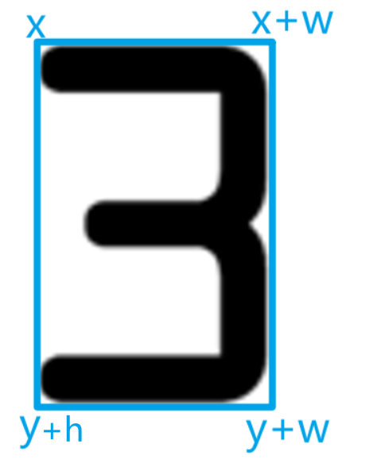


## 输入图像处理

### 1.指定卷积核大小

```python
# 初始化卷积核
rectKernel = cv2.getStructuringElement(cv2.MORPH_RECT, (9, 3))
sqKernel = cv2.getStructuringElement(cv2.MORPH_RECT, (5, 5))
```

### 2.读取图像

```python
#读取输入图像，
image = cv2.imread(args["image"])
cv_show('image',image)
```


### 3.图像预处理

1.图像太大，改变图像大小

2.进行灰度处理

```python
image = myutils.resize(image, width=300)
gray = cv2.cvtColor(image, cv2.COLOR_BGR2GRAY)
cv_show('gray',gray)
```


### 4.礼帽操作

根据字体大小选择对应的核(卷积)

礼帽操作突出明亮的区域

```python
#礼帽操作，突出更明亮的区域
tophat = cv2.morphologyEx(gray, cv2.MORPH_TOPHAT, rectKernel) 
cv_show('tophat',tophat) 
```

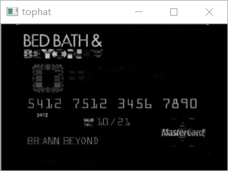


### 5.Sobel算子操作

绝对值，归一化操作

```python
gradX = cv2.Sobel(tophat, ddepth=cv2.CV_32F, dx=1, dy=0, #ksize=-1相当于用3*3的
	ksize=-1)

# 绝对值
gradX = np.absolute(gradX)
(minVal, maxVal) = (np.min(gradX), np.max(gradX))
gradX = (255 * ((gradX - minVal) / (maxVal - minVal)))
gradX = gradX.astype("uint8")

print (np.array(gradX).shape)
cv_show('gradX',gradX)
```

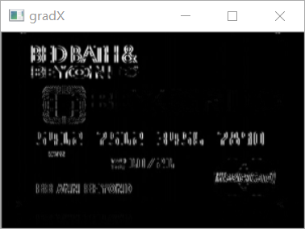


### 6.闭操作

图像中有许多干扰的选项，我们需要把蓝色部分看成一个块，可以先膨胀再腐蚀提取出数字区域

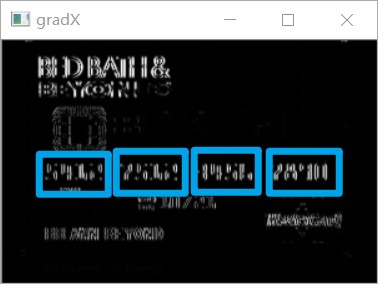

```python
#通过闭操作（先膨胀，再腐蚀）将数字连在一起
gradX = cv2.morphologyEx(gradX, cv2.MORPH_CLOSE, rectKernel) 
cv_show('gradX',gradX)
#THRESH_OTSU会自动寻找合适的阈值，适合双峰，需把阈值参数设置为0
thresh = cv2.threshold(gradX, 0, 255,
	cv2.THRESH_BINARY | cv2.THRESH_OTSU)[1] 
cv_show('thresh',thresh)

#再来一个闭操作

thresh = cv2.morphologyEx(thresh, cv2.MORPH_CLOSE, sqKernel) #再来一个闭操作
cv_show('thresh',thresh)
```

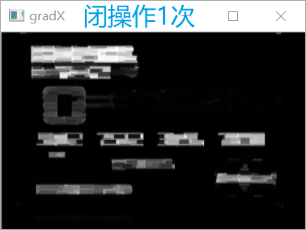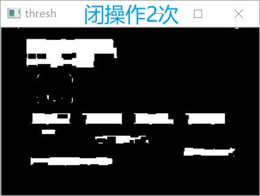

### 7.计算轮廓

```python
# 计算轮廓
thresh_, threshCnts, hierarchy = cv2.findContours(thresh.copy(), cv2.RETR_EXTERNAL,
	cv2.CHAIN_APPROX_SIMPLE)

cnts = threshCnts
cur_img = image.copy()
# 绘制轮廓
cv2.drawContours(cur_img,cnts,-1,(0,0,255),3) 
cv_show('img',cur_img)
locs = []
```


### 8.过滤轮廓

轮廓太多有些轮廓是我们不需要的需要过滤掉

1.设置适合的比例将轮廓筛选出来

2.对轮廓进行排序

```python
# 遍历轮廓
for (i, c) in enumerate(cnts):
	# 计算矩形
	(x, y, w, h) = cv2.boundingRect(c)
	ar = w / float(h)

	# 选择合适的区域，根据实际任务来，这里的基本都是四个数字一组
	if ar > 2.5 and ar < 4.0:

		if (w > 40 and w < 55) and (h > 10 and h < 20):
			#符合的留下来
			locs.append((x, y, w, h))
            
# 将符合的轮廓从左到右排序
locs = sorted(locs, key=lambda x:x[0])

# 显示筛选好的矩形区域		
cur_img = image.copy()
for (i, (gX, gY, gW, gH)) in enumerate(locs):
		# 画出来指定四个点，红色
	cv2.rectangle(cur_img, (gX, gY),
		(gX + gW, gY + gH), (0, 0, 255), 1)
cv_show('img',cur_img)
# 将符合的轮廓从左到右排序
```


### 9.提取单个字符轮廓

1.遍历提取的四个大轮廓

2.对轮廓的大小向外扩展一些区域

3.预处理

```python
# 每一个轮廓根据坐标提取每一个组
group = gray[gY - 5:gY + gH + 5, gX - 5:gX + gW + 5]
cv_show('group',group)
```

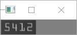


**二值化**

```python
# 二值化
group = cv2.threshold(group, 0, 255,
                      cv2.THRESH_BINARY | cv2.THRESH_OTSU)[1]
cv_show('group',group)
```

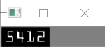

**检测轮廓并排序**

计算出每一数字的轮廓，并按照模板处理的方式进行排序

```python
# 计算每一组的轮廓
	group_,digitCnts,hierarchy = cv2.findContours(group.copy(), cv2.RETR_EXTERNAL,
		cv2.CHAIN_APPROX_SIMPLE)
	digitCnts = contours.sort_contours(digitCnts,
		method="left-to-right")[0]
```

**模板匹配**

对得到的轮廓进行resize为模板同样大小

对轮廓和模板中每一个数字进行匹配打分选择最优的一个

```python
# 计算每一组中的每一个数值
for c in digitCnts:
    # 找到当前数值的轮廓，resize成合适的的大小
    (x, y, w, h) = cv2.boundingRect(c)
    roi = group[y:y + h, x:x + w]
    roi = cv2.resize(roi, (57, 88))
    cv_show('roi',roi)

    # 计算匹配得分
    scores = []

    # 在模板中计算每一个得分
    for (digit, digitROI) in digits.items():
        # 模板匹配
        result = cv2.matchTemplate(roi, digitROI,
                                   cv2.TM_CCOEFF)
        (_, score, _, _) = cv2.minMaxLoc(result)
        scores.append(score)

        # 得到最合适的数字
        groupOutput.append(str(np.argmax(scores)))
```

### 10.画出图像并打印结果

```python
# 画出来
cv2.rectangle(image, (gX - 5, gY - 5),
              (gX + gW + 5, gY + gH + 5), (0, 0, 255), 1)
cv2.putText(image, "".join(groupOutput), (gX, gY - 15),
            cv2.FONT_HERSHEY_SIMPLEX, 0.65, (0, 0, 255), 2)

# 得到结果
output.extend(groupOutput)

# 打印结果
print("Credit Card Type: {}".format(FIRST_NUMBER[output[0]]))
print("Credit Card #: {}".format("".join(output)))
cv2.imshow("Image", image)
cv2.waitKey(0)
```

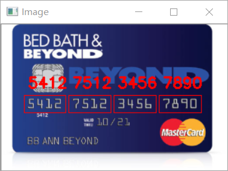


