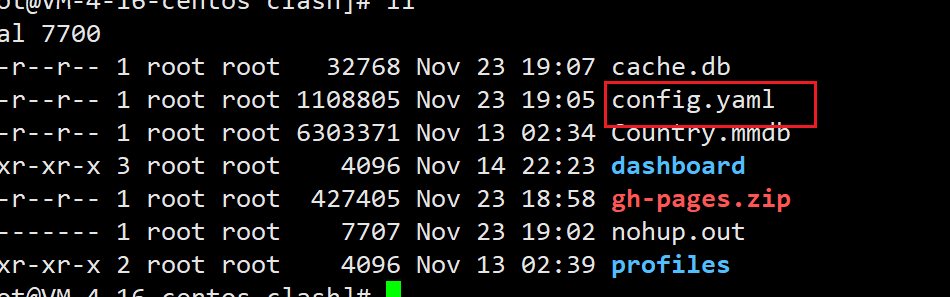

## 1.下载软件 解压安装并授权

仓库地址如下

```bash
https://github.com/Dreamacro/clash
```

也可以用wget

```bash
wget https://github.com/Dreamacro/clash/releases/download/v0.15.0/clash-linux-amd64-v0.15.0.gz
```

```bash
gzip -d clash-linux-amd64-v0.15.0.gz #解压
mv clash-linux-amd64-v0.15.0 /usr/local/bin/clash #移动到bin
chmod +x /usr/local/bin/clash #添加执行权限
```

## 2.设置成服务

```bash
vim /etc/systemd/system/clash.service
```

```ini
[Unit]
Description=clash service
After=network.target

[Service]
Type=simple
User=root
ExecStart=/usr/local/bin/clash
Restart=on-failure # or always, on-abort, etc

[Install]
WantedBy=multi-user.target
```

然后设置clash开机启动

```bash
systemctl daemon-reload
systemctl enable clash
```

## 3.配置clash 以及面板

```bash
service clash start
```

第一次启动会在 ~/.config/clash 初始化配置文件

然后下载面板文件

```bash
cd ~/.config/clash
```

```bash
wget https://github.com/haishanh/yacd/archive/gh-pages.zip
unzip gh-pages.zip
mv yacd-gh-pages/ dashboard/
```

然后修改我们自己的配置



可以直接复制windows版本的clash里面的配置文件 然后修改少量的地方

在配置文件中加上/修改如下

secret就是api的访问秘钥 如果没有的话任何人都可以访问你的clash面板的api 不安全

```yaml
secret: xxxx
external-controller: 0.0.0.0:9090  #别忘记在服务器厂商开放端口号
external-ui: dashboard  #打开面板
```

修改后记得重启服务

然后就可以访问

http://serverip:9090/ui/
