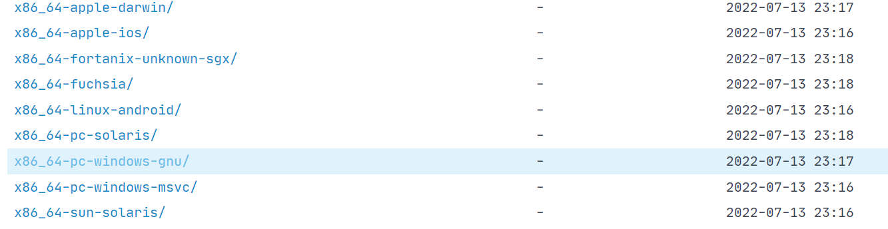
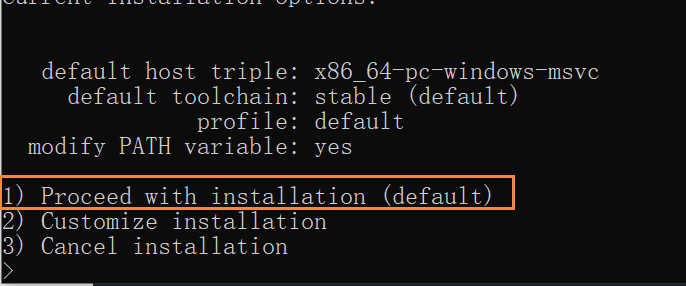
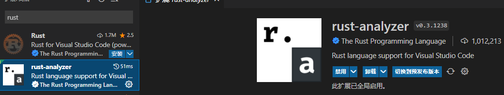

## 1.rust下载

下载地址 [官网](https://www.rust-lang.org/learn/get-started)  [清华镜像](https://mirrors.tuna.tsinghua.edu.cn/rustup/rustup/archive/1.25.1/)



## 2.设置rustc环境变量

在系统环境变量中添加如下变量（选一个就可以，可以组合）：

```properties
# 清华大学
RUSTUP_DIST_SERVER：https://mirrors.tuna.tsinghua.edu.cn/rustup
RUSTUP_UPDATE_ROOT：https://mirrors.tuna.tsinghua.edu.cn/rustup/rustup
# 中国科学技术大学
RUSTUP_DIST_SERVER：https://mirrors.ustc.edu.cn/rust-static
RUSTUP_UPDATE_ROOT：https://mirrors.ustc.edu.cn/rust-static/rustup
```

## 3.设置cargo 国内镜像

C:\Users\用户名\\.cargo\config

```properties
[source.crates-io]
registry = "https://github.com/rust-lang/crates.io-index"
replace-with = 'ustc'
[source.ustc]
# registry = "https://mirrors.ustc.edu.cn/crates.io-index"
registry = "https://mirrors.tuna.tsinghua.edu.cn/git/crates.io-index.git"
[http]
check-revoke = false
```

## 4.安装

> 运行 rustup-init.exe



## 5.安装rust插件



## 6.安装源码

```sh
rustup component add rust-src
```

