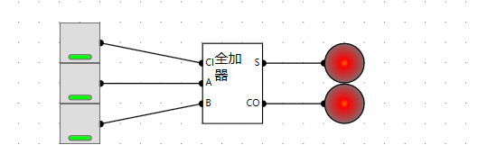
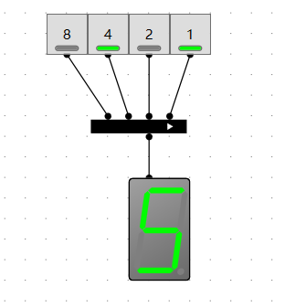

## 半加器
一位二进制加法：0 + 0 = 0(无进位)、0 + 1 = 1(无进位)、1 + 0 = 1(无进位)、1 + 1 = 0(进位1)
写成真值表(A,B输入，S输出，C进位)

| A    | B    | S    | C    |
| ---- | ---- | ---- | ---- |
| 0    | 0    | 0    | 0    |
| 0    | 1    | 1    | 0    |
| 1    | 0    | 1    | 0    |
| 1    | 1    | 0    | 1    |

根据真值表可以得出A、B和C之间的关系为**与**的关系。A、B与C之间的关系为**异或**的关系

$$
\begin{aligned}
S = & \overline{A}B + \overline{B}A \\
C = & AB
\end{aligned}
$$
**绘制电路**

**测试电路**

## 异或门实现

异或门，不同时为1，相同时为0

| A    | B    | S    |
| ---- | ---- | ---- |
| 0    | 0    | 0    |
| 0    | 1    | 1    |
| 1    | 0    | 1    |
| 1    | 1    | 0    |

真值表为
$$
\begin{aligned}
S = & \overline{A}B + \overline{B}A \\
\end{aligned}
$$
**绘制电路**

**测试电路**

## 全加器

CI进位输入，CO进位输出。输入A+B的输出S和进位在相加得输出S，和**进位C**，进位C和A+B得进位向或得出**进位输出CO**

**绘制电路**

**测试电路**

## 8位加法器

在有了1位全加器之后，通过组合8个位实现8位的加法器。

**8位灯泡组件封装**

**8位开关组件封装**

**8位加法器**

**测试电路**

00000001 + 00000011 = 00000100 及 1 + 3 = 4

## 一位取反器

一位取反器通过一个**非门**就可以实现,即输入0时输出为1。输入1时输出为0

| I    | O    |
| ---- | ---- |
| 1    | 0    | 
| 1    | 1    | 

此时需要通过使能来控制，I得状态是否翻转，当使能E为低电平时输入I和输出保持不变，高电平时进行输入I与输出O相反

| E    | I    | O    |
| ---- | ---- | ---- |
| 0    | 0    | 0    |
| 0    | 1    | 1    |
| 1    | 0    | 1    |
| 1    | 1    | 0    |

通过分析真值表得出通过**异或门**就可以实现。

**测试电路**

使能，输入低电平，输出高电平完成取反

## 8位取反器

将8个1位的取反器按下图电路组合得到8位取反器：

**测试电路未使能**

**测试电路使能**

## 增加减法

- 对于**加法**，默认进位输入为0
- 对于**减法**，被减数**按位取反**再加1,刚好8位加法器得进位和反向器得使能可以共用上

**测试电路一**

加法：00000001 + 00000011 = 00000100 即 1 + 3 = 4

**测试电路二**

减法：4 - 1 = 3转为二进制即为 00000100 + (00000001)取反加1 = 00000100 + (11111110 + 1) =  00000011。进位为1。

**测试电路三**

对于上图进位为1，因为减法不应该存在进位**输出**改进进位输出电路.

对于加法，使能为低电平，经过非门后值为高电平1。1与上任何数为任何数。

对于减法，使能为高电平，经过非门后值为低电平0，0与上任何值都为低电平0。

## 1灯16进制

输入位宽为4位，能寻址2的4次方个内存单元及16个地址单元。

数据位宽4位及4个地址线，2的4次方个内存单元及16个地址单元。

数据位宽8位，可以一次获取8位数据

**绘制电路**

**测试电路**

| 数值 | 二进制    | 16进制 |
| ---- | --------- | ------ |
| 0    | 0011 1111 | 3F     |
| 1    | 0011 0000 | 30     |
| 2    | 0101 1011 | 5B     |
| 3    | 0100 1111 | 4F     |
| 4    | 0110 0110 | 66     |
| 5    | 0110 1101 | 6D     |
| 6    | 0111 1101 | 7D     |
| 7    | 0000 0111 | 7      |
| 8    | 0111 1111 | 7F     |
| 9    | 0110 1111 | 6F     |
| A    | 0111 0111 | 77     |
| b    | 0111 1100 | 7C     |
| C    | 0011 1001 | 39     |
| d    | 0101 1100 | 5E     |
| E    | 0111 1001 | 79     |
| F    | 0111 0001 | 71     |

## 2灯16进制显示

绘制电路

**测试电路**

## 8位十进制显示

将一个**8位的2进制数**，利用3个7段数码管显示。

- 8位2进制可以表示的范围位0~255即寻找范围0~255个地址
- 1个数码管需要4位输入，则3个需要12位输入，则ROM数据位宽为12。
- 输入的是8位数，则ROM地址位宽为8

**测试电路**

**加法器测试**

## 数码管高位消隐

> 要想让高位为零时不亮，可以考虑先给单个数码管加一个使能位。
>
> 解决思路就是做一个8位的二选一选择器

### 21选择器

- 有2个输入，分别为A和B，以及一个有效位。

- 有效输出A，无效输出B。下图前4项，EN有效位为0输出B。后4项EN有效位为1输出A

| EN   | A    | B    | S    |
| ---- | ---- | ---- | ---- |
| 0    | 0    | 0    | 0    |
| 0    | 0    | 1    | 1    |
| 0    | 1    | 0    | 0    |
| 0    | 1    | 1    | 1    |
| 1    | 0    | 0    | 0    |
| 1    | 0    | 1    | 0    |
| 1    | 1    | 0    | 1    |
| 1    | 1    | 1    | 1    |

**电路实现**

**测试电路**

### 8位21选择器

将8个1位的21选择器组合后得到8位的21选择器。

### 电路测试

### 七段数码管增强

基于8位21选择器实现,无效不显示功能。

**测试电路**

### 10进制增强显示

- 000显示为0，最低为一定要显示使能为1
- 021显示为21
- 201显示为201,第二位中值为0,第二个或出来为0,所以要将高位的或的值输出第二位的或门的输入第二位才可以显示。

**测试电路**

### 16进制增强显示

高位需要有值才显示，使用或门来使能

**测试电路**

