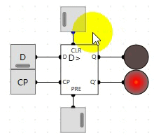

## R-S触发器

**R-S触发器**又名复位-置位触发器（R-复位RESET，S-置位SET）

- 复位R设置Q为0
- 置位S设置Q为1

### 真值表

| R    | S    | Q    | Q’   |
| ---- | ---- | ---- | ---- |
| 0    | 0    | Q    | Q‘   |
| 0    | 1    | 1    | 0    |
| 1    | 0    | 0    | 1    |
| 1    | 1    | 0    | 0    |

### 电路实现

### 测试电路

- 当R为0，S为1时置位。Q为1，Q'为0。
- 当R为1，S为0时复位。Q为0，Q'为1。
- 当R为1，S为1时。Q为0，Q'为0。
- 当R为0，S为0时。保持之前状态

## D触发器

D触发器是一个具有记忆功能的，具有两个稳定状态的信息存储器件，是构成多种[时序电路](https://baike.baidu.com/item/时序电路/4836638?fromModule=lemma_inlink)的最基本逻辑单元，也是数字逻辑电路中一种重要的单元电路。

D触发器能存储1位的数据，在内存中。（可以用做**寄存器**）

### 电路实现

- 当EN为低电平时，0与上任何数都为0经过与门后都为0，级R和S都为0。R和S都为零时保持之前的状态，就不受D输入的影响。
- 当EN为高电平时，1与上任何数都为任何数。经过了一个非门，所以R和S必定是相反的值。
- 当EN为高电平时，就可以通过D来存储数据。当EN为低电平时，D的改变不会影响Q的输出。这样就完成了1比特数据的存储。

### 电路测试

## D边沿触发器

让计算机在上**升沿存储数据**，在下降沿做其他事情。能够存储一位的信息。

### 电路实现

- 当CP为低电平时，第一个D触发器EN为高电平使能了，此时修改D的值将会被存储到第一个D触发器中。
- 当CP由低电平切换为高电平时，第一个D触发器的使能被关闭不能接收数据。第二个D触发器的使能被打开，第一个D触发器存储的数据将流转到第二个D触发器。
- 当CP为高电平时，切换D的值，由于第一个D触发器的使能是关闭，数据将不能通过。

### 电路测试

## 触发器优化

以上触发器每次在启动时Q的值都是随机的，为了解决这个问题，需要新增清零和预置状态来优化。

R-S触发器增加清零Clear和预置Preset标准，连到3位的或非门上。

### **R-S触发器优化后**

### **D触发器优化后**

### D边沿触发器优化后

### D边沿触发器优化后测试

- CLR 清零
- PRE置位为1

### D边沿触发器实现跑马灯

- 开关打开后，PRE被置位Q输出为1第一个灯泡被点亮，即第二个触发器锁存的值为1，其他D边沿触发器被清零，即最后一个触发器值为0，第一个D值为零。
- 开关关闭后，等待时钟上升沿到来时。第一个触发器锁存的值为0被第一个Q所取到，第一个LED熄灭。第二个锁存的值为1被取到，第二个LED点亮

## T触发器

T触发器是在数字电路中，凡在CP时钟脉冲控制下，根据输入信号T取值的不同，具有保持和翻转功能的触发器，即当T=0时能保持状态不变，当T=1时一定翻转的电路。

### 电路实现

- 当Q为高电平时LED点亮，Q'为低电平。此时D触发器锁存值为低电平，当上升沿到来D锁存的值低电平被输出到Q，LED熄灭。Q'为高电平。等待下一个上升沿到来。。。

### 电路测试

## 行波计数器

基于T触发器，实现计数器。

### 电路实现

### 电路测试

