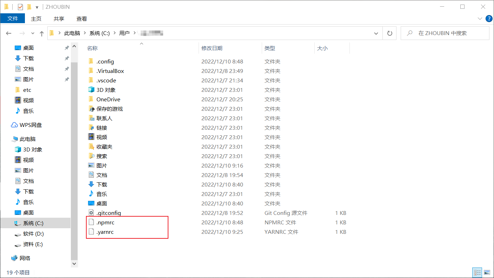
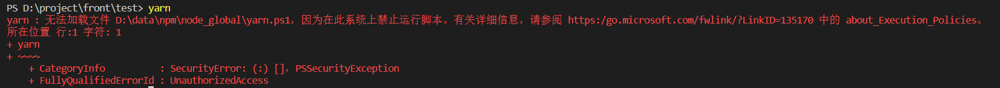

## 配置文件位置



## npm配置

1.设置全局安装位置

```
npm config set prefix "D:\data\npm\node_global"
```

2.设置缓存位置

```
npm config set cache "D:\data\npm\node_cache"
```

3.设置环境变量

```
NODE_PATH = D:\data\npm\node_global\node_modules
NODE_GLOBAL = D:\data\npm\node_global
```

4.设置path

```
%NODE_GLOBAL%
```

## yarn配置

1.安装yarn

```
npm i -g yarn
```

2.解决vscode运行错误



执行如下命令

```sh
# 配置策略
get-ExecutionPolicy # 查看执行策略
set-ExecutionPolicy RemoteSigned # 设置执行策略
```

3.设置bin位置

```sh
# 查看 yarn 全局bin位置
yarn global bin
# 改变 yarn 全局bin位置
yarn config set prefix "D:\data\yarn\yarn_global"
```

4.设置全局安装位置

```sh
# 查看全家安装位置
yarn global dir
# 改变全局安装位置
yarn config  set global-folder "D:\data\yarn\yarn_global"
```

5.设置缓存位置

```sh
# 查看缓存位置
yarn cache dir
# 改变缓存位置
yarn config set cache-folder "D:\data\yarn\yarn_cache"
```

6.设置环境变量

```sh
YARN_BIN = D:\data\yarn\yarn_global\bin
YARN_GLOBAL = D:\data\yarn\yarn_global\
```

7.设置path

```sh
%YARN_BIN%
%YARN_GLOBAL%
```

## 下载配置

设置下载源

```sh
# 官方源
npm config set registry https://registry.npmjs.org/
# 淘宝源
npm config set registry https://registry.npm.taobao.org/
# 腾讯
npm config set registry https://mirrors.cloud.tencent.com/npm/
# cnpm
npm config set registry https://r.cnpmjs.org/
```

查看当前源

```sh
npm config get registry
```

## nrm安装

nrm安装

```sh
npm install -g nrm
```

查看可选源

```sh
nrm ls
```

切换源

```sh
nrm use taobao
```