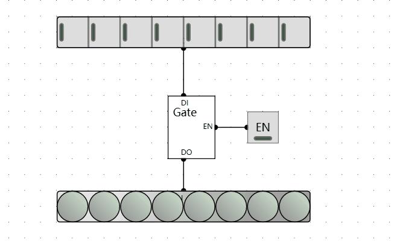

## 8位存储器

1byte数据需要8位存储，D边沿触发器可以存储一位数据，则将8个组合起来就可以存储8位(1个字节)的存储器。

### 电路实现

### 电路测试

## 三态门

三态电路可提供三种不同的输出值：逻辑“0”，逻辑“1”和高阻态。

### 电路测试

## 8位三态门

当一条线路上连接了多个器件时，需要通过3态门来控制哪些连接，哪些断开。面对一个8位的输入，因此需要8位的3态门开关对应。**主要用于存储器的读控制**。

### 电路实现

### 测试电路

## 8位寄存器

利用存储器存一个字节数据基础上，加上读写控制位。

### 电路实现

### 测试电路

## 38译码器

在组合8个寄存器用来存储8个字节的数据时，遇到一个问题：如何每次只能选中8个寄存器中的一个进行读写？

8位需要2的3次方来控制，则需要3个地址线。3位输入8位输出，只有一个为1，为1的位置表示选中。

### 真值表

| A2   | A1   | A0   | B7   | B6   | B5   | B4   | B3   | B2   | B1   | B0   |
| ---- | ---- | ---- | ---- | ---- | ---- | ---- | ---- | ---- | ---- | ---- |
| 0    | 0    | 0    | -    | -    | -    | -    | -    | -    | -    | 1    |
| 0    | 0    | 1    | -    | -    | -    | -    | -    | -    | 1    | -    |
| 0    | 1    | 0    | -    | -    | -    | -    | -    | 1    | -    | -    |
| 0    | 1    | 1    | -    | -    | -    | -    | 1    | -    | -    | -    |
| 1    | 0    | 0    | -    | -    | -    | 1    | -    | -    | -    | -    |
| 1    | 0    | 1    | -    | -    | 1    | -    | -    | -    | -    | -    |
| 1    | 1    | 0    | -    | 1    | -    | -    | -    | -    | -    | -    |
| 1    | 1    | 1    | 1    | -    | -    | -    | -    | -    | -    | -    |

### 公式

- B0 = A2‘A1‘A0’ （A2取反 与上 A1取反 与上 A0取反）
- B1 = A2‘A1‘A0 （A2取反 与上 A1取反 与上 A0）
- B2 = A2‘A1A0’ （A2取反 与上 A1 与上 A0取反）
- B3 = A2‘A1A0 （A2取反 与上 A1 与上 A0）
- B4 = A2A1‘A0’ （A2 与上 A1取反 与上 A0取反）
- B5 = A2A1‘A0 （A2 与上 A1取反 与上 A0）
- B6 = A2A1A0’ （A2 与上 A1 与上 A0取反）
- B7 = A2A1A0 （A2 与上 A1 与上 A0）

### 电路实现

### 测试电路

## 8字节存储器

组合8个1字节寄存器组件，利用38译码器选中每次要读写的1个字节寄存器来做数据读取和写入。

### 电路实现

### 测试电路

