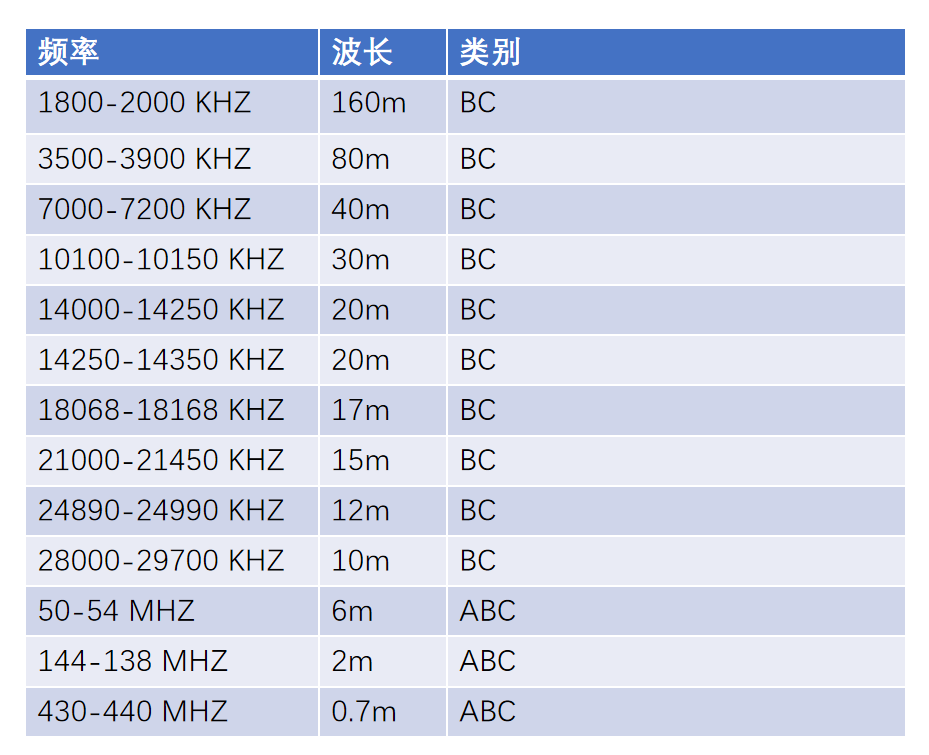
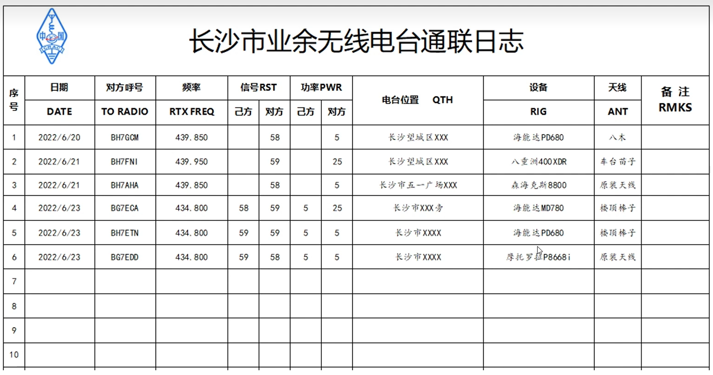
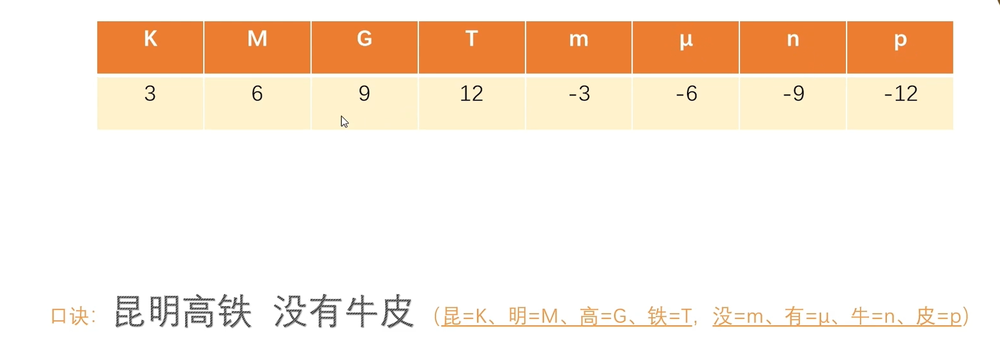
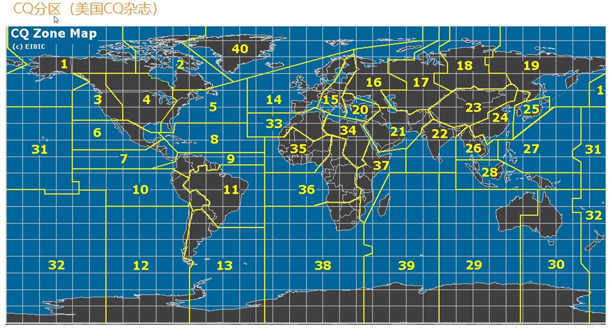
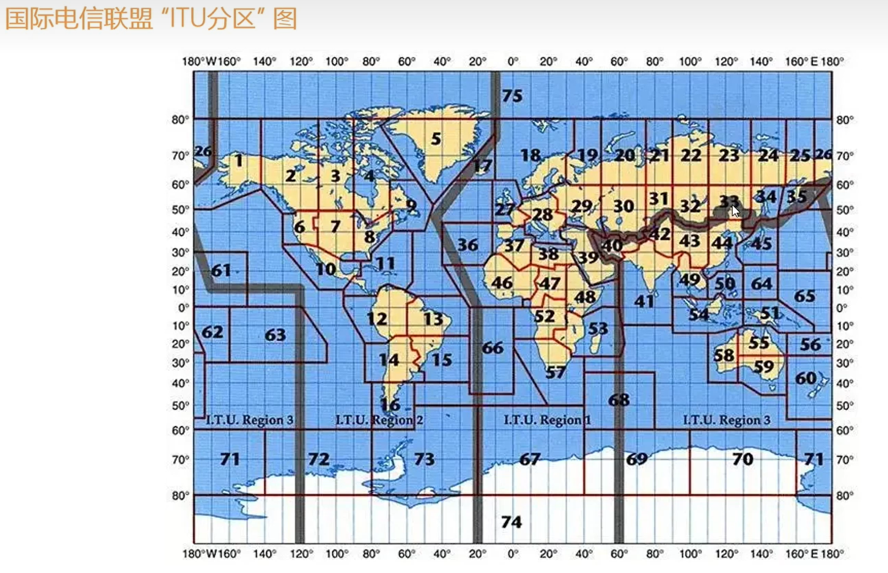
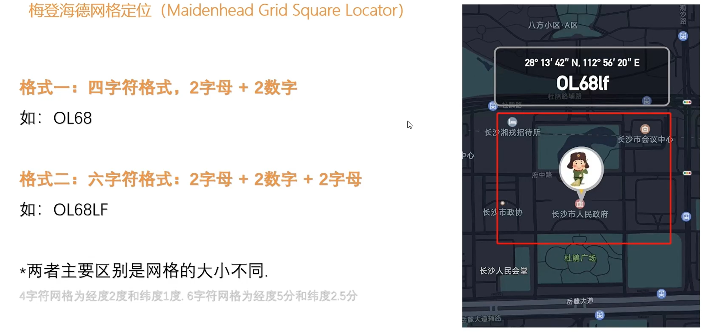
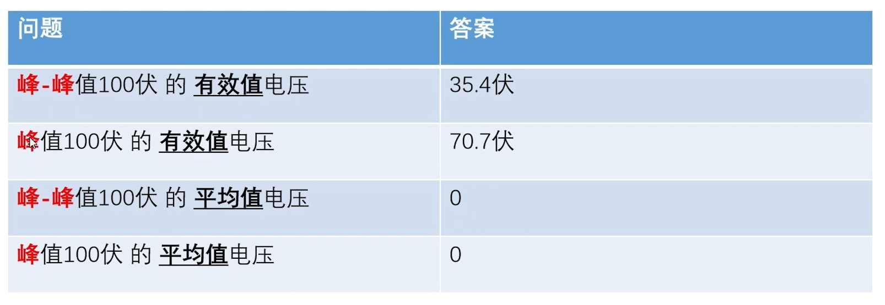
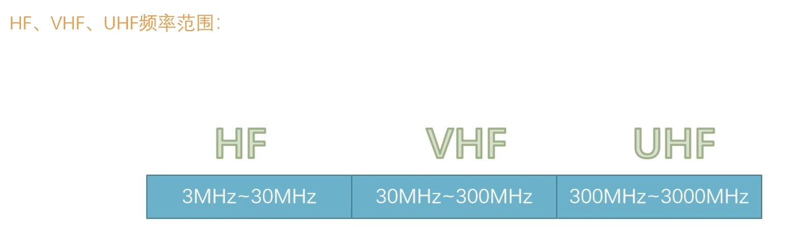
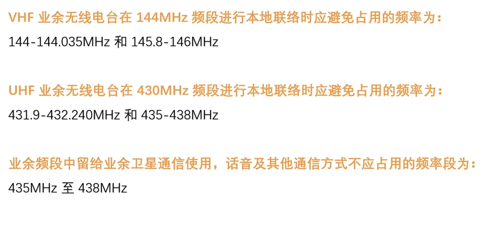
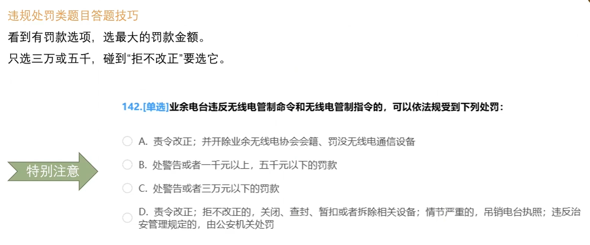

## 波段题

俗称的6米业余波段的频率范围以及业余业务和卫星业余业务的使用状态分别为：

[A] 50-54MHz，主要业务

[B] 50-52MHz，次要业务

[C] 51-54MHz，专用

[D] 52-56MHz，次要业务

::: details
答案 A
:::

主要业务和次要业务

6m 50-54MHZ主要业务。

2m 144-148MHZ 主要业务。频道范围，可拆分为唯一主要 + 共用主要。

0.7m 430-440 MHZ 次要业务，主要业务是：无线电定位和航空无线电导航。

## 划分分配指配

[1] 在无线电管理中，由国家将某个特定的频带列入频率划分表，规定该频带可在指定的条件下供业余业余业务或者卫星业余业务使用，这个过程称为：

[A]划分

[B]分配

[C]指配

[D]授权

::: details
答案 A
:::

[2]在无线电管理中，将无线电频率或频道规定由一个或多个部门，在指定的区域内供地面或空间无线电通信业务在指定条件下使用，这个过程称为：

[A]分配

[B]划分

[C]指配

[D]授权

::: details
答案 A
:::

[3]在无线电管理中，将无线电频率或频道批准给具体的业余无线电台在规定条件下使用，这个过程称为：

[A]指配

[B]划分

[C]分配

[D]授权

::: details
答案 A
:::

在无线电管理中，由国家将某个特定的频带列入划分表...

**划分**

在无线电管理中，将无线电频率或频道规定由一个或多个部门...

**分配**

在无线电管理中，将无线电频率或频道批准给具体的业余无线电在规定条件下使用...

**指配**

规定条件下=指配，多个部门=分配、列入划分表=划分

口诀：**梨花调脂多粉**（列划、条指、多分）

## 通联日志

[1] 法规和国际业余无线电惯例要求业余电台日志记载的必要基本内容是：

[A] 通信时间、通信频率、通信模式、对方呼号、双方信号报告

[B] 通信对方姓名、对方所在国家或城市、通信模式、双方信号报告

[C] 通信时间、通信频率、双方收发信设备和天线、对方台址

[D] 通信时间、通信模式、对方信号报告、对方台址、对方天气

::: details
答案 A
:::

## 无线电常用度量单位

[1] 无线电常用度量单位的词头K的意义为：（”x＾m”表示“x的m次方”）

[A]10＾3

[B]10＾(-3)

[C]10＾6

[D]10＾(-6)

::: details
答案 A
:::
[2] 无线电常用度量单位的词头m的意义为：（”x＾m”表示“x的m次方”）

[A]10＾(-3)

[B]10＾3

[C]10＾6

[D]10＾(-6)

::: details
答案 A
:::
[3] 无线电常用度量单位的词头M的意义为：（”x＾m”表示“x的m次方”）

[A] 10＾6

[B] 10＾(-6)

[C] 10＾3

[D] 10＾(-3)

::: details
答案 A
:::
[4] 无线电常用度量单位的词头μ的意义为：（”x＾m”表示“x的m次方”）

[A]10＾(-6)

[B]10＾6

[C]10＾(-3)

[D]10＾3

::: details
答案 A
:::
[5] 无线电常用度量单位的词头G的意义分别为：（”x＾m”表示“x的m次方”）

[A]10＾9

[B]10＾6

[C]10＾12

[D]10＾(-12)

::: details
答案 A
:::
[6] 无线电常用度量单位的词头n的意义分别为：（”x＾m”表示“x的m次方”）

[A]10＾(-9)

[B]10＾9

[C]10＾12

[D]10＾(-12)

::: details
答案 A
:::

[7] 无线电常用度量单位的词头T的意义分别为：（”x＾m”表示“x的m次方”）

[A]10＾12

[B]10＾-12

[C]10＾9

[D]10＾(-9)

::: details
答案 A
:::

[8] 无线电常用度量单位的词头p的意义分别为：（”x＾m”表示“x的m次方”）

[A]10＾(-12)

[B]10＾12

[C]10＾(-9)

[D]10＾9

::: details
答案 A
:::

## 位置题

[1] 我国所属的“CQ分区”有：

[A]23、24、27

[B]42、43、44

[C]23、24

[D]42、43、44、50

::: details
答案 A
:::

[2]“ITU分区”是IARU的活动计算通信成绩的基础。我国所属的“ITU分区”有：

[A] 33、42、43、44、50

[B] 33、42、43、44

[C] 23、24

[D] 23、24、27

::: details
答案 A
:::

[3]业余无线电通信梅登海德网格定位系统（Maidenhead Grid Square Locator）是一种：

[A]根据经纬度坐标对地球表面进行网格划分和命名，用以标示地理位置的系统

[B]卫星定位系统

[C]根据国际呼号系列对地球表面进行网格划分和命名，用以标示地理位置的系统

[D]根据国际政治行政区划对地球表面进行网格划分和命名，用以标示地理位置的系统

::: details
答案 A
:::

[4]业余无线电通信常用的梅登海德网格定位系统网格名称的格式为：

[A]2个字母和2位数字、2个字母和2位数字再加2个字母

[B]4位数字或者6位数字

[C]4个字母或者6个字母

[D]呼号前缀字母加2位数字和2个字母

::: details
答案 A
:::

[4]业余无线电通信常用的梅登海德网格定位系统网格名称的长度是4字符或6字符，两者定位精度不同，差别为：

[A]两者网格大小不同，4字符网格为经度2度和纬度1度，6字符网格为经度5分和纬度2.5分

[B]4字符网格精确到国家分区，6字符网格精确到国家的城市或县乡

[C]4字符网格根据国际呼号系列区分，6字符网格在4字符基础上加以经纬度细分

[D]4字符网格名称用于HF频段通信，6字符网格名称用于VHF/UHF通信

::: details
答案 A
:::

[5]业余无线电通信所说的“网格定位”是什么意思？

[A]一个由一串字母和数字确定的地理位置

[B]一个由一串字母和数字确定的方位角和仰角

[C]用来调谐末级功放的设备

[D]用于无线电测向运动的设备

::: details
答案 A
:::

## 峰值电压

[1]峰-峰值为100伏的正弦交流电压，其有效值电压为：

[A]约35.4伏

[B]约70.7伏

[C]约141伏

[D]约50伏

::: details
答案 A
:::

[2]峰值为100伏的正弦交流电压，其有效值电压为：

[A]约70.7伏

[B]约35.4伏

[C]约141伏

[D]约50伏

::: details
答案 A
:::

[3]峰-峰值为100伏的正弦交流电压，其平均值电压为：

[A]0

[B]约35.4伏

[C]约70.7伏

[D]约141伏

::: details
答案 A
:::

[4]峰值为100伏的正弦交流电压，其平均值电压为：

[A]0

[B]约35.4伏

[C]约70.7伏

[D]约141伏

::: details
答案 A
:::

## 避免占用频率

[1]VHF业余无线电台在144MHz频段进行本地联络时应避免占用的频率为：

[A]144-144.035MHz和145.8-146MHz

[B]144.035-145.8MHz

[C]144.050-144.053MHz和145.100-145.750MHz

[D]144.035-144.053MHz和145.550-145.750MHz

::: details
答案 A
:::
[2]UHF业余无线电台在430MHz频段进行本地联络时应避免占用的频率为：

[A]431.9-432.240MHz和435-438MHz

[B]430-431.9MHz和432.240-435MHz

[C]431-432MHz和438-440MHz

[D]430-431.2MHz和435-436MHz

::: details
答案 A
:::
[3]430MHz业余频段中留给业余卫星通信使用，话音及其他通信方式不应占用的频率段为：

[A]435MHz至438MHz

[B]432MHz至434MHz

[C]438MHz至439MHz

[D]433MHz至435MHz

::: details
答案 A
:::
[4]144MHz业余频段中留给业余卫星通信使用，话音及其他通信方式不应占用的频率段为：

[A]145.8MHz至146MHz

[B]144.8MHz至145MHz

[C]144.2MHz至144.5MHz

[D]145.4MHz至144.6MHz

::: details
答案 A
:::

